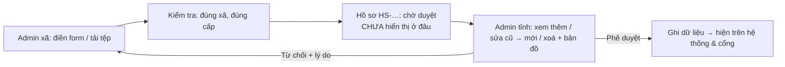
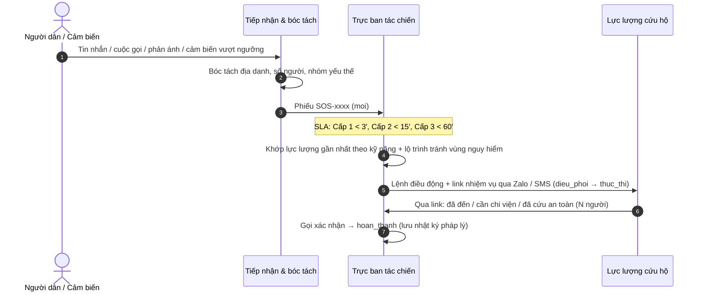
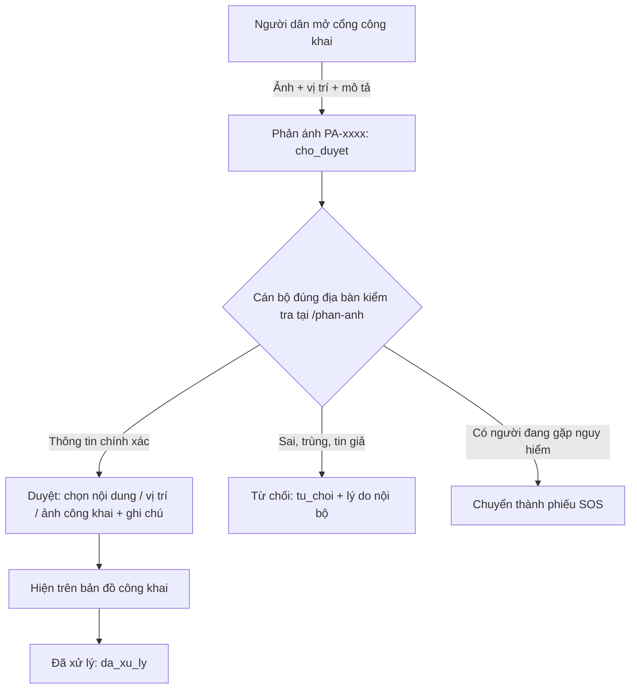
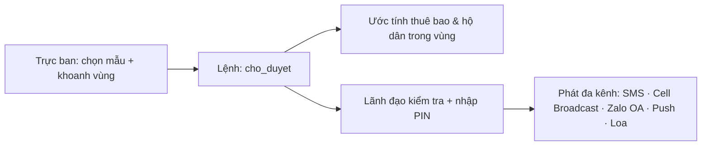
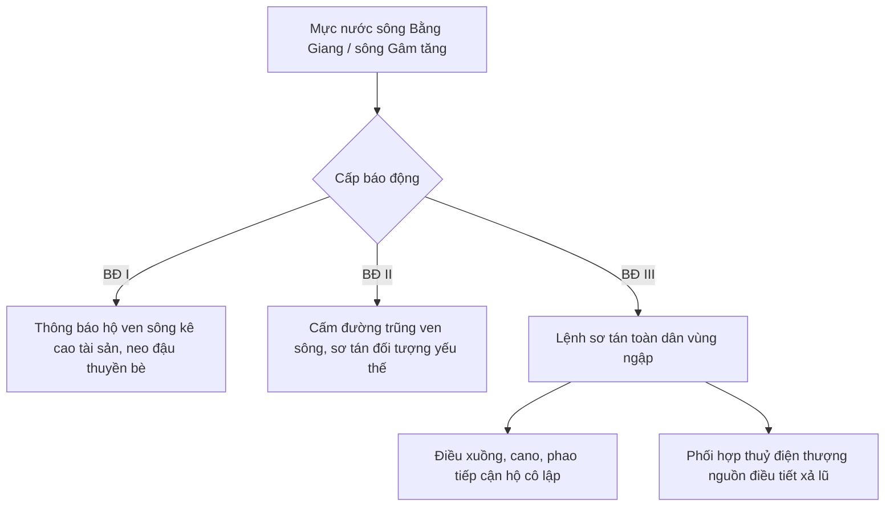
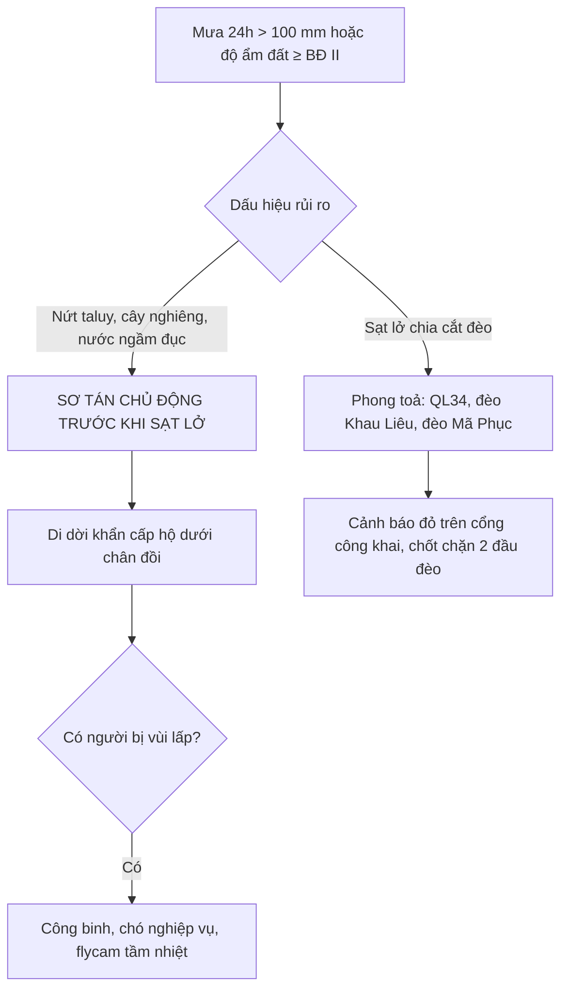

# Hệ thống Điều hành PCTT & TKCN tỉnh Cao Bằng

Ứng dụng web điều hành, ứng phó thiên tai cho **Ban Chỉ huy Phòng chống thiên tai & Tìm kiếm cứu nạn tỉnh Cao Bằng**:
màn hình trung tâm (video wall, nền tối), máy tính bảng hiện trường (nền sáng) và **cổng công khai cho người dân**.

Đây là **tài liệu duy nhất** của hệ thống (hướng dẫn cho lập trình viên và trợ lý AI nằm ở [CLAUDE.md](CLAUDE.md)).
Sửa chức năng, cấu hình hay quy trình thì cập nhật đúng mục trong tệp này.

> ⚠️ **Chưa sẵn sàng làm kênh cảnh báo chính thức**: lệnh cảnh báo được soạn, duyệt thật nhưng **chưa gửi tin thật**
> qua SMS / Cell Broadcast / Zalo; dữ liệu trạm, lực lượng, kho, điểm sơ tán, danh bạ hiện là **mẫu minh hoạ**.
> Xem [mục 2 — Hiện trạng](#hien-trang) trước khi dùng thật.

**Đọc theo vai trò**

| Bạn là | Nên đọc |
|---|---|
| Lãnh đạo, cán bộ nghiệp vụ | [1. Tổng quan](#tong-quan) · [2. Hiện trạng](#hien-trang) · [7. Quy trình nghiệp vụ](#quy-trinh) · [8. Phân quyền](#phan-quyen) |
| Người vận hành máy chủ | [2. Hiện trạng](#hien-trang) · [5. Cấu hình](#cau-hinh) · [6. Kết nối dữ liệu thật](#ket-noi-du-lieu) · [10. Triển khai thật](#trien-khai) ([10.8. Sổ tay từng bước](#so-tay-van-hanh)) · [11. Bảo mật](#bao-mat) |
| Lập trình viên | [3. Kiến trúc](#kien-truc) · [4. Chạy thử](#chay-thu) · [12. Kiểm thử](#kiem-thu) · [CLAUDE.md](CLAUDE.md) |

**Mục lục**

1. [Tổng quan phân hệ](#tong-quan)
2. [Hiện trạng chức năng & dữ liệu](#hien-trang)
3. [Kiến trúc](#kien-truc)
4. [Chạy thử trên máy](#chay-thu)
5. [Cấu hình (.env)](#cau-hinh)
6. [Kết nối dữ liệu thật & API key](#ket-noi-du-lieu)
7. [Quy trình nghiệp vụ (SOP)](#quy-trinh)
8. [Phân quyền (RBAC)](#phan-quyen)
9. [Cổng công khai & phản ánh của người dân](#cong-cong-khai)
10. [Triển khai thật (production)](#trien-khai)
11. [Bảo mật & tuân thủ](#bao-mat)
12. [Kiểm thử & CI](#kiem-thu)
13. [Nguồn dữ liệu địa giới & giấy phép](#nguon-dia-gioi)

---

<a id="tong-quan"></a>
## 1. Tổng quan phân hệ

| # | Phân hệ | Trang | Nội dung chính |
|---|---|---|---|
| A | Dashboard tổng quan | `/dashboard` | Một hàng tab (`?tab=…`; link cũ `?level=xa` / `?level=he_thong` vẫn mở đúng): **Tổng hợp** (tỉnh / vùng lọc) · **Hồ chứa & xả lũ** · **Sạt lở & đường đèo** (hai tab này theo bộ lọc xã / lưu vực và phạm vi được giao — `GET /api/v1/dashboard/reservoirs`, `/dashboard/landslides`, cùng số với ô KPI; cổng công khai vẫn toàn tỉnh; chưa tải được thì báo rõ, không hiện "0 hồ xả"; đầu tab Sạt lở: **heatmap 48 giờ cảm biến cảnh báo sớm** — độ nghiêng taluy, độ ẩm đất; mỗi ô = giá trị lớn nhất trong giờ, màu theo ngưỡng BĐ I–III của cảm biến; chọn cảm biến → chuỗi thời gian kèm vạch ngưỡng; điện thoại 24 giờ gần nhất) · **Cấp xã/phường** (`?tab=cap_xa`: tiến độ sơ tán, điểm sơ tán, SOS đang mở — chỉ tài khoản có `sos.view`, lực lượng, danh bạ, xóm của 1 xã) · **Hệ thống & dữ liệu** (`?tab=he_thong`, quyền `integration.view`: máy chủ, trạm & thiết bị, nguồn dữ liệu, dữ liệu nền còn thiếu). **Một thang màu rủi ro** Xanh / Vàng / Cam / Đỏ, Xám = chưa có dữ liệu (`utils/risk.js`, chú giải ngay dưới tiêu đề) cho dải tình huống, thẻ KPI, bản đồ, biểu đồ, bảng. Dải tình huống luôn trên cùng, mỗi tình huống một chip theo mức, tự tổng hợp từ số liệu (trạm vượt BĐ, SOS quá hạn / cấp 1, sạt lở cấm đường, hồ xả, mưa ≥ 50 mm/24h — **không phải cấp độ rủi ro thiên tai chính thức**); **6 ô KPI gọn** — 1 hàng trên laptop, 3×2 trên iPad, 2×3 trên điện thoại, chạm ô → chi tiết (**mưa TB lưu vực theo diện tích** — đa giác Thiessen của các trạm trong vùng đang xem, vùng 1 trạm lấy đúng số trạm đó — kèm mưa giờ trọn gần nhất ↗ / ↘ so với giờ trước, mực nước: số trạm trên BĐ + trạm nặng nhất kèm mũi tên lên / xuống (m/giờ, so số đo ~1 giờ trước) + **giờ dự báo vượt mức báo động cao hơn** — ghi rõ bản tin KTTV hay dự báo mô phỏng; trạm không có số đo / mất tín hiệu / chưa khai báo ngưỡng hiện xám, SOS chờ, quá hạn SLA nhấp nháy, sơ tán so với kế hoạch, lực lượng – xuồng – máy xúc, hồ đang xả · cấm đường); **Việc chờ quyết định** (lệnh cảnh báo chờ bạn duyệt, SOS quá hạn, hồ sơ xã / phản ánh chờ duyệt — chỉ mục tài khoản làm được, dùng lại số của thanh menu); bản đồ điểm nóng; hydrograph thực đo + dự báo, chọn trạm ngay trên biểu đồ (**tô màu phần vượt báo động** giữa đường mực nước và vạch BĐ I / II / III — vàng / cam / đỏ, dự báo tô nhạt; ngay dưới: **vận hành hồ chứa trên cùng sông** — lưu lượng xả từng hồ, cùng trục thời gian và con trỏ; mỗi trạm có mũi tên xu hướng; đầu biểu đồ: số đo mới nhất, xu hướng, "Dự báo vượt BĐ … lúc …" hoặc "chưa chạm" kèm đỉnh — bản tin KTTV do trực ban nhập, chưa có thì ghi rõ mô phỏng); mưa giờ (bình quân lưu vực, cùng cách tính) + tích luỹ + dự báo mô hình 3 giờ tới; ngưỡng sạt lở; vật tư theo kho (quyền `resource.view`); dự báo mưa 72 giờ theo xã; nhật ký sự kiện; bảng tác chiến 4 chuyên đề (tìm, lọc theo mức màu, sắp xếp, phân trang; điện thoại hiện dạng thẻ; xuất Excel / PDF mọi dòng đã lọc; tab SOS / Kho chỉ hiện khi có quyền xem; **soạn cảnh báo cho xã đã chọn** → khung soạn, vẫn Maker–Checker); **Báo cáo nhanh** (quyền `sos.create`) 3 bước, báo lỗi ngay khi nhập, tạo phiếu SOS thật; **xuất PDF / Excel báo cáo nhanh**; **báo cáo văn bản** (nút "Văn bản") — PDF định dạng chuẩn gửi UBND tỉnh / Ban Chỉ đạo, thể thức Nghị định 30/2020 (quốc hiệu, tiêu ngữ, cơ quan ban hành, số – ký hiệu, kính gửi, I. Tình hình thiên tai: mưa, bảng mực nước – hồ chứa – sạt lở; II. Công tác ứng phó: SOS, sơ tán, lực lượng; III. Đánh giá – kiến nghị do người dùng nhập; nơi nhận, chức vụ người ký), chữ Times nhúng trong PDF (tìm / sao chép được), soạn trong 3 bước có báo lỗi ngay khi nhập, tuỳ chọn phụ lục ảnh chụp màn hình. Mỗi khối có trạng thái đang tải / trống / lỗi (nút "Thử lại"); mất mạng → dải báo giờ của số liệu đang hiện. Bố cục theo thiết bị của lãnh đạo — laptop / iPad ngang: màn hình đầu có dải khẩn, 6 KPI, bản đồ, Việc chờ quyết định (nhật ký cột phải dính khi cuộn); iPad dọc: bản đồ cả hàng rồi Việc chờ | nhật ký; điện thoại: KPI → Việc chờ → bản đồ → biểu đồ thu gọn được → nhật ký 5 mục mới (menu trái tự thu gọn ở 1024–1279 px khi người dùng chưa chọn; KPI xếp 1 hàng khi vùng nội dung đủ rộng). **Chế độ trình chiếu** cho màn hình lớn phòng điều hành (nút "Trình chiếu" hoặc `/dashboard?trinh-chieu=1&xoay=60`): nền tối, ẩn thanh trên / menu, chữ số to, tự xoay vòng Tổng hợp → Hồ chứa → Sạt lở, giữ màn hình sáng, Esc để thoát. PDF xuất từ điện thoại / iPad dựng ở bố cục laptop (~4 trang, trước ~19). Điện thoại (từ 360 px): thanh dưới đáy Mực nước · Bản đồ · **Báo SOS** (giữa, nổi) · Cứu hộ · Gọi 112. Thiếu dữ liệu → ghi rõ "chưa có", không điền số mẫu |
| B | Bản đồ giám sát | `/ban-do` | 4 nhóm lớp (thuỷ văn, vùng nguy hiểm, lực lượng – vật tư, SOS), radar mưa, thanh thời gian −12h…+24h (số đo quá khứ, bản tin dự báo), popup có biểu đồ mini, trạm mất tín hiệu ghi rõ, **vùng ngập theo kịch bản BĐ I–III**, **bản tin bão** do trực ban nhập, **đánh dấu điểm sự cố** (có hạn hiệu lực), phản ánh của người dân, cập nhật số người ở điểm sơ tán, **kéo–thả đội cứu hộ vào điểm SOS**, khoanh vùng → đếm hộ dân → soạn cảnh báo, đo khoảng cách, **tìm đường an toàn A→B** |
| C | Vật tư & Lực lượng | `/nguon-luc` | Lực lượng / Kho vật tư / Phương tiện; cảnh báo kho < 20% định mức, sắp hết hạn; **báo tình trạng (bảo dưỡng / hỏng) và nhiên liệu từng phương tiện**; nhiên liệu dự trữ (cập nhật được); điều động nhanh; **xuất / nhập kho**; xuất Excel/PDF |
| D | Điều hành cứu hộ | `/cuu-ho` | Kanban 4 cột, SLA cấp 1/2/3 (3′/15′/60′), tiếp nhận đa kênh + bóc tách tin nhắn, khớp lực lượng gần nhất theo kỹ năng, ETA, tiến độ sơ tán theo xã (xã / trực ban cập nhật) & sức chứa |
| E | Cảnh báo & Hotline | `/canh-bao` | Mẫu tin có tham số, phát theo xã / vùng vẽ, 5 kênh, **Maker–Checker + PIN**, bảng theo dõi giao nhận, danh bạ Tỉnh → Xã → Thôn, IVR, nhật ký pháp lý |
| F | Bộ lọc địa phương & Sáng/Tối | toàn cục | Chỉ 56 xã/phường sau 01/07/2025 (Nghị quyết 1657/NQ-UBTVQH15: 3 phường, 53 xã — không nhóm / hiện theo địa bàn huyện cũ), nhóm lọc nhanh theo thiên tai (BCH tự sửa qua Nhập dữ liệu); Omni-search (địa danh, xóm, mã SOS, toạ độ thập phân / độ-phút-giây / link Google Maps); giao diện sáng/tối theo hệ điều hành, in luôn nền sáng |
| G | Nguồn dữ liệu & IoT | `/nguon-du-lieu` | Dự báo tổ hợp ECMWF + GFS theo xã; OpenWeather; cổng IoT HTTP / MQTT / LoRaWAN; kiểm tra số đo; cảnh báo mất tín hiệu; giám sát kết nối |
| H | Phản ánh của người dân | `/phan-anh` | Cán bộ đúng địa bàn duyệt / từ chối / chuyển SOS phản ánh có ảnh của người dân |
| I | Phân quyền | `/phan-quyen` | 3 cấp, mỗi cấp 1 vai trò (Quản trị hệ thống · Quản trị tỉnh · Quản trị xã/phường), mỗi tài khoản 1 vai trò; chỉ cấp trên quản lý cấp dưới; nhật ký phân quyền |
| — | **Cổng công khai** | `/`, `/cong-khai` | Người dân không cần đăng nhập: cảnh báo đã duyệt, bản đồ vùng nguy hiểm – điểm sơ tán, "Tôi đang ở đâu?", dự báo mưa theo xã, mực nước, hồ chứa, điểm đen sạt lở, đường dây nóng, **gửi phản ánh kèm ảnh**, tra cứu tiến độ phiếu |

Tự động hoá: cảm biến nghiêng / độ ẩm đất vượt BĐ II → tự khoanh vùng nguy cơ 1 km, tạo phiếu SOS nguồn `SENSOR` và
**bản nháp cảnh báo chờ Lãnh đạo duyệt**; dự báo mực nước 3 giờ tới vượt BĐ III hoặc mưa dự báo 24 giờ ≥ 100 mm
→ nháp "Chuẩn bị sơ tán". Hệ thống **không bao giờ tự phát** cảnh báo khi chưa có người duyệt.

---

<a id="hien-trang"></a>
## 2. Hiện trạng chức năng & dữ liệu

Cập nhật lần cuối: 02/10/2026. Đổi trạng thái một chức năng (mô phỏng → thật) phải cập nhật mục này.
Ký hiệu: ✅ chạy thật · 🟡 chạy thật nhưng dựa trên dữ liệu xấp xỉ · 🔶 mô phỏng · ⛔ chưa có

### 2.1. Chức năng

| Phân hệ | Chức năng | Trạng thái | Ghi chú |
|---|---|---|---|
| Cảnh báo | Soạn lệnh từ mẫu, khoanh vùng, Maker–Checker + PIN, thời hạn hiệu lực, gia hạn / kết thúc (PIN), nhật ký pháp lý | ✅ | [7.3](#sop-canh-bao) |
| Cảnh báo | **Gửi tin tới người dân** (SMS Brandname, Cell Broadcast, Zalo OA/ZNS, Push, loa) | ⛔ | Chưa có code gửi. `SIMULATOR=true`: số "đã gửi / đã nhận" là **số ngẫu nhiên**; `SIMULATOR=false`: lệnh đã duyệt chốt "Đã công bố trên cổng", ghi rõ **chưa** tới điện thoại người dân |
| Cảnh báo | Tổng đài IVR, nút gọi `tel:` | 🔶 / ⛔ | Nhật ký cuộc gọi là mô phỏng; chưa nối tổng đài SIP |
| Cứu hộ | Phiếu SOS, Kanban, SLA, điều động, khớp lực lượng gần nhất | ✅ | Phụ thuộc dữ liệu lực lượng (2.2) |
| Cứu hộ | **Báo lệnh điều động tới trưởng nhóm** (SMS / Push) | ⛔ | Chưa tự gửi: hộp thoại điều động ghi rõ "hệ thống chưa gửi tin cho đội", có nút gọi và sao chép nội dung lệnh (kèm **link nhiệm vụ**) để trực ban báo qua điện thoại / Zalo |
| Cứu hộ | **Link nhiệm vụ cho trưởng nhóm hiện trường** (`/nhiem-vu`, không cần tài khoản): xem điểm SOS, chỉ đường Google Maps, gọi người báo tin, báo **đã đến / đã cứu an toàn / cần chi viện** | ✅ | Không lấy vị trí điện thoại; "đã cứu" chờ trực ban xác nhận mới đóng phiếu; link đóng khi xong nhiệm vụ / sau 72 giờ ([7.1](#sop-cuu-ho)) |
| Cứu hộ | Vị trí lực lượng, phương tiện theo thời gian thực | ⛔ | Chưa có thiết bị định vị; khi chạy thật vị trí đứng yên tại nơi đóng quân (chỉ bộ mô phỏng làm di chuyển). Thay thế: trưởng nhóm bấm **Đã đến hiện trường** trên link nhiệm vụ, hoặc trực ban bấm **Đội báo đã đến hiện trường** khi đội báo qua điện thoại / bộ đàm; trước đó thanh tiến độ là **ước tính theo ETA** (ghi rõ) |
| Nguồn lực | Trạng thái, nhiên liệu phương tiện; nhập thêm hàng; nhiên liệu dự trữ; vật tư mang theo khi điều động | ✅ | Cập nhật tay ([7.1](#sop-cuu-ho)). Nhiên liệu **chưa ai báo** hiện "Chưa cập nhật" (trước đây mặc định 100%) |
| Cứu hộ | Tiến độ sơ tán theo xã (KPI "Sơ tán an toàn" của Dashboard) | ✅ | Xã / trực ban cập nhật ở Điều hành cứu hộ → **Giám sát sơ tán nhân dân** ([7.4](#giam-sat-kttv)); chưa ai cập nhật thì KPI là 0/0 |
| Cứu hộ | Bóc tách tin nhắn SOS | ✅ | Bộ luật offline; LLM tuỳ chọn (SĐT được che trước khi gửi) |
| Cứu hộ | Tiếp nhận SOS tự động từ Zalo OA / app (`POST /api/v1/sos/intake`) | ⛔ | Cổng có sẵn, **tắt** tới khi đặt `INTAKE_API_KEY` và có bên gửi |
| Giám sát | Dự báo mưa tổ hợp ECMWF + GFS theo 56 xã (Open-Meteo) | ✅ | Gói miễn phí chỉ cho mục đích phi thương mại ([6.2](#open-meteo)) |
| Giám sát | Nhận số đo IoT (HTTP / MQTT / LoRaWAN), kiểm tra số đo, mất tín hiệu | ✅ | Chưa có trạm thật nào kết nối |
| Giám sát | Số đo trạm | 🔶 | Sinh bởi bộ mô phỏng khi `SIMULATOR=true`; chạy thật cần trạm thật kết nối |
| Giám sát | Dự báo mực nước (Hydrograph) | ✅ | Trực ban nhập **bản tin dự báo của Đài KTTV** ([7.4](#giam-sat-kttv)); đường "HEC-HMS" chỉ có ở bộ mô phỏng — hệ thống không tự chạy mô hình thuỷ văn |
| Giám sát | Mưa 3 giờ tới của trạm mưa | ✅ | Dự báo mô hình số (Open-Meteo, [6.2](#open-meteo)), **không phải** nowcast radar — chưa có số liệu radar gốc |
| Giám sát | Camera | 🔶 | Hình vẽ; chưa nối media server RTSP/HLS |
| Giám sát | Quỹ đạo bão / áp thấp (bản đồ điều hành) | ✅ | Trực ban **nhập bản tin bão** của Trung tâm Dự báo KTTV quốc gia ([7.4](#giam-sat-kttv)) — chưa có kết nối tự động. Chưa có bản tin: chạy thật `GET /map/storm-track` trả 404, lớp bị khoá kèm "Chưa có bản tin bão đang theo dõi"; `SIMULATOR=true` hiện quỹ đạo kịch bản, nhãn ghi rõ "kịch bản mô phỏng" |
| Giám sát | Vùng ngập theo kịch bản BĐ I–III (bản đồ điều hành) | ✅ / ⛔ | Tô vùng khi mực nước trạm (hiện tại hoặc thời điểm trên thanh thời gian) đạt ngưỡng. **Cần bản đồ ngập kịch bản** (loại dữ liệu `ngap_kich_ban`); chưa nhập thì lớp bị khoá |
| Giám sát | Điểm sự cố cán bộ đánh dấu (cây đổ, đứt điện, sập cầu…), phản ánh của người dân trên bản đồ điều hành | ✅ | Điểm sự cố hiện ngay trên cổng công khai, có hạn hiệu lực; [7.4](#giam-sat-kttv) |
| Giám sát | Cảnh báo tự động (vượt báo động, cảm biến sạt lở) | ✅ | Chạy trên số đo thật lẫn mô phỏng |
| Công khai | Cổng thông tin, "Tôi đang ở đâu?", dự báo, chia sẻ cảnh báo | ✅ / 🟡 | Điểm sơ tán, vùng nguy hiểm, đường chia cắt hiện cho dân → **bắt buộc dữ liệu chính thức** |
| Công khai | Điểm đen sạt lở & đường đèo | 🟡 | 12 điểm khai báo trong code (`services/landslides.py`, gắn mã cảm biến mẫu); trạng thái suy ra từ vùng nguy hiểm + cảm biến. Không vùng nguy hiểm trong 1 km, không đường bị cắt, cảm biến nghiêng / độ ẩm đất gắn kèm không có số đo 6 giờ qua → **"Chưa có dữ liệu giám sát" (xám)**, không "Chưa ghi nhận nguy cơ"; trang chỉ hiện "TRỰC TIẾP" khi có cảm biến báo số đo; chưa có mạng đường → thẻ "Tắc đường" ghi "chưa có dữ liệu mạng đường" (không khẳng định "không ách tắc") |
| Công khai | Chỉ đường an toàn | 🟡 / ⛔ | Chạy thật **chưa có mạng đường chính thức** (sơ đồ trục chính vẽ tay chỉ nạp khi `DEMO_MODE=true`): chỉ hiện **khoảng cách và hướng chim bay** (nét đứt xám), ghi rõ không phải đường đi, nêu tên vùng nguy hiểm hướng đó cắt qua. Có mạng đường: toàn tuyến (kể cả chặng chim bay) được kiểm tra với **mọi** vùng nguy hiểm đang hiệu lực; chỉ báo "không đi qua vùng nguy hiểm **đã ghi nhận**", nêu tên vùng nếu cắt qua và số km chưa có dữ liệu đường |
| Công khai | Phản ánh kèm ảnh, duyệt theo địa bàn, tra cứu tiến độ | ✅ | |
| Công khai | Bản nhẹ `/ban-nhe` (< 50 KB, không JavaScript), mở lại khi mất mạng (PWA) | ✅ | [9.4](#ban-nhe) |
| Nền tảng | Bản đồ nền tự lưu trữ (OpenStreetMap) | ✅ | Cần chạy `deploy/fetch-basemap.sh` ([6.9](#ban-do-nen)) |
| Nền tảng | Đăng nhập, xác thực 2 lớp (TOTP), RBAC, đổi/quên mật khẩu, nhật ký thao tác, xuất PDF/Excel | ✅ | [11.1](#xac-thuc-2-lop) |

### 2.2. Dữ liệu

`DEMO_MODE=false` (bắt buộc khi chạy thật) chỉ nạp **dữ liệu nền**. Các nhóm còn lại phải lấy từ cơ quan chủ quản
và nhập **trước** khi công bố cổng cho người dân — **không dùng dữ liệu mẫu**: cổng sẽ chỉ người dân tới điểm sơ tán,
vùng nguy hiểm, số điện thoại không có thật.

| Nhóm dữ liệu | Bảng | Khi `DEMO_MODE=false` | Nguồn chính thức |
|---|---|---|---|
| Ranh giới tỉnh | `spatial_admin.administrative_units` (tinh) | ✅ OpenStreetMap | — |
| Ranh giới, dân số 56 xã/phường | `administrative_units` (xa) | ✅ dữ liệu công khai sau sắp xếp (`backend/seed/caobang_communes.geojson`, [13](#nguon-dia-gioi)); số hộ = dân số / 4 (ước tính) | Có shapefile chính thức của Sở NN&MT thì nhập đè bằng loại `ranh_gioi_xa`. Phạm vi RBAC và việc gán SOS/phản ánh vào xã dựa trên ranh giới này |
| Xóm / tổ dân phố | `administrative_units` (thon) | ⛔ 8 xóm **mẫu** | Danh sách sau sắp xếp năm 2026 (nghị quyết HĐND từng xã) — UBND xã / Sở Nội vụ; nhập bằng loại `xom` ([2.4](#nhap-du-lieu)) |
| Địa danh (đèo, di tích, công trình) | `spatial_admin.place_names` | 🟡 mẫu | UBND xã |
| Mạng đường | `operations.road_nodes`, `road_segments` | ⛔ trống — sơ đồ trục chính vẽ tay (`source = 'so_do'`) chỉ nạp khi `DEMO_MODE=true`; bản cũ đã nạp khi chạy thật bị xoá ở lần triển khai kế tiếp (seed, migration 0013). Chưa có loại dữ liệu nhập | Sở Xây dựng / OSM đã hiệu chỉnh |
| Mẫu tin cảnh báo | `communications.message_templates` | ✅ | Rà soát lời văn với Văn phòng BCH |
| Danh mục vật tư | `resources.items` | ✅ | |
| Trạm quan trắc, ngưỡng báo động | `iot_telemetry.monitoring_stations` | ⛔ trống | Đài KTTV Cao Bằng, VRain |
| Hồ chứa, quy trình xả | `iot_telemetry.reservoirs` | ⛔ trống | Chủ đập / Sở Công Thương. Số liệu vận hành (mực nước, cửa xả): trực ban nhập theo báo cáo của hồ ([7.4](#giam-sat-kttv)) tới khi có nguồn tự động |
| Vùng nguy hiểm, điểm sạt lở | `iot_telemetry.hazard_zones`, `hazard_points` | ⛔ trống | Bản đồ phân vùng rủi ro sạt lở, lũ quét |
| Bản đồ ngập theo kịch bản (ứng với BĐ I / II / III hoặc mực nước tại trạm) | `iot_telemetry.flood_scenarios` | ⛔ trống | Sở NN&MT, các đề án / dự án bản đồ ngập lụt của tỉnh; nhập bằng loại `ngap_kich_ban` sau khi đã có trạm |
| Lực lượng, phương tiện | `resources.forces`, `vehicles` | ⛔ trống | BCH Quân sự, Công an, đội xung kích |
| Kho, tồn kho, nhiên liệu | `resources.warehouses`, `inventory`, `fuel_depots` | ⛔ trống | Văn phòng BCH |
| Điểm sơ tán | `resources.evacuation_sites` | ⛔ trống | Phương án ứng phó của từng xã |
| Kế hoạch và tiến độ sơ tán (số hộ, nhân khẩu) | `operations.evacuation_progress` | ⛔ trống | Phương án ứng phó của từng xã; xã tự cập nhật khi có đợt sơ tán ([7.4](#giam-sat-kttv)) |
| Danh bạ, đường dây nóng tỉnh | `communications.contacts` | ⛔ trống (cổng chỉ hiện 112/113/114/115) | Văn phòng BCH |

Nhập bằng công cụ ở [2.4](#nhap-du-lieu), có người thứ hai đối chiếu với văn bản gốc.

<a id="nhap-du-lieu"></a>
### 2.4. Nhập dữ liệu chính thức

Trang **Nhập dữ liệu** (`/nhap-du-lieu`, quyền `data.import`: Super admin, Lãnh đạo BCH, Admin tỉnh) hoặc dòng lệnh trên
máy chủ. Quy trình: **Tải tệp mẫu** → điền (hoặc **Điền trực tiếp** trên web: từng bản ghi, chọn vị trí / vẽ vùng trên bản
đồ) → **Kiểm tra** (không ghi gì: báo lỗi theo dòng, số bản ghi thêm / cập nhật / xoá, xem trước) → **Nhập** (kiểm tra
lại, ghi toàn bộ trong 1 transaction hoặc không ghi gì; ghi nhật ký pháp lý; mọi màn hình và cổng công khai cập nhật ngay).

**Xã/phường gửi — cấp tỉnh phê duyệt** (quyền `data.submit` theo phạm vi xã, mặc định vai trò Admin xã/phường):



- Xã chỉ gửi: xóm, điểm sơ tán, điểm & vùng nguy hiểm, danh bạ **cấp xã / thôn**, kho & lực lượng **cấp xã**, tồn kho
  của kho cấp xã, phương tiện của lực lượng cấp xã (`SUBMITTABLE` trong `specs.py`). Ranh giới xã, trạm quan trắc, hồ
  chứa, danh bạ cấp tỉnh, cây xăng: chỉ cấp tỉnh nhập.
- Mọi bản ghi phải thuộc xã người gửi phụ trách (mã xã **và** vị trí / vùng); không sửa được bản ghi đã có của xã khác
  hay cấp tỉnh (cùng mã); "thay toàn bộ" chỉ xoá bản ghi **trong xã mình**. Tệp mẫu tải về đã điền sẵn mã xã, vị trí
  trong xã.
- Hồ sơ lưu tệp gốc (`operations.data_submissions`), **chưa ghi** vào bảng nghiệp vụ → không hiện trên màn hình điều
  hành, cổng công khai. Người duyệt mở hồ sơ: hệ thống **kiểm tra lại với dữ liệu hiện tại** và hiện đúng những gì sẽ
  ghi (thêm mới, giá trị cũ → mới, bản ghi bị xoá, vị trí trên bản đồ).
- **Phê duyệt**: ghi dữ liệu + đổi trạng thái trong 1 transaction, khoá hồ sơ (hai người bấm cùng lúc → ghi 1 lần). Người
  gửi không tự duyệt; **Từ chối** bắt buộc ghi lý do; người gửi **rút** được hồ sơ đang chờ. Tối đa 20 hồ sơ chờ / người.
- Thông báo: số hồ sơ chờ duyệt trên menu + email cho người có `data.import` toàn tỉnh; người gửi nhận email kết quả.
  Mọi bước ghi nhật ký pháp lý (`data.submit`, `data.import` kèm mã hồ sơ, `data.submission.reject` / `.withdraw`).
- Admin tỉnh vẫn nhập thẳng (không qua duyệt) như trên. Tình huống khẩn (sạt lở mới giữa bão) không đi qua luồng này:
  xã dùng SOS, phản ánh, soạn cảnh báo.

| Loại (mã) | Bảng | Định dạng | Khoá | Thay toàn bộ |
|---|---|---|---|---|
| Ranh giới xã/phường (`ranh_gioi_xa`) | `administrative_units` | GeoJSON vùng | mã xã có sẵn — chỉ cập nhật | — |
| Xóm / tổ dân phố (`xom`) | `administrative_units` (cấp thôn) | CSV / Excel | `ma` — trống = tự sinh `<mã xã>-<tên>` | ✓ chỉ xóm của các xã có trong tệp |
| Nhóm lọc nhanh theo thiên tai (`nhom_loc_nhanh`) | `presets` | CSV / Excel | `ma` | ✓ |
| Điểm sơ tán (`diem_so_tan`) 🌐 | `evacuation_sites` | CSV / Excel / GeoJSON điểm | `ma` | ✓ |
| Vùng nguy hiểm (`vung_nguy_hiem`) 🌐 | `hazard_zones` | GeoJSON vùng | `ma` | ✓ (không xoá vùng do cảm biến tạo) |
| Điểm nguy hiểm (`diem_nguy_hiem`) 🌐 | `hazard_points` | CSV / Excel / GeoJSON điểm | `ma` | ✓ |
| Danh bạ & đường dây nóng (`danh_ba`) 🌐 | `contacts` | CSV / Excel | `ma` (+ `ma_cap_tren`) | ✓ |
| Trạm quan trắc (`tram_quan_trac`) 🌐 | `monitoring_stations` | CSV / Excel / GeoJSON điểm | `ma` | — |
| Vùng ngập theo kịch bản (`ngap_kich_ban`) | `flood_scenarios` | GeoJSON vùng | `ma` (+ `ma_tram`; `cap_bao_dong` 1–3 **hoặc** `muc_nuoc_m`) | ✓ |
| Hồ chứa (`ho_chua`) 🌐 | `reservoirs` | CSV / Excel / GeoJSON điểm | `ma` | — |
| Kho vật tư (`kho`) | `warehouses` | CSV / Excel / GeoJSON điểm | `ma` | — |
| Tồn kho (`ton_kho`) | `inventory` | CSV / Excel | `ma_kho` + `ma_vat_tu` | — |
| Lực lượng (`luc_luong`) | `forces` | CSV / Excel / GeoJSON điểm | `ma` | — |
| Phương tiện (`phuong_tien`) | `vehicles` | CSV / Excel | `ma` (+ `ma_luc_luong`; `trang_thai`, `nhien_lieu` **chỉ khi thêm mới** — nhập lại không đổi trạng thái / nhiên liệu đang có) | — |
| Điểm cấp nhiên liệu (`cay_xang`) | `fuel_depots` | CSV / Excel / GeoJSON điểm | `ma` | ✓ |

🌐 = hiện trên cổng công khai. Quy tắc:

- **Mã (`ma`)** là định danh ổn định: nhập lại tệp đã sửa → **cập nhật** đúng bản ghi, không nhân đôi. Ô trống ghi
  đè thành trống (tệp là nguồn chính), trừ cột ghi "trống = giữ nguyên".
- **Ngưỡng báo động trạm mực nước** phải tăng dần **BĐ I < II < III** — đảo thứ tự / gõ nhầm (`18.1` thay `181`) là lỗi,
  không nhập (cấp báo động cho người dân tính từ các ngưỡng này); được để trống tạm, nhưng go-live bắt buộc đủ 3 ngưỡng
  và kiểm tra lại thứ tự. Trạm loại khác: không tăng dần chỉ cảnh báo.
- **Toạ độ WGS84** (vĩ độ ~22,3–23,1; kinh độ ~105,3–106,9 cho Cao Bằng); điểm ngoài tỉnh bị từ chối. GeoJSON phải là
  WGS84 (EPSG:4326) — tệp VN-2000 phải chuyển hệ trước. Hình học vùng lỗi tự sửa (`ST_MakeValid`) kèm cảnh báo.
- **Xã/phường** tự xác định theo vị trí nếu để trống `ma_xa`. Nhập ranh giới xã mới → mọi đối tượng (SOS, phản ánh,
  điểm sơ tán…) được gán lại xã theo ranh giới mới.
- **Excel**: dùng trang tính đầu tiên, dòng 1 là tên cột; CSV phải là UTF-8 (Excel: Lưu thành → "CSV UTF-8"). Tên cột
  và giá trị liệt kê viết có dấu cũng được ("Vĩ độ", "Trường học"). Tối đa 20 MB, 20.000 dòng.
- **Thay toàn bộ** xoá mọi bản ghi của bảng không có trong tệp (kể cả dữ liệu mẫu) — giao diện báo trước số bản ghi sẽ
  xoá và bắt buộc tích xác nhận. Chỉ có ở bảng không bị bảng khác tham chiếu.
- **Xóm / tổ dân phố** (sau sắp xếp theo nghị quyết HĐND từng xã, 2026): mỗi xã một tệp hoặc gộp nhiều xã; cột bắt buộc
  `ma_xa`, `ten` ("Xóm Nà Pò" hay "Nà Pò" đều được — cùng mã); không cần toạ độ. Chọn **Thay toàn bộ** để bỏ xóm cũ
  đã sáp nhập: chỉ xoá xóm của các xã **có trong tệp**. Dùng cho: người dân **chọn xóm khi gửi phản ánh** (danh sách
  theo xã, [9](#cong-cong-khai)), tìm kiếm địa danh, nhận biết xóm trong tin SOS (tên xóm trùng ở nhiều xã: tin phải
  nhắc cả xã mới gán đúng xóm). Hiện có 8 xóm **mẫu** — thay bằng danh sách chính thức lấy từ UBND các xã / Sở Nội vụ.
- **Nhóm lọc nhanh theo thiên tai** (mục "Lọc nhanh theo đặc thù thiên tai" của bộ lọc địa phương, chọn vùng nhận cảnh
  báo): tệp mẫu tải về **chứa sẵn các nhóm đang dùng** — danh sách xã của từng nhóm hiện do người lập trình đặt, BCH xác
  nhận / sửa rồi nhập lại; thêm nhóm mới bằng dòng mới (VD lưu vực sông Gâm, sông Quây Sơn, đèo Mã Phục). Cột
  `danh_sach_xa` ghi **mã hoặc tên** xã/phường, cách nhau `;` ("Xã Bảo Lạc; CB-COCPANG"); tên trùng nhiều xã → ghi mã.
  `loai_thien_tai`: `ngap_lut` / `sat_lo` / `tong_hop` (biểu tượng trên bộ lọc). Hệ thống chỉ dùng 56 xã/phường sau
  01/07/2025 — không còn nhóm lọc theo địa bàn huyện cũ (migration 0019 đã xoá các nhóm "Địa bàn … (cũ)" tạo trước đây).
- Thứ tự khi nhập lần đầu: ranh giới xã → xóm → kho → tồn kho → lực lượng → phương tiện → phần còn lại.

Dòng lệnh (tệp lớn, người vận hành máy chủ):

```bash
docker compose cp diem_so_tan.csv backend:/tmp/        # chạy thật: dcp cp …
docker compose exec backend python -m app.services.data_import --list
docker compose exec backend python -m app.services.data_import diem_so_tan /tmp/diem_so_tan.csv            # kiểm tra
docker compose exec backend python -m app.services.data_import diem_so_tan /tmp/diem_so_tan.csv --apply    # nhập
```

### 2.3. Việc phải xong trước khi mở cho người dân

Bắt buộc:

1. ⛔ Tích hợp ít nhất một kênh cảnh báo thật có báo cáo giao nhận (SMS Brandname hoặc Cell Broadcast qua nhà mạng)
   và gỡ số liệu giao nhận ngẫu nhiên khỏi giao diện.
2. ⛔ Nhập dữ liệu chính thức mục 2.2 bằng công cụ [2.4](#nhap-du-lieu) (tối thiểu: ranh giới xã, điểm sơ tán, vùng
   nguy hiểm, danh bạ đường dây nóng).
3. ⛔ Bản đồ nền: tải bản đồ tự lưu trữ (`sh deploy/fetch-basemap.sh`); nền ngoài (zoom toàn quốc, Vệ tinh, Địa hình)
   có giấy phép sử dụng ([6.9](#ban-do-nen)).
4. ⛔ Triển khai theo [mục 10](#trien-khai): `APP_ENV=production`, HTTPS, sao lưu ra ngoài máy chủ, đã diễn tập khôi phục.
5. ⛔ Hồ sơ cấp độ an toàn thông tin, kiểm thử xâm nhập, thông báo xử lý dữ liệu cá nhân ([mục 11](#bao-mat)).
6. ⛔ Diễn tập trên một xã thí điểm: soạn → duyệt → phát → người dân nhận được.

Nên có: chính sách xoá SĐT người phản ánh sau thời hạn; máy chủ dự phòng ngoài tỉnh; giám sát số liệu (metrics: tải,
thời gian phản hồi); kiểm thử tải lại trên máy chủ thật ([12.2](#kiem-thu-tai)).

---

<a id="kien-truc"></a>
## 3. Kiến trúc

```
Người dân (không đăng nhập)                Cán bộ (JWT + RBAC theo địa bàn)
        │                                          │
        └──── [Caddy HTTPS — chỉ khi chạy thật] ───┘
                          │
               frontend (nginx) ── React 18 + Vite + Tailwind, react-leaflet, Recharts (mỗi trang một chunk)
                          │  tệp tĩnh nén sẵn (gzip_static) · cache 10 s API công khai (trả bản cũ khi backend lỗi)
                          │  ghi đè X-Forwarded-For = 1 IP · log không chứa query string
                          │  /api/v1/public/*   /api/v1/*   /ws
backend × N (RUN_MODE=api, gunicorn × API_WORKERS, FastAPI async)
   ├── ProxyHeaders (tin TRUSTED_PROXIES) → CORS → RateLimit (Redis) → router
   ├── WebSocket hub ── nhận sự kiện qua Redis pub/sub "pctt:events" (mọi tiến trình đều phát được)
   └── Casbin enforcer ── đồng bộ chính sách giữa tiến trình qua Redis "pctt:casbin"
worker × 1 (RUN_MODE=worker: python -m app.worker)
   ├── simulator (chỉ khi SIMULATOR=true) · runner đồng bộ Open-Meteo / OpenWeather · phát hiện mất tín hiệu
   └── cầu nối MQTT (khi có MQTT_URL)
migrate (chạy thật: 1 lần mỗi lần triển khai) ── alembic upgrade head + seed
db       PostgreSQL 16 + PostGIS + TimescaleDB (timescale/timescaledb-ha:pg16)
redis    giới hạn tần suất · cache · pub/sub sự kiện & chính sách
minio    ảnh phản ánh (bucket riêng tư)          mqtt  Mosquitto (thiết bị IoT)
mailpit  SMTP thử nghiệm (chỉ dev)               backup  pg_dump + ảnh hằng ngày (chỉ chạy thật)
```

- **Khởi động nhiều tiến trình an toàn**: bootstrap vai trò RBAC, nguồn dữ liệu, bucket MinIO chạy trong **advisory
  lock** của Postgres. Trạng thái dùng chung giữa tiến trình nằm ở CSDL hoặc Redis, không nằm trong biến của tiến trình.
- **Kiểm tra cấu hình**: `APP_ENV=staging|production` → backend, worker, seed **dừng khởi động** nếu còn khoá / mật khẩu
  mặc định (`backend/app/preflight.py`).
- **Bộ lọc địa phương**: frontend chỉ gửi `admin_codes`; backend hợp nhất ranh giới xã và lọc bằng `ST_Intersects`.
  Nhóm lọc nhanh theo thiên tai là dữ liệu (`spatial_admin.presets`), BCH sửa qua Nhập dữ liệu (`nhom_loc_nhanh`, [2.4](#nhap-du-lieu)).
- **Sáng / Tối**: biến CSS (`frontend/src/index.css`). Chưa bấm chọn thì theo hệ điều hành (kể cả khi máy tự đổi lúc
  chiều tối). Chữ màu trạng thái (vàng / cam / xanh lá) có sắc đậm riêng cho nền sáng — đọc được dưới nắng (≥ 4,5 : 1).
  Bảng màu tối chỉ áp cho màn hình: in (Ctrl+P) luôn ra nền sáng, chữ đậm; thanh trên, menu, thông báo không in; nội
  dung dài in sang các trang sau (không bị cắt ở mép màn hình).
- **Chịu tải** (đo ở [12.2](#kiem-thu-tai)):
  - Người dân: tệp tĩnh nén sẵn; cổng công khai chỉ tải ~220 KB (gzip) lần đầu; API công khai cache 2 tầng (nginx 10 s +
    Redis); "Tôi đang ở đâu?" làm tròn toạ độ ~11 m và cache.
  - Cán bộ: truy vấn tổng hợp của dashboard / bản đồ dùng chung giữa người cùng phạm vi (`cached_view`). Khoá gồm phiên
    bản dữ liệu (tăng khi có sự kiện nghiệp vụ: SOS, điều động, vùng nguy hiểm, cảnh báo, kho…) và khung 5 giây: sự kiện
    nghiệp vụ hiện ngay, số đo IoT / GPS trễ tối đa 5 giây (không làm cache vô dụng lúc bão). N màn hình cùng tải lại chỉ
    tính 1 lần (gộp yêu cầu trùng trong và giữa các tiến trình).
  - Xử lý ảnh chạy trong thread, không chặn các yêu cầu khác của tiến trình.
- **CSDL**: 5 schema nghiệp vụ `spatial_admin`, `resources`, `operations`, `iot_telemetry` (hypertable
  `sensor_readings`), `communications`, cộng `integrations`, `community` (phản ánh). Cấu trúc: `backend/alembic/sql/`.

| Môi trường | Phát triển / trình diễn | Triển khai thật |
|---|---|---|
| Tệp compose | `docker-compose.yml` | `docker-compose.prod.yml` (project `caobang-pctt-prod`) |
| Cấu hình | `.env` (từ `.env.example`) | `.env.production` (từ `.env.production.example`) |
| `APP_ENV` | `development` | `production` |
| Dữ liệu | `DEMO_MODE=true`: dữ liệu mẫu + tài khoản demo | dữ liệu nền + Superadmin |
| Cổng mở | 8080, 8000, 5433, 9001, 8025, 1883 | chỉ 80/443 (Caddy), 8883 (MQTT TLS nếu dùng) |

**Cấu trúc thư mục**

```
backend/            API + worker (Python, FastAPI) — app/ (api/v1, rbac, services, integrations, infra, ws), alembic/,
                    seed/, tests/ (kiểm thử đơn vị), Dockerfile
frontend/           giao diện (React, Vite) — src/ (pages, components, api, rbac, app), nginx.conf + nginx/ (snippet),
                    scripts/compress.mjs (nén sẵn khi build), Dockerfile
tests/e2e/          kiểm thử API qua HTTP (Node) — cần stack dev chạy với DEMO_MODE=true
tests/ui/           kiểm thử giao diện bằng trình duyệt thật (Playwright) — máy tính, máy tính bảng, điện thoại
tests/load/         kiểm thử tải (k6)
scripts/maintenance/  script bảo trì CSDL máy dev (có chặn production)
deploy/             Caddyfile, backup.sh (chạy thật); golive-check.sh, restore-drill.sh, external-monitor.sh
docs/GO-LIVE.md     kiểm tra trước khi mở cổng cho người dân (Go / No-Go) + biên bản
mqtt/  db/init/     cấu hình Mosquitto (dev + thật); extension PostgreSQL khi khởi tạo
docker-compose.yml  dev / trình diễn / CI     docker-compose.prod.yml  chạy thật
.env.example        mẫu dev                    .env.production.example  mẫu chạy thật
README.md           tài liệu duy nhất          CLAUDE.md                hướng dẫn cho lập trình viên / AI
```

---

<a id="chay-thu"></a>
## 4. Chạy thử trên máy

### 4.1. Cài phần mềm

| Phần mềm | Bắt buộc? | Ghi chú |
|---|---|---|
| **Docker Desktop** (https://www.docker.com/products/docker-desktop/) | Có | Windows cần WSL 2. Máy ≥ 8 GB RAM, trống ≥ 6 GB ổ đĩa. Mở Docker Desktop và chờ "Engine running" |
| **Git** (https://git-scm.com/downloads) | Có | |
| **Node.js 20+** (https://nodejs.org/) | Khi sửa giao diện / chạy kiểm thử API | |

### 4.2. Tải mã nguồn & chạy

```bash
git clone https://github.com/hoang-hg/caobang-pctt.git
cd caobang-pctt
cp .env.example .env            # PowerShell: Copy-Item .env.example .env
docker compose up -d --build    # lần đầu 5–10 phút (tải image CSDL ~1 GB)
docker compose ps               # các dịch vụ "Up" / "healthy"
docker compose logs -f backend  # thấy "[seed] Hoàn tất" và "Application startup complete" là xong
```

`.env.example` đặt `DEMO_MODE=true`, `SIMULATOR=true`: dữ liệu mẫu, tài khoản demo và bộ mô phỏng (số đo cảm biến mỗi
4 giây, SOS mới ~3 phút/lần, lực lượng di chuyển sau khi điều động). `DEMO_MODE` chỉ có tác dụng khi CSDL còn trống.

Sửa giao diện (thấy thay đổi ngay):

```bash
docker compose up -d --build db backend worker
cd frontend && npm install && npm run dev      # http://localhost:5173, proxy /api & /ws → localhost:8000
```

### 4.3. Địa chỉ

| Địa chỉ | Nội dung |
|---|---|
| **http://localhost:8080** | Cổng công khai; **Đăng nhập** (góc phải) để vào hệ thống điều hành |
| http://localhost:5173 | Giao diện chế độ phát triển |
| http://localhost:8000/docs | Tài liệu API (Swagger) — chỉ bật ở development |
| http://localhost:8000/health | Trạng thái CSDL, Redis, kho ảnh |
| http://localhost:8025 | Mailpit — xem email "Quên mật khẩu" |
| http://localhost:9001 | MinIO Console (`pctt_minio` / `pctt_minio_dev_password`) |
| `localhost:1883` | Broker MQTT (dev, cho phép ẩn danh) |
| `localhost:5433` | PostgreSQL (`pctt` / `pctt_dev_password`, db `caobang_pctt`) |

### 4.4. Tài khoản demo (chỉ có khi `DEMO_MODE=true`)

Mật khẩu công khai trong mã nguồn (`backend/app/seed_data.py`) — **bị cấm ở production**.

| Tài khoản | Mật khẩu | Vai trò | Phạm vi | PIN |
|---|---|---|---|---|
| `admin` | `admin123` | Cấp 1 · Quản trị hệ thống | Toàn tỉnh | `0000` |
| `admin.tinh` | `admintinh123` | Cấp 2 · Quản trị tỉnh | Toàn tỉnh | – |
| `chihuy` | `chihuy123` | Cấp 2 · Quản trị tỉnh (chức vụ lãnh đạo — có PIN, duyệt cảnh báo) | Toàn tỉnh | `2468` |
| `trucban` | `trucban123` | Cấp 2 · Quản trị tỉnh (chức vụ trực ban — soạn lệnh, chưa cấp PIN) | Toàn tỉnh | – |
| `admin.coba` | `admincoba123` | Cấp 3 · Quản trị xã | Xã Cô Ba | – |
| `admin.cathan` | `admincathan123` | Cấp 3 · Quản trị xã | Xã Ca Thành | – |
| `admin.thucphan` | `adminthucphan123` | Cấp 3 · Quản trị phường | Phường Thục Phán | – |
| `canbo.coba` | `coba123` | Cấp 3 · Quản trị xã (chức vụ cán bộ PCTT) | Xã Cô Ba | – |

Dùng thử: cổng công khai → **Tôi đang ở đâu?**, **Gửi phản ánh** · đăng nhập `trucban` soạn lệnh cảnh báo → đăng nhập
`chihuy` phê duyệt bằng PIN · `admin.coba` duyệt phản ánh vừa gửi · bản đồ: kéo đội cứu hộ thả vào điểm SOS ·
cứu hộ: dán tin nhắn cầu cứu → **Bóc tách thông tin** · menu tên người dùng → Đổi mật khẩu; "Quên mật khẩu?" → Mailpit.

### 4.5. Lệnh thường dùng

```bash
docker compose logs -f backend worker                  # log API và tiến trình nền
docker compose up -d --build                           # chạy lại sau khi sửa code
docker compose exec backend python -m app.seed --reset # xoá dữ liệu nghiệp vụ, nạp lại (bị chặn ở production)
node scripts/maintenance/clean-simulated-data.mjs --yes  # xoá SOS/phản ánh/cảnh báo/số đo mô phỏng, giữ tài khoản mẫu (chỉ dev)
docker compose restart backend worker
docker compose down                                    # tắt (giữ dữ liệu) · down -v: XOÁ dữ liệu CSDL
docker compose exec redis sh -c "redis-cli --scan --pattern 'rl:*' | xargs -r redis-cli del"   # mở khoá 429 khi thử nghiệm
```

### 4.6. Lỗi thường gặp

| Hiện tượng | Cách xử lý |
|---|---|
| `Cannot connect to the Docker daemon` | Mở Docker Desktop, chờ "Engine running" |
| `port is already allocated` (8080, 8000, 5433) | Tắt chương trình đang dùng cổng, hoặc đổi `POSTGRES_PORT` / cổng trong `docker-compose.yml` |
| **502 Bad Gateway** ngay sau khi chạy | Backend đang migrate / seed → chờ 20–30 giây |
| `pip install … did not complete` khi build | Mạng chập chờn → chạy lại `docker compose up -d --build` |
| "Mất kết nối" góc phải | Backend dừng → `docker compose ps`, `docker compose restart backend` |
| Bản đồ trắng | Máy không có Internet / mạng chặn máy chủ bản đồ → đổi nền bản đồ hoặc kiểm tra mạng |
| Không thấy nút / "Không có quyền" | Tài khoản không có quyền tại địa bàn đó — xem [mục 8](#phan-quyen) |
| Bị đăng xuất ("quyền đã thay đổi") | Quản trị viên vừa đổi quyền / khoá tài khoản → đăng nhập lại |
| **429** / "Đăng nhập sai quá nhiều lần" | Giới hạn tần suất → chờ, hoặc xoá khoá `rl:*` / `loginfail:*` trong Redis (lệnh ở 4.5) |
| Đăng nhập tài khoản demo báo sai | CSDL được tạo với `DEMO_MODE=false` → đặt `true` rồi `python -m app.seed --reset` |
| Không nghe âm báo SOS | Trình duyệt chặn âm thanh khi chưa tương tác → click vào trang một lần |

---

<a id="cau-hinh"></a>
## 5. Cấu hình (.env)

Mọi biến của backend khai báo ở `backend/app/config.py`. Tệp mẫu: `.env.example` (máy dev), `.env.production.example`
(chạy thật). Cột **Chạy thật**: **bắt buộc** — thiếu thì `docker compose` hoặc backend dừng; *khuyến nghị*; tuỳ chọn; ~~cấm~~.

**Môi trường & dữ liệu**

| Biến | Mặc định dev | Chạy thật | Ý nghĩa |
|---|---|---|---|
| `APP_ENV` | `development` | `production` (compose ép) | `staging` / `production` bật kiểm tra cấu hình |
| `DEMO_MODE` | `true` | ~~true~~ | Seed dữ liệu mẫu + tài khoản demo |
| `SIMULATOR` | `true` | ~~true~~ | Bộ mô phỏng số đo, GPS, SOS, tiến độ phát tin |
| `RUN_MODE` | theo service | theo service | `api` / `worker` / `all` |

**Tài khoản quản trị tổng** (chỉ dùng để **tạo** tài khoản lần đầu; sau đó đổi trong giao diện)

| Biến | Mặc định dev | Chạy thật | Ý nghĩa |
|---|---|---|---|
| `SUPERADMIN_USERNAME` / `_FULL_NAME` | `admin` / `Quản trị hệ thống` | tuỳ chọn | |
| `SUPERADMIN_EMAIL` | `admin@caobang-pctt.local` | **bắt buộc** | Email thật (quên mật khẩu) |
| `SUPERADMIN_PASSWORD` | `admin123` | **bắt buộc** | ≥ 12 ký tự, có chữ và số |
| `SUPERADMIN_PIN` | `0000` | **bắt buộc** | Mã ký duyệt cảnh báo, ≥ 6 chữ số, không lặp / liên tiếp |
| `SUPERADMIN_ROLE` / `_DOMAIN` | `super_admin` / `*` | giữ nguyên | |

**Bí mật & CSDL**

| Biến | Mặc định dev | Chạy thật | Ý nghĩa |
|---|---|---|---|
| `JWT_SECRET` | chuỗi mẫu | **bắt buộc** ≥ 32 ký tự ngẫu nhiên | Ký phiên đăng nhập |
| `SECRET_KEY` | trống (dẫn xuất từ JWT_SECRET) | **bắt buộc**, khác JWT_SECRET | Mã hoá API key đối tác và khoá xác thực 2 lớp trong CSDL — đổi khoá = nhập lại key, mọi người cài lại 2 lớp |
| `JWT_EXPIRE_HOURS` | `12` | tuỳ chọn | Thời hạn mỗi token phiên; trang điều hành còn mở thì tự gia hạn |
| `SESSION_MAX_HOURS` | `72` | tuỳ chọn | Phiên tự gia hạn tới tối đa ngần này giờ kể từ lúc đăng nhập, sau đó phải đăng nhập lại (báo trước 30 phút) |
| `TOTP_REQUIRED_ROLES` | trống | `super_admin,admin_tinh` | Vai trò bắt buộc xác thực 2 lớp ([11.1](#xac-thuc-2-lop)); trống → cảnh báo khi khởi động; còn tên vai trò cũ → cảnh báo |
| `TOTP_ISSUER` | `BCH PCTT Cao Bằng` | tuỳ chọn | Tên hiện trong ứng dụng xác thực |
| `POSTGRES_USER` / `_DB` | `pctt` / `caobang_pctt` | tuỳ chọn | |
| `POSTGRES_PASSWORD` | `pctt_dev_password` | **bắt buộc** (dùng hex, ghép vào URL) | |
| `POSTGRES_PORT` | `5433` | — | Cổng mở ra máy (chỉ dev) |
| `POSTGRES_MAX_CONNECTIONS` | — | `200` | |
| `POSTGRES_SHARED_BUFFERS` / `_EFFECTIVE_CACHE_SIZE` / `_WORK_MEM` / `_MAINTENANCE_WORK_MEM` | — | `4GB` / `12GB` / `16MB` / `512MB` | Bộ nhớ Postgres cho máy 16 GB (≈ 25% / 75% RAM) |
| `DB_POOL_SIZE` / `DB_MAX_OVERFLOW` | `5` / `5` | tuỳ chọn | Kết nối CSDL mỗi tiến trình ([10.2](#trien-khai-may-chu)); đặt lớn → "too many clients" khi tăng tải |
| `API_WORKERS` | `2` | `4` | Số tiến trình API |
| `REDIS_MAXMEMORY` | — | `512mb` | |
| `DB_STATEMENT_TIMEOUT_MS` | `30000` | `30000` | Câu lệnh SQL chạy quá thời gian này ở tiến trình API bị huỷ (worker, migrate không áp dụng; nhập dữ liệu tự nới 10 phút) |
| `DB_MEM_LIMIT` / `BACKEND_MEM_LIMIT` | — | `12g` / `3g` | Giới hạn RAM container CSDL / mỗi bản backend ([10.2](#trien-khai-may-chu)) |
| `MINIO_ROOT_USER` / `_PASSWORD` | `pctt_minio` / `pctt_minio_dev_password` | **bắt buộc** mật khẩu | Kho ảnh |

**Mạng & truy cập**

| Biến | Mặc định dev | Chạy thật | Ý nghĩa |
|---|---|---|---|
| `DOMAIN` | — | **bắt buộc** | Tên miền công khai (HTTPS) |
| `ACME_EMAIL` | — | **bắt buộc** với profile `caddy` | Email chứng chỉ Let's Encrypt |
| `PUBLIC_BASE_URL` | `http://localhost:8080` | `https://$DOMAIN` (tự suy ra) | Link email, link chia sẻ |
| `CORS_ORIGINS` | `http://localhost:5173,…8080` | `https://$DOMAIN` (tự suy ra) | |
| `TRUSTED_PROXIES` | dải nội bộ | giữ nguyên, **không bao giờ** `*` | Proxy được tin để lấy IP người dùng |
| `RATE_LIMIT_ENABLED` | `true` | luôn `true` (compose ép) | |
| `FRONTEND_BIND` | — | `127.0.0.1:8080` | Nơi nginx nghe |
| `NGINX_REAL_IP_CONF` | — | tuỳ chọn | Tệp `real-ip.conf` riêng (Cloudflare…) |
| `BACKEND_IMAGE` / `FRONTEND_IMAGE` | — | tuỳ chọn | Image dựng sẵn từ CI |
| `API_DOCS` | tự động | tuỳ chọn | Bật Swagger ngoài development |

**Nguồn dữ liệu & tích hợp** (chi tiết: [mục 6](#ket-noi-du-lieu))

| Biến | Mặc định | Chạy thật | Ý nghĩa |
|---|---|---|---|
| `OPEN_METEO_ENABLED` | `true` | `true` | Dự báo tổ hợp ECMWF/GFS |
| `OPEN_METEO_API_KEY` | trống | *khuyến nghị* | Gói thương mại Open-Meteo |
| `OPENWEATHER_API_KEY` | trống | tuỳ chọn | OpenWeather One Call 3.0 (đặt → tự bật nguồn) |
| `MQTT_URL` / `MQTT_TOPIC` | `mqtt://mqtt:1883` / `caobang/pctt/+/readings` | trống = tắt | Cầu nối IoT MQTT |
| `INTAKE_API_KEY` | trống (tắt) | tuỳ chọn, ≥ 32 ký tự | Cổng tiếp nhận SOS tự động |
| `TURNSTILE_SITE_KEY` + `TURNSTILE_SECRET` | trống | *khuyến nghị* (cả hai) | Chống bot form phản ánh |
| `LLM_API_URL` / `_KEY` / `_MODEL` | trống | để trống ([11](#bao-mat)) | Bóc tách tin SOS bằng LLM |
| `SMTP_HOST` / `_PORT` / `_USER` / `_PASSWORD` / `_STARTTLS` / `_FROM` | Mailpit | **bắt buộc** `SMTP_HOST` | Email quên mật khẩu, cảnh báo sự cố |

**Cảnh báo sự cố vận hành** ([10.6](#giam-sat))

| Biến | Mặc định | Chạy thật | Ý nghĩa |
|---|---|---|---|
| `OPS_ALERT_EMAILS` | trống = `SUPERADMIN_EMAIL` | *khuyến nghị* (nhóm vận hành) | Người nhận email sự cố, cách nhau dấu phẩy |
| `OPS_ALERT_WEBHOOK_URL` | trống | *khuyến nghị* | Thêm kênh chat: POST `{"text": …}` (Slack, Mattermost, Google Chat, Telegram) |
| `OPS_ALERT_REPEAT_MIN` | `180` | tuỳ chọn | Còn lỗi → nhắc lại sau bấy nhiêu phút |
| `OPS_DISK_WARN_PCT` | `85` | tuỳ chọn | Báo khi ổ đĩa dữ liệu Docker / thư mục sao lưu dùng từ mức này |
| `OPS_API_URL` | theo service | compose đặt cho worker | Worker gọi kiểm tra API (`http://backend:8000/health`) |

**Sao lưu** (chỉ `docker-compose.prod.yml`): `BACKUP_DIR` (`./backups`), `BACKUP_KEEP_DAYS` (14), `BACKUP_AT` (giờ UTC, mặc định `19:30` = 02:30 giờ VN). Chép ra ngoài máy chủ: `BACKUP_REMOTE`, `OFFSITE_*` ([10.5](#sao-luu)) — trống thì backend cảnh báo khi khởi động.

Thêm biến mới: `config.py` + `docker-compose.yml` + `docker-compose.prod.yml` + hai tệp mẫu + bảng này.

---

<a id="ket-noi-du-lieu"></a>
## 6. Kết nối dữ liệu thật & API key

### 6.1. Danh mục kết nối

Hiện chỉ **Open-Meteo** và **OpenWeather** là nguồn kéo có code sẵn và dùng API key. Các nguồn trong nước và kênh
cảnh báo **chưa có code kết nối** — chưa có key nào dùng được cho tới khi ký thoả thuận và viết bộ nối.

| Kết nối | Dùng để | Code | Cần gì | Đặt ở đâu |
|---|---|---|---|---|
| Open-Meteo (ECMWF IFS + NOAA GEFS) | Dự báo mưa 72 giờ theo 56 xã | ✅ chạy, không key | Gói thương mại: https://open-meteo.com/en/pricing | `OPEN_METEO_API_KEY` hoặc giao diện |
| OpenWeatherMap One Call 3.0 | Dự báo mưa bổ sung tại xã có trạm | ✅ có, tắt tới khi có key | Đăng ký "One Call by Call": https://openweathermap.org/api/one-call-3 | `OPENWEATHER_API_KEY` hoặc giao diện |
| Trạm IoT qua HTTP | Số đo mưa, mực nước, nghiêng, độ ẩm | ✅ | Khoá riêng từng thiết bị (`cbk_…`) | Sinh ở trang **Nguồn dữ liệu → Thiết bị IoT** |
| Nền tảng IoT hãng (HTTP batch) | Nhiều thiết bị một lần | ✅ | Token nguồn `IOT_HTTP` (`cbs_…`) | Hiện / xoay vòng ở trang Nguồn dữ liệu |
| LoRaWAN (ChirpStack, TTN) | Webhook số đo | ✅ | Token nguồn `LORAWAN` | Trang Nguồn dữ liệu |
| Broker MQTT | Thiết bị gửi qua MQTT | ✅ | Tài khoản broker cho worker + từng thiết bị, chứng chỉ TLS | `MQTT_URL`, `mqtt/passwd`, `mqtt/acl` ([6.5](#mqtt)) |
| Webhook SOS (Zalo OA, app) | Tin cầu cứu → phiếu SOS | ✅ cổng, ⛔ bên gửi | `INTAKE_API_KEY` giao cho bên gửi | `.env` ([6.6](#intake)) |
| Đài KTTV Cao Bằng / Cục KTTV | Mực nước, bản tin | ⛔ | Thoả thuận chia sẻ dữ liệu | Đẩy vào `/ingest/batch` hoặc viết bộ nối ([6.7](#nguon-trong-nuoc)) |
| VRain, VNDMS, dữ liệu vận hành hồ chứa, cảnh báo sạt lở theo xã | Đo mưa, giám sát thiên tai, xả lũ | ⛔ | Thoả thuận | như trên |
| SMS Brandname, Cell Broadcast, Zalo ZNS/OA, tổng đài SIP | **Gửi cảnh báo cho dân** | ⛔ (chưa làm) | Hợp đồng nhà mạng / Zalo | Sẽ bổ sung biến khi tích hợp |
| Bản đồ nền tự lưu trữ (OSM, Protomaps) | Nền Địa lý, Ban đêm vùng Cao Bằng | ✅ không key | Chạy `deploy/fetch-basemap.sh` ([6.9](#ban-do-nen)) | `data/tiles/` |
| Bản đồ nền Google / CARTO | Zoom toàn quốc, Vệ tinh, Địa hình, ngoài vùng phủ | ⚠️ | Giấy phép / API key ([6.9](#ban-do-nen)) | Frontend `components/map/MapTools.jsx` |
| Radar mưa RainViewer | Lớp radar | ✅ không key | Tuân thủ điều khoản RainViewer | — |
| Cloudflare Turnstile | Chống bot form phản ánh | ✅ | Site key + secret: https://dash.cloudflare.com → Turnstile | `TURNSTILE_SITE_KEY`, `TURNSTILE_SECRET` |
| SMTP | Email quên mật khẩu | ✅ | Tài khoản máy chủ thư của tỉnh | `SMTP_*` |
| LLM (API tương thích OpenAI) | Bóc tách tin SOS | ✅ tuỳ chọn | Đánh giá dữ liệu cá nhân trước ([11](#bao-mat)) | `LLM_*` |

**API key trong `.env` hay trong giao diện?** Đặt `OPEN_METEO_API_KEY` / `OPENWEATHER_API_KEY` trong `.env` → mỗi lần
khởi động hệ thống ghi key đó vào CSDL (mã hoá bằng `SECRET_KEY`); `.env` là nguồn chính, key sửa ở giao diện sẽ bị ghi
đè (giao diện có ghi chú). Để trống → nhập và quản lý key ở trang **Nguồn dữ liệu & IoT → Cấu hình**. Key thiết bị IoT
và token nguồn đẩy luôn quản lý ở giao diện (sinh ngẫu nhiên, chỉ hiện một lần, xoay vòng được).

```
                ┌──────────── Nguồn KÉO (worker gọi theo chu kỳ) ─────────────┐
Open-Meteo ─────┤ ensemble ECMWF (51) + GEFS (31) → P10/P50/P90 theo 56 xã    │
OpenWeather ────┤ One Call 3.0 → mưa theo giờ tại xã có trạm                  │──► iot_telemetry.area_forecasts
                └──────────────────────────────────────────────────────────────┘
                ┌──────────── Nguồn ĐẨY (thiết bị / nền tảng gửi vào) ─────────┐
Thiết bị 4G ────┤ POST /api/v1/ingest/readings  (X-Device-Key)                 │
Nền tảng hãng ──┤ POST /api/v1/ingest/batch     (Bearer token IOT_HTTP)        │──► lõi tiếp nhận: kiểm tra
Broker MQTT ────┤ topic caobang/pctt/<mã thiết bị>/readings                    │    → sensor_readings → WebSocket
ChirpStack/TTN ─┤ POST /api/v1/ingest/lorawan   (Bearer token LORAWAN)         │    → cảnh báo tự động
                └──────────────────────────────────────────────────────────────┘
```

<a id="open-meteo"></a>
### 6.2. Open-Meteo (bật mặc định)

- Một lần gọi cho cả 56 xã (toạ độ tâm xã): `models=ecmwf_ifs025,gfs025`, `hourly=precipitation`, 72 giờ, cộng 1 lần gọi
  dự báo tất định ECMWF (nhiệt độ, gió giật). Chu kỳ 3 giờ.
- Mỗi giờ, mỗi xã: P10 / P50 / P90 / trung bình / xác suất mưa ≥ 5 mm/h cho `ECMWF_ENS`, `GFS_ENS`, `BLEND` (gộp 82
  thành phần) → `iot_telemetry.area_forecasts`. Dự báo 3 giờ tới của trạm mưa (biểu đồ mưa ở Dashboard) lấy P50 kết hợp của xã chứa trạm — dự báo mô hình số,
  không phải nowcast radar.
- **Kích hoạt từ dự báo**: xã có mưa 24 giờ tới (P50) ≥ `alert_24h_mm` (100 mm) → nháp "Chuẩn bị sơ tán" chờ duyệt
  (tối đa 1 lần / 12 giờ).
- Cấu hình JSON (trang Nguồn dữ liệu): `{"models": ["ecmwf_ifs025","gfs025"], "forecast_days": 3, "include_deterministic": true, "heavy_mm_h": 5.0, "alert_24h_mm": 100.0}`.
- **Giấy phép**: gói miễn phí chỉ cho mục đích phi thương mại. Có key → tự chuyển sang máy chủ `customer-*.open-meteo.com`.
- Xem: Dashboard → "Dự báo mưa 72 giờ theo xã"; Bản đồ → lớp "Mưa dự báo 24h theo xã";
  API `GET /api/v1/forecast/areas?hours=24&model=BLEND`, `/forecast/areas/{mã xã}`, `/forecast/models`.

### 6.3. OpenWeatherMap One Call 3.0

Tắt tới khi có key (1.000 lượt/ngày miễn phí). Mặc định chỉ gọi tại xã có trạm mưa (`targets: rain_stations`), mỗi giờ;
ghi vào `area_forecasts` model `OPENWEATHER`.

<a id="thiet-bi-iot"></a>
### 6.4. Thiết bị IoT: đăng ký & gửi số đo

Mỗi thiết bị gắn với **một trạm**. Giá trị lưu = giá trị gửi × `scale` + `offset_value` (VD thước nước báo cm so với mốc
180 m: scale 0,01, offset 180). Trạm nhận số đo thật đầu tiên chuyển `source = 'iot'` → bộ mô phỏng ngừng sinh cho trạm
đó; xoá hết thiết bị → trạm trở lại mô phỏng.

```bash
# HTTP, 1 thiết bị (gửi bù khi mất mạng: "readings":[{"value":3.1,"time":"…"}, …])
curl -X POST https://<máy chủ>/api/v1/ingest/readings -H "Content-Type: application/json" -H "X-Device-Key: cbk_..." \
  -d '{"device_id":"CB-RAIN-TIN-01","value":12.5,"time":"2026-09-26T08:00:00Z"}'
# HTTP batch (≤ 5.000 số đo / lần)
curl -X POST https://<máy chủ>/api/v1/ingest/batch -H "Authorization: Bearer cbs_..." -H "Content-Type: application/json" \
  -d '[{"device_id":"A","value":3.2},{"device_id":"B","value":181.4,"time":1790409600}]'
# MQTT: payload {"value": 0.42}, {"readings": [...]} hoặc số trần
mosquitto_pub -h <broker> -p 8883 --capath /etc/ssl/certs -u CB-TILT-KCC-01 -P <mật khẩu> -t caobang/pctt/CB-TILT-KCC-01/readings -m '{"value":0.42}'
```

LoRaWAN: ChirpStack v4 *Integrations → HTTP* hoặc The Things Network v3 *Webhooks*, URL `https://<máy chủ>/api/v1/ingest/lorawan`,
header `Authorization: Bearer cbs_...`; mã thiết bị = **DevEUI**, giá trị lấy từ trường `value_field` (VD `level_cm`).
`time`: ISO 8601 hoặc epoch (giây / mili-giây); trống = lúc nhận.

| Kiểm tra số đo | Quy tắc |
|---|---|
| Khoảng giá trị | Mưa 0–300 mm/h · Nghiêng ±90° · Độ ẩm 0–100 % · Mực nước BĐ I − 30 m … BĐ III + 30 m |
| Thời gian | Không ở tương lai quá 5 phút, không cũ quá 7 ngày |
| Trùng lặp | Bỏ số đo cùng trạm, cùng thời điểm |
| Mất tín hiệu | Quá 3 × chu kỳ dự kiến không có dữ liệu → thiết bị "mất tín hiệu", trạm `offline`, ghi nhật ký |

Số đo hợp lệ đi qua cùng luồng cảnh báo tự động với dữ liệu mô phỏng. Tab **Giám sát kết nối**: thiết bị trực tuyến /
mất tín hiệu, trạm dùng dữ liệu thật, số đo nhận / bị loại 24 giờ, lỗi đồng bộ, trạng thái MQTT, nhật ký tiếp nhận.

<a id="mqtt"></a>
### 6.5. MQTT khi chạy thật

`docker-compose.prod.yml`, profile `mqtt` (`mqtt/mosquitto.prod.conf`): không cho kết nối ẩn danh, mỗi thiết bị một tài
khoản chỉ được ghi topic của chính mình, thiết bị ngoài Internet bắt buộc TLS cổng **8883**; cổng 1883 chỉ trong mạng
docker cho worker. Dev (`mqtt/mosquitto.conf`) cho phép ẩn danh.

```bash
cp mqtt/acl.example mqtt/acl
docker run --rm -v "$PWD/mqtt:/m" eclipse-mosquitto:2 mosquitto_passwd -c -b /m/passwd pctt-worker "<mật khẩu worker>"
docker run --rm -v "$PWD/mqtt:/m" eclipse-mosquitto:2 mosquitto_passwd -b /m/passwd CB-TILT-KCC-01 "<mật khẩu thiết bị>"
mkdir -p mqtt/certs && cp /etc/letsencrypt/live/<tên miền broker>/{fullchain,privkey}.pem mqtt/certs/
# .env.production: MQTT_URL=mqtt://pctt-worker:<mật khẩu worker>@mqtt:1883 → thêm --profile mqtt khi up
```

Thêm / đổi mật khẩu thiết bị: sửa `mqtt/passwd` rồi `… restart mqtt`. `mqtt/passwd`, `mqtt/acl`, `mqtt/certs/` không đưa lên git.

<a id="intake"></a>
### 6.6. Tiếp nhận SOS tự động (webhook)

`POST /api/v1/sos/intake` cho Zalo OA / app / tổng đài chuyển tin cầu cứu thành phiếu SOS (nguồn `ZALO`, `APP`, `HOTLINE`).
**Tắt** mặc định; bật bằng `INTAKE_API_KEY`, bên gửi đặt header `X-Intake-Key`. Thiếu khoá → 503, sai khoá → 401.
Bên gửi **nên** gửi `external_id` (mã tin gốc, VD message id của Zalo): webhook gửi lại cùng (nguồn, `external_id`) —
khi mất mạng / hết thời gian chờ — nhận lại đúng phiếu đã có (`"duplicate": true`), không tạo phiếu thứ hai.

```bash
curl -X POST https://<máy chủ>/api/v1/sos/intake -H "X-Intake-Key: $INTAKE_API_KEY" -H "Content-Type: application/json" \
  -d '{"source":"ZALO","external_id":"zalo-msg-123","raw_message":"Nhà ngập sâu, có 2 người già","reporter_phone":"09xx","lat":22.66,"lon":106.25}'
```

<a id="nguon-trong-nuoc"></a>
### 6.7. Nguồn trong nước (cần thoả thuận)

VRain, Đài KTTV Cao Bằng / Cục KTTV, VNDMS, dữ liệu vận hành hồ chứa, cảnh báo sạt lở theo xã (hiện chưa có API công khai).
Khi có thoả thuận: đối tác **đẩy** dữ liệu → cấp token nguồn và dùng `/ingest/batch`; đối tác cho **kéo** qua API → viết bộ nối
`backend/app/integrations/adapters/<tên>.py` có `run(source, api_key)` (mẫu `openweather.py`), đăng ký trong `ADAPTERS`
và `DEFAULT_SOURCES` của `runner.py`, thêm biến key vào `env_source_keys()` nếu muốn đặt key trong `.env`.

### 6.8. Kênh cảnh báo (chưa làm)

`backend/app/services/broadcast.py` hiện chỉ ước tính số người nhận và mô phỏng tiến độ. Khi tích hợp: mỗi kênh một bộ
gửi thật có báo cáo giao nhận từ nhà cung cấp, thay `advance_delivery` ngẫu nhiên; biến cấu hình kênh thêm theo [mục 5](#cau-hinh).

<a id="ban-do-nen"></a>
### 6.9. Bản đồ nền

**Bản đồ nền tự lưu trữ** (nền "Bản đồ Địa lý" và "Chế độ ban đêm"): tệp vector `data/tiles/caobang.pmtiles` (~160 MB,
dữ liệu OpenStreetMap theo sơ đồ Protomaps) phủ Cao Bằng, các tỉnh giáp ranh và Quảng Tây, zoom tới 15 (đường thôn, tên
xóm). nginx phục vụ thẳng tệp này tại `/tiles/` (trình duyệt đọc từng ô bằng HTTP Range, không cần máy chủ tile riêng);
trình duyệt tự vẽ bằng `protomaps-leaflet`, nhãn tiếng Việt. Khung nhìn trong vùng phủ **không gọi dịch vụ ngoài nào** →
vẫn có bản đồ khi đứt cáp quang quốc tế, và không vướng điều khoản tải tile trực tiếp của Google.

```bash
sh deploy/fetch-basemap.sh      # cần Internet + Docker; ~1 phút. Chạy lại mỗi quý để cập nhật đường, địa danh
```

Tải xong là dùng ngay, không cần khởi động lại (thư mục `data/tiles` gắn vào nginx ở cả hai tệp compose). Vùng khác:
`BBOX=<tây,nam,đông,bắc>`; bản cố định: `BUILD=<ngày>.pmtiles` (danh sách: https://maps.protomaps.com/builds).

Khi nào vẫn dùng nền ngoài (`components/map/MapTools.jsx`, `BASEMAPS`):

| Trường hợp | Nền hiển thị |
|---|---|
| Zoom ≤ 6 (nhìn toàn quốc, Biển Đông) | Google Maps tiếng Việt, thể hiện đúng **Hoàng Sa, Trường Sa**. Ô zoom thấp của tệp OSM phủ cả Biển Đông nên không được hiện |
| Khung nhìn vượt ra ngoài vùng phủ của tệp | Google (Ban đêm: CARTO) vẽ bên dưới phần ngoài vùng |
| Chưa chạy `fetch-basemap.sh` (máy dev) | Google / CARTO như trước |
| Nền "Vệ tinh", "Địa hình" | Luôn là Google |

Ghi công OpenStreetMap / Protomaps hiện ở góc bản đồ (bắt buộc theo giấy phép ODbL). **Nền ngoài vẫn cần giấy phép khi
dùng thật**: điều khoản Google Maps Platform không cho tải tile trực tiếp không qua API có key (có thể bị chặn bất cứ lúc
nào); CARTO miễn phí có giới hạn sử dụng. Muốn thay: dịch vụ có hợp đồng / API key (Google Map Tiles API, bản đồ nền của
cơ quan nhà nước) — sửa `url` trong `BASEMAPS`, bảo đảm thể hiện đúng chủ quyền lãnh thổ Việt Nam.

---

<a id="quy-trinh"></a>
## 7. Quy trình nghiệp vụ (SOP)

Quy trình phối hợp **Người dân — Cán bộ tác chiến — Lãnh đạo chỉ huy**, phục vụ huấn luyện, diễn tập và vận hành.

<a id="sop-cuu-ho"></a>
### 7.1. Tiếp nhận, phân loại & điều phối cứu hộ (SOS)



1. **Tiếp nhận**: cổng công khai (phản ánh chuyển SOS), hotline, cán bộ nhập, cảm biến (`SENSOR`), webhook (khi bật).
   Bộ luật bóc tách địa danh xã/thôn, số người mắc kẹt, nhóm yếu thế (trẻ em, người cao tuổi, phụ nữ mang thai). Số người
   **cộng theo nhóm** ("2 cụ già và 1 trẻ em" = 3; tin ghi tổng thì lấy tổng: "4 người, trong đó 2 trẻ em" = 4); "mắc kẹt
   trên mái / nước tới mái" → **Cấp 1**. Kết quả bóc tách ở khung **Tiếp nhận đa kênh** **sửa được** (loại, mức ưu tiên,
   số người, nhóm yếu thế) trước khi tạo phiếu; phiếu đã tạo sửa bằng nút bút chì trên thẻ (gọi lại / đội báo thêm thông
   tin — ghi nhật ký). Cán bộ xã nhận tin ở xã khác: hệ thống nêu vị trí thuộc xã nào, báo trực ban tỉnh tạo phiếu.
   **Chuông SOS**: trình duyệt chặn âm thanh tới lần bấm đầu tiên trên trang — màn hình trực ban mở lại (F5, tự khởi động)
   mà chưa ai bấm thì thanh trên hiện **"Bấm để bật chuông SOS"**; bấm vào trang một lần là chuông kêu được.
   **Mất kết nối realtime** (mạng chập chờn, máy ngủ, đổi wifi / 4G): nối lại được thì mọi màn hình tải lại, SOS còn chờ
   xử lý / phản ánh chờ duyệt / yêu cầu chi viện **đến trong lúc mất kết nối** được báo (thông báo + chuông) như lúc nhận
   trực tiếp. Trình duyệt gửi nhịp tim 25 giây/lần, 60 giây không nhận được gì → coi là mất kết nối (kết nối chết im lặng,
   thanh trên trước đây vẫn "Trực tuyến") rồi nối lại.
2. **Phân cấp & SLA**: **Cấp 1** nguy hiểm tính mạng tức thì (vùi lấp, lũ cuốn, mắc kẹt trên mái) — phản hồi < 3 phút;
   **Cấp 2** nước dâng, cô lập, có người già / trẻ nhỏ — < 15 phút; **Cấp 3** ngập cục bộ, thiếu lương thực — < 60 phút.
   Đồng hồ SLA chạy ở **Chờ xử lý** (từ lúc nhận tin) và ở **Đang điều phối khi chưa có đội nào đang đi** — "Chờ điều
   động", tính từ lúc chuyển sang cột này hoặc lúc huỷ lệnh trước (`sos_tickets.status_changed_at`). Quá SLA → thẻ nhấp
   nháy "QUÁ HẠN", tính vào số phiếu quá hạn của trang Cứu hộ và KPI dashboard (`OVERDUE_SQL`). Trước đây kéo phiếu sang
   "Đang điều phối" là dừng đồng hồ dù chưa ai đi cứu.
   **Chuyển trạng thái** không cần kéo thả: menu **"Chuyển trạng thái…"** trên thẻ (điện thoại, bàn phím) — chỉ hiện cột
   được phép (đang có đội → không về Chờ xử lý / Đang điều phối; "Đã cứu an toàn" cần quyền `sos.resolve`).
3. **Khớp lực lượng & lộ trình**: lọc đơn vị ứng trực gần nhất (dân quân, quân đội, công an PCCC & CNCH), cảnh báo nếu
   lộ trình buộc đi qua vùng nguy hiểm đang hiệu lực, kèm **cảnh báo quanh tuyến** (không chặn đường): trạm mực nước
   trong 2 km đang vượt BĐ II hoặc mất tín hiệu, điểm nguy hiểm đã nhập trong 200 m, xã có mưa dự báo ≥ 100 mm / 24 giờ.
   **Phiếu có thể trùng** (cùng SĐT hoặc cách < 200 m trong 30 phút, chưa hoàn thành) được báo ngay khi tạo.
   **Nhiều trực ban cùng xử lý 1 phiếu**: lệnh điều động khoá phiếu tới khi ghi xong — phiếu vừa được xác nhận "Đã cứu"
   không bị mở lại; cùng một lực lượng không điều 2 lần cho cùng phiếu (409); quân số / phương tiện trừ có điều kiện.
   **Vật tư mang theo**: hộp thoại điều động gợi ý vật tư theo loại sự cố; chọn **Xuất từ kho …** (xếp theo khoảng cách,
   ghi đủ / thiếu từng mặt hàng) thì tồn kho bị trừ **cùng giao dịch** với lệnh — kho thiếu bất kỳ mặt hàng nào → không
   phát lệnh (409), quân số / phương tiện giữ nguyên; không chọn kho → lệnh chỉ ghi nhu cầu, trực ban xuất kho riêng.
   Phương tiện **bảo dưỡng / hỏng** hoặc đã báo nhiên liệu **dưới 20%** không được gợi ý; nhiên liệu chưa báo vẫn gợi ý,
   ghi "chưa rõ".
4. **Link nhiệm vụ cho trưởng nhóm** (dân quân, tổ cứu hộ thường không có tài khoản): mỗi lệnh điều động sinh một link
   `https://<tên miền>/nhiem-vu#<mã>`, đã kèm cuối **nội dung lệnh** để trực ban sao chép gửi qua Zalo / SMS. Trưởng nhóm
   mở trên điện thoại, **không đăng nhập**: xem loại sự cố, số người, nhóm yếu thế, địa chỉ, tin nhắn gốc, toạ độ; nút
   **Chỉ đường** (Google Maps); vùng nguy hiểm / cảnh báo **trên lộ trình đề xuất tính lại lúc mở** (Google Maps không biết
   vùng sạt lở, ngập); gọi người báo tin và trực ban tỉnh; ba nút **Đã đến hiện trường**, **Đã cứu an toàn** (ghi số người),
   **Cần chi viện** (ghi cần gì). Báo cáo hiện ngay trên thẻ phiếu (kèm thông báo, chuông khi cần chi viện) và nhật ký.
   - Trang **không lấy vị trí** điện thoại. **"Đã cứu an toàn" không tự đóng phiếu**: thẻ phiếu hiện "Đội báo đã cứu N/M
     người — chờ xác nhận"; trực ban gọi xác nhận rồi bấm **Xác nhận hoàn thành** (link lộ ra ngoài cũng không đóng được
     phiếu). Báo cứu ít hơn số người mắc kẹt → nhật ký ghi "CÒN … NGƯỜI CHƯA RÕ". Cần chi viện → nút **Chi viện** trên thẻ
     mở hộp thoại điều động thêm lực lượng.
   - Link chỉ dùng cho **đúng lệnh đó**, đóng khi trực ban xác nhận hoàn thành, lệnh bị huỷ, hoặc sau **72 giờ**. Link chỉ
     hiện **một lần** (CSDL lưu SHA-256 của mã): mất link, đội đổi trưởng nhóm, hoặc link lộ ra ngoài → nút **Link** trên thẻ
     phiếu cấp link mới (quyền `dispatch.create`; `POST /api/v1/dispatch/{lệnh}/mission-link`), link cũ hết hiệu lực ngay.
   - Mã nằm sau dấu `#` → trình duyệt không gửi lên máy chủ (không vào log nginx / backend, không lọt qua Referer); trang
     gửi lại trong header `X-Mission-Token` tới `/api/v1/mission` — **không** nằm dưới `/api/v1/public/` vì nginx cache
     tiền tố đó theo đường dẫn. Mất sóng rồi tải lại trang vẫn xem được thông tin đã tải (lưu tạm trên điện thoại, xoá khi
     link đóng); báo cáo gửi lúc mất sóng báo "chưa gửi được" để bấm lại.
5. **Huỷ lệnh điều động** (nhầm lực lượng, đội không tiếp cận được): nút **Huỷ lệnh** trên thẻ phiếu (quyền
   `dispatch.create`; `POST /api/v1/dispatch/{lệnh}/cancel`, bắt buộc lý do) → lực lượng, phương tiện về **sẵn sàng**; tích
   "vật tư chưa dùng đã nhập lại kho" thì cộng lại tồn kho; link nhiệm vụ của đội báo "lệnh đã huỷ"; phiếu không còn đội
   nào → về **Đang điều phối** để điều lực lượng khác. Phiếu đang có đội thực hiện **không kéo về** "Chờ xử lý" / "Đang
   điều phối" được (409) — trước đây kéo được: phiếu hiện như chưa ai xử lý (quá hạn SLA) trong khi đội vẫn đi, lực lượng
   bị giữ tới khi đóng phiếu. Cán bộ xã (không có quyền điều động) kéo phiếu sang "Đang điều phối": hộp thoại báo cần trực
   ban tỉnh điều lực lượng.
6. **Thực thi & hoàn tất**: chưa có GPS — đội báo đến qua link nhiệm vụ, hoặc khi đội báo qua điện thoại / bộ đàm, trực ban
   (hoặc xã của phiếu, quyền `sos.update`) bấm **Đội báo đã đến hiện trường** trên thẻ phiếu (`POST
   /api/v1/dispatch/{lệnh}/arrived`, ghi giờ đến — link nhiệm vụ hiện "trực ban ghi"); trước đó thanh tiến độ là ước tính
   theo giờ xuất phát và ETA. Đưa người về điểm sơ tán rồi đánh dấu **Đã cứu an toàn** / **Xác nhận hoàn thành** (lực lượng,
   phương tiện tự về "sẵn sàng", link nhiệm vụ đóng).
7. **Nguồn lực** (trang Vật tư & Lực lượng): **Cập nhật** từng phương tiện — Sẵn sàng ↔ Bảo dưỡng / hỏng kèm lý do, mức
   nhiên liệu % (`PATCH /api/v1/resources/vehicles/{id}`, quyền `vehicle.update`; "đang làm nhiệm vụ" chỉ do lệnh điều
   động gán, báo hỏng giữa nhiệm vụ thì phương tiện rời nhiệm vụ). **Nhập hàng** vào kho (`POST
   …/warehouses/{id}/receive`, quyền `inventory.receive`): cộng vào tồn kho, hạn dùng giữ **hạn sớm nhất**, mặt hàng mới cần
   định mức, chặn hàng đã hết hạn. **Cập nhật** nhiên liệu dự trữ tại điểm cấp nhiên liệu (`PATCH …/fuel-depots/{id}`,
   không vượt sức chứa). Mọi thao tác ghi nhật ký thao tác + nhật ký sự kiện.

### 7.2. Phản ánh hiện trường & tra cứu tiến độ



- Ảnh bị xoá EXIF/GPS, họ tên và SĐT người gửi chỉ cán bộ có `report.view` tại địa bàn đó xem được, IP chỉ lưu dạng băm.
- Phản ánh loại **"Người mắc kẹt"** báo khẩn như SOS: thông báo đỏ kèm chuông cho cán bộ, nhật ký mức nguy hiểm, thẻ phản
  ánh ghi **KHẨN** — duyệt và chuyển SOS ngay.
- **Chuyển SOS**: số người mắc kẹt, mức ưu tiên, loại sự cố **điền sẵn từ nội dung người dân viết** ("3 người già mắc kẹt" →
  3; cán bộ kiểm tra lại); để trống số người thì máy chủ tự bóc tách. Nội dung người dân gửi trở thành **tin gốc** của
  phiếu — thẻ phiếu và link nhiệm vụ của đội hiện trường đều thấy (trước đây chỉ nằm trong ghi chú nội bộ, phiếu "0 người").
  Người dân tra mã `PA-` thấy tiến độ của phiếu cứu hộ: đã chuyển yêu cầu cứu hộ (BCH đang bố trí) → đội đang trên đường →
  đội đã đến; trực ban xác nhận cứu xong → phản ánh **tự chuyển "đã xử lý"** (trước đây "đang xử lý" mãi tới khi cán bộ tự
  đóng phản ánh).
- Khi duyệt, cán bộ ghi chú kết quả (VD "Đã cử dân quân cắm biển cảnh báo") để người dân yên tâm.
- **Duyệt = chọn phần công khai** — cổng công khai không bao giờ trả mô tả / toạ độ gốc người dân gửi:
  - **Nội dung**: gợi ý sẵn mô tả gốc đã **tự che SĐT, email, số giấy tờ**; cán bộ bỏ tiếp tên người, số nhà. API công khai
    che lại lần nữa khi trả ra (phòng sót).
  - **Vị trí**: mặc định **làm tròn** về lưới 0,002° (lệch tối đa ~150 m, cổng ghi "vị trí gần đúng") — điểm chấm có thể là
    nhà người báo. Cán bộ chọn **vị trí chính xác** khi là điểm công cộng (đường, cầu, taluy, bờ sông). Làm tròn cố định,
    không cộng nhiễu ngẫu nhiên (nhiễu mới mỗi lần lấy trung bình được).
  - **Ảnh**: bỏ chọn "công khai ảnh" khi ảnh có mặt người, biển số, số nhà → cổng không có ảnh, link ảnh công khai 404.
  - "Chuyển SOS" cũng công khai phản ánh (người dân thấy đã có lực lượng xử lý) nhưng **không phải bước duyệt nội
    dung**: phản ánh chưa duyệt chỉ hiện câu chung theo loại ("Ngập lụt — cán bộ đã tiếp nhận; nội dung chi tiết chưa
    công khai"), vị trí làm tròn, **không ảnh**. Phản ánh đã duyệt trước đó giữ phần công khai đã chọn. Đọc lại rồi công
    khai thêm bằng **"Sửa phần công khai"**.
- **Tra cứu tiến độ** (`/cong-khai`, không cần đăng nhập): nhập mã `SOS-xxxx` / `PA-xxxx` **và** SĐT đã dùng khi gửi.
  Không tìm gần đúng, không tìm chỉ bằng SĐT; sai SĐT trả kết quả như "không tồn tại". Gửi phản ánh xong, người dân nhận
  **mã tra cứu** `PA-xxxx-XXXXXX` (đuôi 6 chữ cái ngẫu nhiên, chỉ hiện 1 lần, cán bộ không thấy) — tra được không cần SĐT;
  phản ánh **không để lại SĐT chỉ tra được bằng mã tra cứu** (mã `PA-…` tăng dần, đoán được). SOS do cán bộ tạo (không
  có SĐT người báo) không tra được. Không bao giờ trả ghi chú nội bộ,
  toạ độ, **địa chỉ, nội dung** (kể cả khi đúng SĐT — lỡ bị dò trúng cũng không lộ nơi người đang mắc kẹt), vị trí lực
  lượng; SĐT hiện dạng che `099***666`. **Chống dò** (mã phiếu tăng dần): ngoài giới hạn theo IP, quá 10 lần tra cứu
  không ra kết quả / giờ với cùng **SĐT** hoặc cùng **mã** → tạm chặn (429) — dò mã bằng SĐT của một người, hay dò SĐT
  (hoặc đuôi mã tra cứu) của một mã từ nhiều IP đều bị chặn; trang tra cứu chỉ tự làm mới khi đã tìm thấy phiếu. 4 mốc: **Đã tiếp nhận → Đã điều động → Đang trên đường đến
  (ETA, tự làm mới 15 giây) / Đã đến hiện trường → Đã cứu an toàn / Khắc phục xong** — giảm cuộc gọi dồn dập vào 112/114.
  Đội đã báo đến (link nhiệm vụ / trực ban ghi) → "Đội cứu hộ đã đến hiện trường, đang cứu hộ"; quá giờ dự kiến mà chưa
  đến → "chậm hơn dự kiến, BCH đang giữ liên lạc" (trước đây ghi "đang trên đường — trong ít phút tới" mãi).

<a id="sop-canh-bao"></a>
### 7.3. Soạn, duyệt & phát cảnh báo (Maker – Checker)



> ⚠️ Bước soạn, duyệt bằng PIN, nhật ký chạy thật; bước **phát chưa gửi tin thật** ([2.1](#hien-trang)). Không dùng hệ
> thống làm kênh cảnh báo chính thức cho tới khi tích hợp xong. Khi vận hành thật (`SIMULATOR=false`), lệnh đã duyệt
> được **công bố ngay trên cổng công khai và bản nhẹ**, trạng thái "Đã công bố trên cổng"; bảng giao nhận ghi rõ các kênh
> chưa tích hợp, tin **chưa** tới điện thoại người dân — vẫn phát qua kênh chính thức (loa, nhà mạng) theo quy trình hiện hành.

1. **Không tự duyệt**: người soạn không phê duyệt được lệnh của chính mình (nguyên tắc 4 mắt).
2. **Ký duyệt bằng PIN** cá nhân (lưu dạng băm PBKDF2-SHA256). Sai PIN 5 lần trong 15 phút → tạm khoá phê duyệt 15 phút
   (chống dò PIN khi phiên đăng nhập bị lộ); mỗi lần sai ghi nhật ký `broadcast.approve_failed`.
3. Người duyệt: tài khoản Cấp 1–2 **đã được cấp PIN**, không phải người soạn, có quyền `alert.approve` trên **tất cả** xã nhận tin ([8.2](#phan-quyen)).
4. Phát theo ranh giới xã/phường hoặc đa giác khoanh trên bản đồ. Có vùng vẽ thì người soạn phải có quyền trên mọi xã
   vùng vẽ đi qua (không chỉ các xã tự chọn). Mỗi lệnh chỉ được duyệt 1 lần (bấm đúp / hai lãnh đạo cùng duyệt → 1 lần phát).
5. **Thời hạn hiệu lực**: chọn khi soạn (6 / 12 / 24 / 48 giờ / 3 ngày, mặc định 48 giờ), tính từ lúc duyệt. Hết hạn → thôi
   hiện trên cổng công khai, "Tôi đang ở đâu?", bản nhẹ; danh sách cảnh báo của người dân vẫn liệt kê, ghi **đã kết thúc /
   hết hiệu lực** (trước đây mọi lệnh hiện cố định 48 giờ: lệnh sơ tán đã dỡ bỏ vẫn hiện, bão kéo dài thì cảnh báo tự biến
   mất). Màn hình Cảnh báo: **Gia hạn** (thiên tai kéo dài, cộng thêm từ hạn hiện tại) và **Kết thúc** (hết nguy hiểm sớm,
   bắt buộc lý do) — chỉ lãnh đạo có `alert.approve` **và đã được cấp PIN**, ký PIN; ghi nhật ký `broadcast.extend` /
   `broadcast.end`. Lệnh đã kết thúc / hết hạn không gia hạn được — soạn lệnh mới. Link chia sẻ của lệnh đã hết hiệu lực
   ghi "[Đã hết hiệu lực]".
6. **Báo người duyệt** (người có PIN không phải lúc nào cũng mở hệ thống — `services/alert_watch.py`):
   - Lệnh mới chờ duyệt (trực ban soạn, hệ thống tự sinh từ dự báo / cảm biến) → **email** mọi người duyệt toàn tỉnh đã
     cấp PIN (trừ người soạn); trên màn hình: thông báo 15 giây, **số đếm trên menu "Cảnh báo & Hotline"** giữ tới khi
     duyệt / từ chối; điện thoại: số đỏ trên nút ☰ (SOS chờ + lệnh chờ bạn duyệt). Cán bộ xã không nhận thông báo này.
   - Lệnh còn hiệu lực **sắp hết hạn** (≤ 60 phút; lệnh ngắn: ≤ nửa thời hạn) → worker nhắc **một lần** mỗi mốc hạn:
     thông báo trên màn hình (`broadcast.expiring`), email, nhật ký sự kiện. Gia hạn → mốc mới → nhắc lại trước mốc mới.
     Thẻ lệnh còn dưới 2 giờ đổi màu, ghi "còn … phút — gia hạn nếu còn nguy hiểm".
   - Nối lại sau mất kết nối: báo các lệnh chờ duyệt đến trong lúc đó.
7. **Màn hình Cảnh báo**: trên điện thoại mục **Chờ phê duyệt** ở đầu trang (trước khung soạn). Danh sách hiện **mọi lệnh
   đang hiệu lực** (sắp hết hạn lên đầu) — trước đây chỉ 6 lệnh mới nhất, lệnh sơ tán cũ hơn mất nút gia hạn / kết thúc;
   API `GET /alerts/broadcasts` xếp lệnh chờ duyệt, lệnh đang hiệu lực lên đầu (lọc được `?status=`).
8. **Lệnh bị từ chối**: người soạn nhận thông báo kèm lý do; mục **Bị từ chối gần đây** (3 ngày) ghi người từ chối, lý do;
   nút **Soạn lại từ lệnh này** điền lại tiêu đề, nội dung, mức, vùng xã, kênh, thời hạn để sửa rồi gửi lại.

<a id="giam-sat-kttv"></a>
### 7.4. Giám sát khí tượng thuỷ văn, IoT & bản đồ tác chiến

- Trạm đo mưa, mực nước, cảm biến sạt lở gửi qua HTTP / MQTT / LoRaWAN; số đo dị thường bị loại ([6.4](#thiet-bi-iot)).
- Vượt BĐ I / II / III: trạm đổi màu vàng / cam / đỏ, vào danh sách "Cảm biến vượt ngưỡng"; cảm biến sạt lở vượt BĐ II
  tự khoanh vùng nguy cơ (1 km, 12 giờ), tạo phiếu SOS nguồn cảm biến và nháp cảnh báo. Âm báo tại trung tâm khi có SOS
  cấp 1–2. **Cảm biến mất tín hiệu khi đang báo động** (bị vùi, mất điện) → vùng **không tự hết hạn**: worker gia hạn từng
  giờ, ghi "trạm mất tín hiệu — giữ cảnh báo" cho tới khi có số đo mới (`services/sensor_zones.py`).
- Trạm mực nước vượt báo động **không** tự tạo vùng ngập (chưa có mô hình ngập): vùng ngập lấy từ bản đồ phân vùng đã nhập;
  trạm vượt BĐ II / mất tín hiệu gần tuyến được nêu trong cảnh báo kèm tuyến.
- Dự báo tổ hợp ECMWF + GEFS mỗi 3 giờ, mưa theo xã 24h / 72h (P10 – P50 – P90).
- Công cụ GIS: thanh thời gian (12 giờ qua, 24 giờ tới), đo khoảng cách, hồ đập xung yếu, sức chứa điểm sơ tán.
- **Trạm mất tín hiệu** trên bản đồ điều hành (số đo cũ hơn 60 phút, như cổng công khai): viền nét đứt, không ghi số;
  popup ghi "Mất tín hiệu từ …" kèm số đo cuối, số cuối vượt BĐ thì vẫn giữ màu báo động. Tab "Cảm biến" có nhóm
  **Mất tín hiệu** riêng; không bao giờ ghi "trong ngưỡng an toàn" khi còn trạm chưa có số đo.
- **Thanh thời gian**: quá khứ = trung bình số đo ±30 phút; tương lai = nội suy giữa số đo mới nhất và các mốc dự báo (bản
  tin KTTV ưu tiên); ngoài khoảng các mốc → trạm xám, không kéo dài số cuối.
- **Vùng ngập theo kịch bản**: nhập bản đồ ngập ứng với mực nước tại một trạm (loại `ngap_kich_ban`, ghi cấp BĐ 1–3 —
  đọc ngưỡng hiện hành của trạm — hoặc mực nước m). Lớp chỉ tô vùng khi mực nước trạm tại thời điểm đang xem đạt ngưỡng;
  trạm mất tín hiệu / chưa có dự báo → không tô, ghi số vùng chưa có số đo. Bảng riêng, **không** trộn vào vùng nguy
  hiểm: chỉ đường, "Tôi đang ở đâu", cổng công khai không coi vùng kịch bản là đang ngập.
- **Bản tin bão / ATNĐ**: người có `monitoring.update` bấm **Nhập / cập nhật bản tin bão** (bảng lớp, dưới "Quỹ đạo bão"),
  dán bảng mốc tâm bão "thời điểm · vĩ độ · kinh độ · cấp gió · cấp giật · bán kính gió mạnh cấp 6 (km)" (toạ độ viết
  `20,5N` / `108,0E` được), cần một mốc tại hoặc trước giờ phát hành (`POST /api/v1/map/storm-bulletins`). Cấp bão theo QĐ
  18/2021/QĐ-TTg. Bản tin mới cùng tên thay bản cũ; bão tan → **Kết thúc theo dõi**; mốc cuối đã qua 24 giờ tự ẩn.
- **Điểm sự cố**: người có `incident.update` (quản trị xã trong xã mình, cấp tỉnh mọi xã) chọn công cụ **Đánh dấu điểm sự
  cố** rồi chạm vị trí, hoặc bấm **Tạo điểm sự cố** trên một phản ánh của người dân (`POST /api/v1/map/incidents`). Điểm hiện
  ngay trên cổng công khai, chỉ đường cảnh báo khi đi gần, **tự ẩn khi hết hạn** (6 giờ – 7 ngày); **Kết thúc sự cố** khi
  đã thông đường. Điểm theo bản đồ điểm nguy hiểm chính thức (nhập từ tệp) không đóng ở bản đồ.
- **Phản ánh của người dân** 72 giờ qua (chờ duyệt: viền nét đứt; đã duyệt: nền tím) hiện trên bản đồ điều hành cho người
  có `report.view`.
- **Số người ở điểm sơ tán**: người có `evacuation.update` bấm **Cập nhật số người** trên popup điểm sơ tán hoặc **Sửa** ở
  Điều hành cứu hộ → Sức chứa các điểm sơ tán (`PATCH /api/v1/resources/evacuation-sites/{id}/occupancy`). Vượt sức chứa vẫn
  nhận (nhật ký mức cảnh báo), quá 2 lần sức chứa bị từ chối; cổng công khai cập nhật chỗ còn trống.
- **Hồ chứa**: chưa có nguồn số liệu vận hành tự động ([6](#ket-noi-du-lieu)). Hồ mới nhập danh mục hiện **"Chưa có số
  liệu vận hành"** (cổng công khai không khẳng định "chưa xả tràn" khi không có số liệu). Người có quyền
  `monitoring.update` (trực ban, quản trị tỉnh) bấm **Cập nhật vận hành** ở Dashboard → chuyên đề **Hồ chứa & Xả lũ**, nhập mực nước, số cửa xả đang
  mở, lưu lượng và **thời điểm đơn vị vận hành báo** theo báo cáo của đơn vị quản lý hồ (`PATCH /api/v1/reservoirs/{mã}/operation`,
  ghi nhật ký thao tác) → cổng công khai và bản nhẹ cập nhật ngay, kèm thời điểm số liệu; số liệu cũ hơn 6 giờ gắn nhãn
  **"Số liệu cũ"**. Mỗi lần có số liệu vận hành mới (trực ban nhập, bộ mô phỏng, nguồn tự động sau này) trigger
  `reservoir_operation_log` ghi một dòng vào `iot_telemetry.reservoir_operations` (migration 0020) →
  `GET /api/v1/dashboard/reservoir-operations?hours=48&river=…` (giá trị cuối mỗi 30 phút) vẽ diễn biến dưới biểu đồ thủy văn
  và trong thẻ hồ ("Diễn biến vận hành 48 giờ": mực nước so MNDBT, Q đến / Q xả). Lịch sử có từ lúc triển khai bản này;
  bản trình diễn tạo sẵn 48 giờ bằng đúng mô hình hồ của bộ mô phỏng (`scenario.reservoir_tick`). Form báo lỗi ngay khi nhập, cùng quy tắc với máy chủ (mực nước lệch MNDBT quá 50 m, số cửa xả vượt số cửa
  của hồ, lưu lượng âm, thời điểm ở tương lai / quá 2 ngày), nhận dấu phẩy thập phân (`195,4`).
- **Dự báo mực nước**: hệ thống không tự chạy mô hình thuỷ văn. Người có quyền `monitoring.update` bấm **Nhập bản tin
  dự báo** (dưới biểu đồ Hydrograph của Dashboard), chọn trạm, dán bảng 2 cột "thời điểm – mực nước" từ bản tin của Đài KTTV
  (dán thẳng từ Excel; giờ viết `07:00 04/10`, `7h 04/10/2026` hoặc `2026-10-04 07:00`, mực nước `180,45` hoặc
  `180.45`), xem trước đỉnh dự báo so với BĐ I–III rồi lưu (`PUT /api/v1/stations/{mã}/forecast`, model `KTTV`). Bản tin
  mới **thay toàn bộ** bản tin cũ của trạm; mốc lệch ngưỡng BĐ I quá 50 m (gõ thừa / thiếu chữ số) bị từ chối. Hydrograph
  vẽ nét đứt kèm giờ phát hành; chưa có bản tin → ghi "Chưa có bản tin dự báo". Bản tin hết hiệu lực: mở lại form, bấm
  **Gỡ bản tin** (`DELETE` cùng đường dẫn). Mọi thao tác ghi nhật ký thao tác và nhật ký sự kiện (đỉnh vượt báo động → mức cảnh báo).
  `GET /api/v1/stations` trả thêm cho Tổng quan: `prev_value` / `prev_time` (số đo gần mốc 1 giờ trước, 45–90 phút → mũi
  tên xu hướng), `next_level` / `next_threshold` (mức báo động kế tiếp trên số đo hiện tại), `eta_time` / `eta_model` (điểm
  dự báo đầu tiên chạm mức đó — bản tin `KTTV` nếu trạm có, không thì đường `HEC-HMS` của bộ mô phỏng).
- **Cảm biến sạt lở**: `GET /api/v1/dashboard/landslide-sensors?hours=48` (6–168) trả các trạm `do_nghieng` / `do_am_dat`
  trong vùng: số đo mới nhất, ngưỡng BĐ I–III và giá trị lớn nhất từng giờ → heatmap tab Sạt lở. Mức Vàng / Cam / Đỏ = vượt
  BĐ I / II / III của chính cảm biến đó; giờ không có số đo = ô xám.
- **Mưa bình quân lưu vực**: KPI "Mưa 24 giờ", biểu đồ mưa giờ (`GET /api/v1/dashboard/rainfall`, trả `method`) và cổng công
  khai tính theo **đa giác Thiessen**: mỗi trạm đại diện phần vùng đang xem (tỉnh, lưu vực / nhóm xã đã chọn) gần nó nhất,
  mưa TB = Σ(mưa trạm × diện tích) / Σ diện tích (`app/area.py: thiessen_ctes`). Giờ nào thiếu số đo của trạm thì chia lại
  trọng số cho các trạm còn lại. Dưới 2 trạm, hoặc vùng chưa có ranh giới → trung bình cộng (`avg_method`). "Lớn nhất" vẫn
  là trạm mưa nhiều nhất (cực đại cục bộ).
- **Tiến độ sơ tán**: KPI "Sơ tán an toàn (hộ)" của Dashboard cộng từ bảng tiến độ của từng xã. Người có quyền
  `evacuation.update` (quản trị xã cho xã mình, cấp tỉnh cho mọi xã) vào Điều hành cứu hộ → **Giám sát sơ tán nhân dân** →
  **Sửa** / **+ Cập nhật xã**, nhập số hộ, nhân khẩu phải sơ tán và đã sơ tán (`PUT /api/v1/evacuation/{mã xã}`). Chặn
  nhân khẩu ít hơn số hộ, số vượt tổng số hộ / dân số của xã. Kết thúc đợt: nhập số đã sơ tán = 0.

### 7.5. Kịch bản lũ & ngập lụt



- **Lưu vực**: sông Bằng Giang qua nội thị Cao Bằng, Hoà An, Quảng Hoà — lũ lên nhanh, thoát chậm qua hẻm núi; sông Gâm
  qua Bảo Lạc, Bảo Lâm — dốc, biên độ lũ lớn, nước xiết.
- **Ngưỡng** (hiện là **minh hoạ**, cấu hình ở `monitoring_stations.alarm_thresholds`, phải thay bằng ngưỡng chính thức
  của Đài KTTV): BĐ I Cao Bằng 180,0 m · Bảo Lạc 212,0 m — trực 24/24, thông báo neo đậu, thu hoạch, di dời tài sản;
  BĐ II 181,0 m · 214,0 m — cấm đường ven sông, sơ tán người yếu thế; BĐ III 182,0 m · 216,0 m — sơ tán khẩn cấp toàn bộ
  vùng ngập, cấm phương tiện qua vùng ngập, kiểm soát hồ chứa thượng nguồn.
- **Phương tiện**: xuồng máy, cano của quân sự và công an PCCC & CNCH; không cho phương tiện thô sơ qua dòng xoáy; chốt
  chặn tại cầu ngầm tràn.

### 7.6. Kịch bản sạt lở & lũ quét



- **Chỉ số kích hoạt**: mưa 24 giờ > 100 mm (hoặc > 50 mm trong 3 giờ); độ ẩm đất BĐ I 38% · II 43% · III 48%; nghiêng
  taluy BĐ I 0,5° · II 1,0° · III 2,0° (giá trị minh hoạ). Vượt BĐ II → khoanh vùng nguy cơ 1 km, SOS nguồn cảm biến,
  nháp cảnh báo. Tuyến xung yếu: QL34 (Bảo Lạc – Bảo Lâm), đèo Khau Liêu, đèo Mã Phục, đường đèo Nguyên Bình, Hà Quảng,
  Thông Nông cũ — theo dõi ở tab **Sạt trượt & Đường đèo** của cổng công khai.
- **Nguyên tắc cốt tử**: phát hiện vết nứt sườn đồi, taluy nứt, cây nghiêng, nước ngầm phụt đục, tiếng nổ / rung trong
  núi → **di dời ngay**, kiên quyết cưỡng chế, không đợi bùn đất trôi xuống.
- **Phong toả**: đoạn đường giao vùng nguy hiểm đang hiệu lực tự hiện **bị chia cắt**, chỉ đường an toàn tự tránh; chốt
  thực địa do lực lượng chức năng làm. *Hạn chế*: chưa có chức năng để cán bộ tự khoanh / đóng một đoạn đường trên giao diện.
- **Thông tuyến**: chỉ cho máy xúc tiếp cận khi đã ngớt mưa và có người cảnh giới sạt lở thứ cấp.
- **Vùi lấp**: công binh quân sự, đội CNCH công an, dân quân tại chỗ; flycam dò nhiệt, máy dò rung, chó nghiệp vụ; trạm
  cấp cứu dã chiến tại chân điểm sạt.

---

<a id="phan-quyen"></a>
## 8. Phân quyền (RBAC) — 3 cấp

**Mỗi cấp 1 vai trò, mỗi tài khoản đúng 1 vai trò tại 1 phạm vi** — điều hành đồng bộ, nhật ký luôn rõ ai làm gì với tư
cách gì. Chức vụ (lãnh đạo, trực ban, cán bộ…) chỉ ghi ở hồ sơ tài khoản; quyền do **cấp** quyết định. Không có vai trò
tuỳ chỉnh. Casbin `rbac_with_domains`; danh mục quyền và 3 vai trò là nguồn sự thật duy nhất ở
`backend/app/rbac/permissions.py`.

| Cấp | Vai trò | Phạm vi | Làm được | Quản lý tài khoản |
|---|---|---|---|---|
| 1 | `super_admin` Quản trị hệ thống | toàn tỉnh `*` | Tất cả | Mọi cấp |
| 2 | `admin_tinh` Quản trị tỉnh | toàn tỉnh `*` | Mọi quyền nghiệp vụ toàn tỉnh: SOS, **điều động**, **soạn và duyệt cảnh báo** (cần PIN, không tự duyệt lệnh mình soạn), tổng đài, kho, phương tiện, nhật ký pháp lý, nguồn dữ liệu / IoT, **nhập dữ liệu chính thức**, duyệt hồ sơ xã gửi, vận hành hồ chứa | Cấp 3 |
| 3 | `admin_xa` Quản trị xã/phường | đúng 1 xã `<CUM>/<MA_XA>` | Trong xã: tiếp nhận – cập nhật – hoàn thành SOS, cập nhật tiến độ sơ tán, đánh dấu điểm sự cố, duyệt / chuyển SOS phản ánh, xuất / nhập kho của xã, báo tình trạng phương tiện của lực lượng xã, xem nguồn lực / cảnh báo / danh bạ, **gửi dữ liệu chờ tỉnh duyệt** | Không |

```
*                          Toàn tỉnh Cao Bằng — Cấp 1, Cấp 2
├── BAOLAC/CB-COBA         Xã Cô Ba — Cấp 3
├── BAOLAC/CB-HUNGDAO      Xã Hưng Đạo — Cấp 3
└── …                      56 xã/phường (cột administrative_units.rbac_domain)
```

Tiền tố `<CUM>` (địa bàn huyện cũ) chỉ còn trong mã phạm vi để khớp dữ liệu đã cấp; **không còn cấp vai trò theo cụm** và
**không hiện trên giao diện**: tên phạm vi, danh sách chọn xã, thông báo lỗi chỉ ghi "Xã …" / "Phường …" (56 xã/phường hiện
hành). Yêu cầu ở phạm vi toàn tỉnh không khớp quyền cấp xã.

### 8.1. Danh mục quyền

| Quyền | Theo phạm vi | Mô tả |
|---|---|---|
| `monitoring.view` | ✓ | Dashboard, bản đồ, số liệu quan trắc |
| `monitoring.update` | toàn tỉnh | Cập nhật số liệu vận hành hồ chứa (mực nước, cửa xả, lưu lượng) theo báo cáo của đơn vị quản lý hồ; nhập / gỡ bản tin dự báo mực nước của KTTV; nhập / kết thúc bản tin bão |
| `evacuation.update` | ✓ | Cập nhật kế hoạch, tiến độ sơ tán của xã và số người ở điểm sơ tán (quản trị xã có sẵn cho xã mình) |
| `incident.update` | ✓ | Đánh dấu / kết thúc điểm sự cố trên bản đồ — hiện ngay trên cổng công khai (quản trị xã có sẵn cho xã mình) |
| `sos.view` / `.create` / `.update` / `.resolve` | ✓ | Xem / tiếp nhận / chuyển trạng thái / xác nhận đã cứu |
| `dispatch.create` | ✓ | Điều động (theo xã của điểm SOS; được điều lực lượng ngoài xã) |
| `resource.view` | ✓ | Lực lượng, kho, phương tiện, điểm sơ tán |
| `inventory.issue` | ✓ | Ra lệnh xuất kho (theo xã của kho; kho cấp tỉnh cần quyền toàn tỉnh); chọn kho xuất vật tư khi điều động |
| `inventory.receive` | ✓ | Nhập thêm hàng vào kho; cập nhật nhiên liệu dự trữ tại điểm cấp nhiên liệu (quản trị xã có sẵn cho xã mình) |
| `vehicle.update` | ✓ | Báo tình trạng (sẵn sàng / bảo dưỡng – hỏng) và mức nhiên liệu phương tiện (theo xã của lực lượng quản lý; quản trị xã có sẵn) |
| `alert.view` / `.create` / `.approve` | ✓ | Xem / soạn (Maker) / duyệt (Checker) — phải có quyền trên **tất cả** xã nhận tin |
| `contact.view` | ✓ | Danh bạ (cấp tỉnh luôn hiện, cấp xã/thôn theo phạm vi) |
| `hotline.operate` | toàn tỉnh | Tổng đài, phân luồng cuộc gọi |
| `audit.view` | toàn tỉnh | Nhật ký pháp lý |
| `user.view` / `user.manage` | ✓ | Xem / tạo tài khoản cấp dưới, đổi cấp – phạm vi, đặt lại mật khẩu / PIN / 2 lớp, khoá |
| `report.view` / `report.moderate` | ✓ | Xem (kể cả SĐT người gửi) / duyệt – từ chối – chuyển SOS phản ánh |
| `integration.view` / `integration.manage` | toàn tỉnh | Xem / cấu hình nguồn dữ liệu, thiết bị IoT, cấp khoá |
| `data.import` | toàn tỉnh | Nhập dữ liệu chính thức từ tệp; phê duyệt / từ chối hồ sơ xã gửi ([2.4](#nhap-du-lieu)) |
| `data.submit` | ✓ | Gửi dữ liệu của xã mình chờ cấp tỉnh phê duyệt ([2.4](#nhap-du-lieu)) |

### 8.2. Cảnh báo: 4 mắt + PIN

Mọi tài khoản Cấp 1–2 soạn và duyệt được lệnh cảnh báo, nhưng **duyệt cần PIN** (do cấp trên cấp khi tạo / sửa tài khoản;
tài khoản chưa được cấp PIN nhận thông báo "chưa được cấp mã PIN phê duyệt") và **người soạn không tự duyệt lệnh của
mình**. PIN sai 5 lần → khoá duyệt 15 phút. Cấp 3 không soạn / duyệt cảnh báo, không có PIN.

### 8.3. Quản lý tài khoản: chỉ cấp trên → cấp dưới

1. Cấp 1 quản lý mọi tài khoản (trừ tự đổi vai trò / tự khoá mình).
2. Người khác chỉ tạo và quản lý tài khoản **cấp dưới** mình (Cấp 2 → Cấp 3); Cấp 3 không quản lý ai. **Cùng cấp không đổi
   mật khẩu, PIN, xác thực 2 lớp, không khoá / đổi cấp của nhau** → không mạo danh được (đổi mật khẩu người khác rồi đăng
   nhập thay họ).
3. Vai trò được cấp: thấp hơn cấp của người cấp, đúng loại phạm vi (Cấp 1–2 toàn tỉnh, Cấp 3 đúng 1 xã), trong phạm vi
   `user.manage` của người cấp, và người cấp có đủ mọi quyền của vai trò đó (không leo thang).
4. **Đổi cấp / phạm vi** thay vai trò hiện có (không cộng dồn); xuống Cấp 3 thì xoá PIN.

Đổi cấp / phạm vi, đổi mật khẩu, khoá tài khoản → `users.token_version` tăng → phiên cũ bị từ chối (401). Mọi thao tác ghi
`communications.rbac_audit_log`. Giao diện chỉ ẩn/hiện; backend mới là nơi chặn thật. WebSocket chỉ đẩy sự kiện thuộc
phạm vi người dùng.

**Mật khẩu do cấp trên đặt** (tạo tài khoản, hoặc cấp trên **đặt lại mật khẩu**): lần đăng nhập tới người dùng chỉ thấy màn
hình **Đặt mật khẩu của riêng bạn**; máy chủ chặn mọi API khác (403, header `X-Must-Change-Password`) và WebSocket tới khi
đổi (`users.must_change_password`; chỉ `/auth/me`, `/auth/change-password`, `/auth/refresh` không chặn). Tự đổi mật khẩu
hoặc đặt lại qua email thì bỏ cờ; Superadmin tự đặt mật khẩu cho mình cũng không bật cờ. Danh sách tài khoản ghi "Chờ tự
đổi mật khẩu". Nâng cấp lên bản có migration 0018: tài khoản cấp trên đã tạo mà **chưa từng đổi mật khẩu** cũng phải đổi ở
lần đăng nhập tới.

**Phiên đăng nhập**: mỗi token sống `JWT_EXPIRE_HOURS` (12 giờ); trang điều hành còn mở thì tự gia hạn 10 phút/lần (`POST
/api/v1/auth/refresh`) tới tối đa `SESSION_MAX_HOURS` (72 giờ) **kể từ lúc đăng nhập** (token mang `auth_time`) — trực ban
xuyên đêm không bị đăng xuất giữa ca. Còn dưới 30 phút mà không gia hạn được nữa → thanh vàng báo giờ hết hạn, nút **Đăng
nhập lại**; hết hạn hoặc phiên bị thu hồi → về trang đăng nhập (giữ trang đang mở) kèm thông báo lý do.

**Chuyển từ mô hình cũ** (tự động khi khởi động, `rbac/seed.migrate_roles`, ghi nhật ký "Chuyển sang phân quyền 3 cấp"):
Lãnh đạo BCH, Trực ban → Quản trị tỉnh; Cán bộ xã → Quản trị xã cùng xã; tài khoản nhiều vai trò → giữ cấp cao nhất.
Chỉ huy cụm, Thủ kho, Quan sát, vai trò tuỳ chỉnh, phạm vi cụm → **gỡ vai trò và khoá tài khoản** (không tự nâng quyền);
Quản trị hệ thống cấp lại đúng cấp rồi mở khoá ở **Phân quyền → Đổi cấp / phạm vi**.

**Tài khoản khi khởi động**: Superadmin tạo từ `SUPERADMIN_*` **một lần** khi chưa có; tài khoản demo chỉ tạo khi
`DEMO_MODE=true`. Khởi động lại **không ghi đè** mật khẩu, trạng thái khoá, vai trò đã chỉnh. Vô hiệu hoá: **khoá** tài khoản.

API quản trị `/api/v1/rbac`: `GET /permissions`, `/roles` (`user.view`; 3 vai trò, chỉ đọc) · `GET /scopes` (toàn tỉnh +
56 xã) · `GET/POST /users`, `PATCH /users/{id}`, `PUT /users/{id}/assignment` (đổi cấp / phạm vi), `POST /users/{id}/mfa/reset`
(`user.manage` + rào chắn cấp) · `GET /audit` (`user.view`, lọc theo phạm vi).

---

<a id="cong-cong-khai"></a>
## 9. Cổng công khai & phản ánh của người dân

Người dân mở `/` không cần đăng nhập (đã đăng nhập thì `/` chuyển tới `/dashboard`; vẫn xem cổng ở `/cong-khai`):
băng trạng thái rủi ro toàn tỉnh · **Tôi đang ở đâu?** (GPS → xã, cảnh báo, điểm sơ tán gần nhất còn chỗ, chỉ đường an toàn) ·
bản đồ dự báo mưa, vùng nguy hiểm, đường chia cắt, điểm sơ tán, phản ánh đã xác minh, trạm quan trắc (trạm chưa có số
đo hiện xám **"Chưa có số liệu"**, số đo cũ hơn 60 phút hiện **"Mất tín hiệu"** kèm thời điểm — không bao giờ tô xanh
"an toàn" khi thiếu số liệu; `app/services/readings.py`) · cảnh báo chính thức (chỉ lệnh
**đã duyệt và phát**, nút chia sẻ Zalo/Facebook, link `?canh-bao=MÃ`) · sông, hồ chứa, điểm đen sạt lở · đường dây nóng
(trực ban tỉnh + 112/113/114/115, không có SĐT cá nhân cán bộ) · gửi phản ánh · tra cứu tiến độ. Mạng yếu: bản nhẹ
`/ban-nhe`; mất mạng: mở lại bằng dữ liệu đã lưu ([9.4](#ban-nhe)).

### 9.1. API công khai `/api/v1/public/*`

Mọi `GET` công khai được nginx cache thêm **10 giây** và trả bản gần nhất khi backend lỗi (`X-Cache-Status`:
MISS / HIT / STALE) — lúc cao điểm, số yêu cầu vào backend gần như không tăng theo số người xem. Khoá cache chỉ gồm các
tham số API thật sự dùng (`frontend/nginx/public-cache.conf`): thêm tham số lạ (`?_=ngẫu_nhiên`) không né được cache để
dồn tải vào backend. **Thêm tham số GET mới cho API công khai → thêm vào `proxy_cache_key`** (pytest kiểm tra), nếu không
các giá trị khác nhau dùng chung một bản cache. Danh sách / ranh giới xã, tỉnh (`GET /api/v1/admin-units*`, cổng gọi mỗi
lần mở trang, ~170 KB) cũng qua cache nginx 10 giây (`frontend/nginx/units-cache.conf`, khoá `level` + `admin_codes`) và
Redis trả thẳng chuỗi JSON đã lưu — không tính vào giới hạn 600 yêu cầu / phút / IP (sau CGNAT vài trăm người mở cổng
cùng lúc trước đây là bị 429).

| Endpoint | Mô tả | Cache Redis |
|---|---|---|
| `GET /overview` | Mưa, sông, cảnh báo, SOS **chỉ đếm theo xã** | 30 s |
| `GET /map` | GeoJSON vùng nguy hiểm, đường chia cắt, trạm, điểm sơ tán (kèm số trực `hotline`) | 30 s |
| `GET /alerts`, `/alerts/{code}/share` | Cảnh báo đang / đã phát; trang chia sẻ Open Graph | 30 s / – |
| `GET /forecast/areas?hours=24\|72`, `/forecast/areas/{code}` | Dự báo mưa theo xã P10/P50/P90 | 5 phút |
| `GET /locate?lat&lon`, `/route?…` | Xã, cảnh báo, điểm sơ tán gần nhất; đường an toàn | – |
| `GET /reservoirs`, `/landslides` | Hồ chứa & xả lũ; điểm đen sạt lở & đường đèo | 20 s |
| `GET /hotlines` | Đường dây nóng | 1 giờ |
| `GET /lite?xa=` (nginx: `/ban-nhe`) | Trang bản nhẹ HTML < 50 KB ([9.4](#ban-nhe)) | 30 s, xoá khi phát cảnh báo |
| `GET /reports`, `/reports/{id}/photos/{idx}` | Phản ánh **đã duyệt** + ảnh | 30 s |
| `GET /report-categories`, `/config` | Loại sự việc; cấu hình công khai (khoá site Turnstile) | – |
| `GET /hamlets?xa=` | Xóm / tổ dân phố của 1 xã (người dân chọn khi gửi phản ánh) | 1 giờ, xoá khi nhập xóm |
| `POST /reports` | Gửi phản ánh (multipart, ≤ 3 ảnh × 8 MB; `hamlet` = mã xóm, tuỳ chọn) | – |
| `POST /track` `{code, phone}` | Tra cứu tiến độ phiếu (POST để SĐT không nằm trên URL / log) | – |

**Không bao giờ trả ra công khai**: vị trí, quân số lực lượng, kho, phương tiện; nội dung / toạ độ / SĐT trong phiếu SOS;
danh bạ cán bộ; họ tên, SĐT, IP người phản ánh; phản ánh chưa duyệt / bị từ chối; cảnh báo nháp / chờ duyệt.
`tests/e2e/public-test.mjs` quét toàn bộ phản hồi công khai để phát hiện các trường này.

**Công khai có chủ đích**: số điện thoại trực của **điểm sơ tán** (`evacuation_sites.contact_phone`, trả ra với tên
`hotline`) — nút Gọi trên cổng, "Tôi đang ở đâu?" và bản nhẹ. Khi nhập (cột `sdt_lien_he`) chỉ dùng số trực của điểm
hoặc UBND xã, **không dùng số di động cá nhân**. public-test kiểm tra điểm sơ tán chỉ có đúng các trường được phép.

### 9.2. Giới hạn tần suất

Cửa sổ cố định, đếm trong Redis (`backend/app/infra/ratelimit.py`), vượt → **429** kèm `Retry-After`. Nhà mạng di động
dùng chung một IP cho rất nhiều thuê bao (CGNAT — cả huyện có thể ra Internet qua vài IP) nên ngưỡng theo IP cho thao
tác của người dân để đủ cho hàng trăm người sau 1 IP; lạm dụng được chặn bằng khoá phụ (SĐT) và Turnstile. GET công khai
phần lớn do cache nginx 10 giây trả (không tới backend, không bị đếm).

| Quy tắc | Giới hạn |
|---|---|
| Gửi phản ánh | 200 / giờ / IP + 5 phản ánh **thành công** / giờ / SĐT người gửi (gửi lỗi không mất lượt) |
| Chỉ đường · Định vị · Tra cứu tiến độ | 60 · 240 · 120 / phút; tra cứu thêm: 10 lần không ra kết quả / giờ theo SĐT và theo mã phiếu |
| API công khai khác | 600 / phút |
| Đăng nhập | 30 / phút. Sai mật khẩu 10 lần → khoá 15′ **theo tài khoản + IP** (kẻ xấu biết tên đăng nhập của lãnh đạo chỉ tự khoá IP của mình); 100 lần từ mọi IP → khoá tài khoản **chưa bật 2 lớp**; sai mã 2 lớp 10 lần → khoá cả tài khoản |
| Quên mật khẩu · Đặt lại | 5 · 10 / giờ |
| Tiếp nhận SOS tự động | 300 / phút (bắt buộc `X-Intake-Key`) |
| Link nhiệm vụ `/mission` (không đăng nhập) | 240 / phút / IP + 30 báo cáo / giờ / link (mã 32 ký tự ngẫu nhiên, không dò được) |
| Nhận số đo IoT `/ingest/*` | 1.200 / phút |
| API nội bộ (đã đăng nhập) | 600 / phút **theo phiên** + trần 3.000 / phút / IP |

**IP người dùng**: Caddy đặt IP thật → nginx (`frontend/nginx/real-ip.conf`) chỉ tin proxy trong dải nội bộ rồi **ghi đè**
`X-Forwarded-For` bằng đúng 1 IP → backend chỉ tin header này khi kết nối đến từ `TRUSTED_PROXIES`. Client tự gửi
`X-Forwarded-For` giả không né được giới hạn.

### 9.3. Phản ánh: chống spam & xử lý ảnh

- Vị trí: người dân chấm điểm trên bản đồ; **xã/phường** tự xác định theo điểm chấm (ranh giới xã tải sẵn, tính trên
  trình duyệt) và đổi được; **xóm / tổ dân phố** chọn từ danh sách tên xóm mới của xã (`GET /public/hamlets`, nhập ở
  2.4) hoặc "không rõ". Lưu **tên** xóm kèm xã tại thời điểm gửi (`citizen_reports.hamlet_name`) → xóm sau này sáp nhập /
  đổi tên, phản ánh cũ vẫn đúng. Xã dùng để phân quyền duyệt vẫn lấy theo vị trí điểm chấm.
- Chống spam: honeypot, giới hạn tần suất, vị trí phải trong tỉnh, chỉ JPEG/PNG/WebP, **Cloudflare Turnstile** (đặt cả
  `TURNSTILE_SITE_KEY` và `TURNSTILE_SECRET` → form hiện ô xác minh, không cần build lại giao diện). Backend không gọi
  được Cloudflare (mất kết nối quốc tế) → cho qua và ghi cảnh báo, để người dân vẫn gửi được lúc thiên tai; trình duyệt
  không tải được ô xác minh → form báo lỗi và nhắc gọi 112.
- Phản ánh gán xã theo vị trí → chỉ cán bộ có quyền ở xã đó hoặc toàn tỉnh thấy và duyệt; phản ánh mới đẩy thông
  báo realtime (`report.new`) cho đúng những người đó.
- Ảnh: xoay theo EXIF rồi **xoá toàn bộ siêu dữ liệu** — EXIF/GPS, XMP (có thể chứa lại toạ độ), comment JPEG (Pillow tự
  ghi lại nếu không xoá; có thể chứa địa chỉ) — chặn ảnh bomb (> 40 megapixel), mã hoá lại JPEG 1600 px + ảnh nhỏ 400 px,
  lưu MinIO bucket riêng tư. Ảnh chưa duyệt chỉ xem qua link **có chữ ký HMAC, hết hạn sau 1 giờ**.

<a id="ban-nhe"></a>
### 9.4. Mạng yếu & mất mạng: bản nhẹ, PWA

Lúc thiên tai, mạng di động thường chập chờn, tắc nghẽn hoặc mất hẳn. Hai cơ chế bổ trợ cho cổng đầy đủ (~0,22 MB):

**Bản nhẹ `/ban-nhe`** — HTML thuần do backend dựng (`backend/app/services/lite.py`), không JavaScript, không ảnh,
**luôn dưới 50 KB** (thực tế ~7 KB, gzip ~3 KB), mở được trên điện thoại cũ, mạng 2G. Gồm: nút gọi 112/114/115, cảnh báo
đang hiệu lực 48 giờ (tối đa 8, ưu tiên mức đỏ), sông vượt báo động, đường dây nóng; chọn xã (`?xa=<mã xã>`, form GET)
→ mức nguy cơ + lời khuyên, vùng nguy hiểm, mưa dự báo 24 giờ, điểm sơ tán của xã (còn chỗ, chỉ đường, gọi số trực). Chỉ dùng
dữ liệu đã công khai (9.1). nginx đổi `/ban-nhe` → `GET /api/v1/public/lite` và cache như API công khai; cache Redis
30 giây, xoá ngay khi phê duyệt cảnh báo hoặc nhập dữ liệu. Nên in địa chỉ này trong tin nhắn cảnh báo / trên loa
truyền thanh: `https://<tên miền>/ban-nhe`. Cổng đầy đủ gợi ý bản nhẹ khi trình duyệt báo mạng 2G hoặc bật tiết kiệm dữ
liệu, và có link ở chân trang.

**PWA (service worker `frontend/src/sw.js`)** — chỉ bật ở bản build. Lần mở đầu tiên lưu sẵn giao diện cổng công khai;
mỗi lần xem, bản mới nhất của cảnh báo, bản đồ, tổng quan, dự báo, đường dây nóng, hồ chứa, sạt lở và trang bản nhẹ được
lưu trên máy (cùng danh sách, ranh giới xã / tỉnh). Mất mạng / máy chủ không phản hồi (hoặc chậm quá 6 giây) → hiện bản đã lưu kèm dải báo *"đang hiển thị dữ
liệu đã lưu lúc …"*. Cài được lên màn hình chính (`manifest.webmanifest`).

| Không bao giờ lưu trên máy | Lý do |
|---|---|
| Yêu cầu có đăng nhập (header `Authorization`) — mọi trang cán bộ | Dữ liệu nội bộ |
| Tra cứu phiếu, "Tôi đang ở đâu?", chỉ đường, ảnh phản ánh, mọi `POST` | Dữ liệu cá nhân / vị trí |
| `/tiles/` (bản đồ nền, HTTP Range) và nguồn ngoài (Google, radar) | Quá lớn; trình duyệt tự cache |

Mỗi bản build có phiên bản service worker mới (theo mã băm tệp), trình duyệt tự cài và xoá bộ nhớ cũ — không cần làm gì
khi cập nhật. **Tắt khẩn cấp** (service worker lỗi): thay `dist/sw.js` bằng tệp chỉ gồm
`self.addEventListener('install', () => self.skipWaiting()); self.addEventListener('activate', () => self.registration.unregister());`
rồi triển khai lại — trình duyệt tự gỡ ở lần mở sau.

---

<a id="trien-khai"></a>
## 10. Triển khai thật (production)

### 10.1. Kiến trúc triển khai

```
Internet ──► Caddy :443 (HTTPS, Let's Encrypt, HSTS)          ← hoặc proxy / HTTPS của trung tâm dữ liệu
               ▼  bỏ X-Forwarded-For client tự gửi, đặt IP thật
           frontend (nginx) ──► backend × N ──► mạng "data" (internal: không mở cổng, không ra Internet)
           worker × 1         migrate (1 lần)      db · redis · minio · backup ──► backup-offsite ──► kho S3 ngoài máy chủ
Thiết bị IoT ──► mqtt :8883 (TLS, tài khoản + ACL) — profile "mqtt"
```

- Chỉ **một** `worker`. `backend` nhân bản được (`--scale backend=N` hoặc tăng `API_WORKERS`); sau khi đổi số bản:
  `restart frontend` để nginx nhận IP mới.
- `migrate` chạy xong (thành công) thì `backend` mới khởi động; `backup` chạy sau `migrate`.
- Thiếu bí mật → `docker compose` báo lỗi; bí mật yếu → backend dừng kèm danh sách lỗi (`logs migrate backend`).

<a id="trien-khai-may-chu"></a>
### 10.2. Máy chủ

Ước tính cho ~0,55 triệu dân Cao Bằng, giả định lúc cao điểm 10% dân số mở cổng trong 1 giờ:

| Hạng mục | Đề xuất | Ghi chú |
|---|---|---|
| CPU / RAM | 8 vCPU, 16 GB | `API_WORKERS` 4–6. Đo trên máy thử ([12.2](#kiem-thu-tai)): 500 người dân dùng ~2 lõi backend, 60 cán bộ làm mới dashboard liên tục ~1,7 lõi |
| Ổ đĩa | SSD ≥ 200 GB + nơi riêng cho sao lưu | Số đo 200 trạm × 5 phút ≈ vài MB/ngày; ảnh ≈ 0,4 MB/phản ánh |
| Băng thông ra | ≥ 200 Mbps | Lần tải đầu ~0,22 MB giao diện (gzip) + ~0,5 MB bản đồ nền tự lưu trữ (khung nhìn toàn tỉnh) ≈ 0,7 MB × 55.000 người/giờ ≈ 90 Mbps, chưa tính ảnh; lần sau trình duyệt dùng lại bản đã lưu. Nên có CDN cho `/assets/` và `/tiles/` |
| Hệ điều hành | Ubuntu 22.04/24.04 LTS, Docker Engine + Compose v2.24+ | Tường lửa: 22 (giới hạn IP quản trị), 80, 443, (8883) |
| Vị trí | Trung tâm dữ liệu có UPS/máy phát, **ngoài vùng ngập** | Lũ lớn có thể cắt điện, cáp quang tại Cao Bằng; sao lưu và máy dự phòng nên ở ngoài tỉnh |

Mỗi container có giới hạn RAM (`deploy.resources.limits` trong `docker-compose.prod.yml`; CSDL `DB_MEM_LIMIT` 12 GB, mỗi
bản backend `BACKEND_MEM_LIMIT` 3 GB — chỉnh theo RAM máy chủ) → một dịch vụ rò bộ nhớ chỉ tự khởi động lại, không
kéo sập CSDL. Số đo quan trắc cũ hơn 7 ngày tự nén (TimescaleDB, migration 0008 — thường giảm ~10 lần dung lượng),
không tự xoá: thời hạn lưu do đơn vị chủ quản quyết định.

Tổng kết nối CSDL ≈ (`API_WORKERS` × số bản backend + 1) × (`DB_POOL_SIZE` + `DB_MAX_OVERFLOW`) phải nhỏ hơn
`POSTGRES_MAX_CONNECTIONS` (mặc định 6 × 1 + 1 = 7 tiến trình × 10 = 70 < 200). Vượt → Postgres trả "too many clients"
(đã gặp khi kiểm thử tải với pool 10 + 10) → giảm pool hoặc thêm PgBouncer. Bộ nhớ Postgres đặt theo RAM:
`POSTGRES_SHARED_BUFFERS` ≈ 25%, `POSTGRES_EFFECTIVE_CACHE_SIZE` ≈ 75%.

### 10.3. Cài đặt lần đầu

> Trước khi công bố địa chỉ cổng: đi hết **[docs/GO-LIVE.md](docs/GO-LIVE.md)** (7 điều kiện Go / No-Go) —
> `sh deploy/golive-check.sh <tên miền>` tự kiểm cấu hình, dữ liệu mẫu còn sót, tài khoản 2 lớp / người duyệt, sao lưu,
> HTTPS và 5 kịch bản đối kháng; các mục còn lại có hướng dẫn và biên bản ký xác nhận.

```bash
git clone <kho mã> /opt/caobang-pctt && cd /opt/caobang-pctt
cp .env.production.example .env.production && chmod 600 .env.production
# Điền: DOMAIN, ACME_EMAIL, JWT_SECRET + SECRET_KEY (openssl rand -hex 32, khác nhau), POSTGRES_PASSWORD +
# MINIO_ROOT_PASSWORD (openssl rand -hex 24), SUPERADMIN_*, SMTP_*, TURNSTILE_*, OPEN_METEO_API_KEY…
mkdir -p backups
sh deploy/fetch-basemap.sh              # bản đồ nền tự lưu trữ → data/tiles (mục 6.9)
alias dcp='docker compose -f docker-compose.prod.yml --env-file .env.production'
dcp --profile caddy --profile offsite up -d --build   # offsite: chép sao lưu ra ngoài (10.5) — cấu hình trước
dcp ps                                  # migrate: Exited (0); các service khác healthy / running
dcp logs migrate backend | tail -50     # đọc các dòng "[cấu hình] …" (cảnh báo) nếu có
```

- **HTTPS của trung tâm dữ liệu** (không dùng Caddy): bỏ `--profile caddy`, đặt `FRONTEND_BIND=<IP nội bộ>:8080`; proxy
  phía trước phải chuyển `X-Forwarded-For`, `X-Forwarded-Proto`, hỗ trợ WebSocket (timeout ≥ 1 giờ) và chặn cổng 8080 từ
  Internet. Biết chính xác IP proxy → bản sao `frontend/nginx/real-ip.conf` chỉ tin IP đó, trỏ `NGINX_REAL_IP_CONF` tới.
- **Cloudflare phía trước**: `real-ip.conf` riêng dùng dải IP Cloudflare + `real_ip_header CF-Connecting-IP;`.
- **Máy chủ đã có Traefik** giữ cổng 80/443 (Coolify, Dokploy…): bỏ `--profile caddy`, thêm
  `-f deploy/docker-compose.traefik.yml` vào mọi lệnh `dcp` — nginx không mở cổng ra máy chủ, Traefik chuyển `DOMAIN`
  vào qua mạng Docker của nó, tự cấp HTTPS + HSTS. Mặc định theo Coolify 4 (mạng `coolify`, entrypoint `http` / `https`,
  certresolver `letsencrypt`); Traefik khác: đặt `TRAEFIK_*` (ghi chú đầu tệp).
- **Chưa có tên miền** (chạy thử): `DOMAIN=<tên>.<IP>.sslip.io` (VD `pctt.203.0.113.10.sslip.io`) — tên tự trỏ về IP,
  vẫn có chứng chỉ Let's Encrypt thật. Không dùng để công bố cho người dân; có tên miền chính thức thì đổi `DOMAIN` rồi
  `dcp up -d`, dữ liệu giữ nguyên.
- **IoT qua MQTT**: [6.5](#mqtt), thêm `--profile mqtt`.

Kiểm tra:

```bash
curl -sI https://$DOMAIN/ | grep -iE "strict-transport|x-content-type"     # header bảo mật
curl -s https://$DOMAIN/health                                             # "status":"ok"
curl -s https://$DOMAIN/health/full                                        # mọi kiểm tra true (sau ~1 phút) → đặt giám sát ngoài (10.6)
curl -sI https://$DOMAIN/api/v1/public/overview | grep -i x-cache-status    # MISS rồi HIT
curl -s -o /dev/null -w "%{http_code}\n" -H "Range: bytes=0-99" https://$DOMAIN/tiles/caobang.pmtiles   # 206
curl -s -o /dev/null -w "%{http_code} %{size_download}\n" https://$DOMAIN/ban-nhe                      # 200, < 50000
curl -s -o /dev/null -w "%{http_code}\n" https://$DOMAIN/docs              # 404 (Swagger tắt)
```

Sau lần chạy đầu:

1. Đăng nhập Superadmin → cài **xác thực 2 lớp** (bắt buộc, [11.1](#xac-thuc-2-lop)) → **đổi mật khẩu và PIN** ngay.
2. Trang **Phân quyền**: tạo tài khoản đích danh cho từng người; không dùng chung tài khoản; có Superadmin đích danh
   rồi thì **khoá** tài khoản `admin` ban đầu.
3. Nhập dữ liệu chính thức ([2.4](#nhap-du-lieu)) **trước** khi công bố địa chỉ cổng.
4. Trang **Nguồn dữ liệu & IoT**: kiểm tra Open-Meteo chạy "OK", đăng ký thiết bị.
5. Thử "Quên mật khẩu" để xác nhận SMTP.

### 10.4. Cập nhật phiên bản

Phát hành theo **số phiên bản**: máy chủ không build, chỉ kéo image GitHub đã build từ đúng commit đã qua CI. Làm theo
từng lệnh (kèm kiểm tra trước / sau, xử lý sự cố): [10.8](#so-tay-van-hanh).

1. Sửa code → nhánh → PR → **CI đạt cả 4 job** → gộp `main`.
2. Cần cập nhật máy chủ khi thay đổi chạm `backend/`, `frontend/`, `docker-compose.prod.yml`, `deploy/` (tài liệu, CI,
   cấu hình dev thì không). Gắn tag trên commit đó của `main`:
   ```bash
   git tag v1.0.1 <commit trên main> && git push origin v1.0.1
   ```
   `deploy.yml` build và đẩy `ghcr.io/hoang-hg/caobang-pctt-backend|frontend:1.0.1` (~5–10 phút, tab **Actions**); tag
   nằm ngoài `main` → dừng, không phát hành.
3. Trên máy chủ (Termius / SSH):
   ```bash
   cd /opt/caobang-pctt && sh deploy/update.sh 1.0.1
   ```
   [`deploy/update.sh`](deploy/update.sh): tải mã nguồn v1.0.1 (compose, `deploy/`, cấu hình nginx) → kéo 2 image → **sao
   lưu CSDL** (`backups/db/pctt_<thời điểm>_truoc-1.0.1.dump`) → chép mã nguồn đè lên (giữ `.env.production`, `backups/`,
   `data/`), đặt `BACKEND_IMAGE` / `FRONTEND_IMAGE`, khởi động lại (migration chạy trước backend) → kiểm tra
   `https://DOMAIN/health/full`: không được phát sinh kiểm tra lỗi mới so với trước khi cập nhật. Bước tải / kéo / sao lưu
   lỗi → dừng, hệ thống chưa bị đụng tới. Kiểm tra lỗi → **tự quay lại** mã nguồn + image cũ. Phiên bản đang chạy:
   `cat .phien-ban`. Trang ngắt ~10–30 giây lúc thay container.
4. Cách vào hệ thống — `PCTT_PROXY` trong `.env.production`: `caddy` (mặc định) · `traefik` (máy chủ có sẵn Traefik /
   Coolify — 10.3) · `none` (proxy của trung tâm dữ liệu). Có `BACKUP_REMOTE` → thêm profile `offsite`;
   `MQTT_URL` trỏ vào broker kèm theo → profile `mqtt`.

Máy chủ còn chạy **v1.0.0**: lần nâng cấp kế tiếp chạy script của phiên bản đích từ `/tmp` (script v1.0.0 bị chép đè khi
đang chạy): `curl -fsSL https://raw.githubusercontent.com/hoang-hg/caobang-pctt/vX.Y.Z/deploy/update.sh -o /tmp/update.sh && sh
/tmp/update.sh X.Y.Z`. Từ v1.0.1 script tự chạy từ bản sao tạm — chạy thẳng trong thư mục cài đặt.

**Quay lại** bản trước: `sh deploy/update.sh <phiên bản trước>` (image cũ vẫn còn trên máy). Script **không tự khôi phục
CSDL**: nếu bản mới đã chạy migration làm đổi cấu trúc CSDL, khôi phục bản `_truoc-<phiên bản>.dump` theo 10.5.
Image riêng tư (repo / package private): trên máy chủ `docker login ghcr.io -u <tài khoản>` bằng token chỉ quyền
`read:packages`. CI (job `prod`) chạy thật `update.sh` trên stack production thử: cập nhật thành công, thiếu image (dừng,
không đổi gì), image hỏng (migration lỗi → tự quay lại, hệ thống vẫn phục vụ).

**Image dịch vụ** (PostgreSQL, Redis, MinIO, Caddy, Mosquitto) được ghim theo digest (`tag@sha256:…`) trong
`docker-compose.prod.yml` nên mỗi lần triển khai chạy đúng bản đã kiểm thử. Cập nhật bản vá bảo mật định kỳ (hằng quý
hoặc khi có cảnh báo): `docker pull <image:tag>` → `docker image inspect <image:tag> --format "{{index .RepoDigests 0}}"` →
thay digest, chạy thử ở máy staging (kiểm thử API + khôi phục sao lưu) rồi mới triển khai. Image nền trong Dockerfile
(python, node, nginx) theo tag phụ nên mỗi lần build nhận bản vá mới.

<a id="sao-luu"></a>
### 10.5. Sao lưu & khôi phục

Service `backup` chạy khi khởi động (sau `migrate`) và hằng ngày lúc `BACKUP_AT`, giữ `BACKUP_KEEP_DAYS` ngày:
`backups/db/pctt_<ngày_giờ>.dump` (pg_dump -Fc) và `backups/photos/photos_<ngày_giờ>.tar.gz` (ảnh MinIO).

**Bắt buộc chép ra ngoài máy chủ** (hỏng ổ đĩa, cháy, ngập phòng máy là mất cả dữ liệu lẫn bản sao lưu): service
`backup-offsite` (profile `offsite`, `deploy/backup-offsite.sh`, rclone) chép `backups/` lên kho lưu trữ S3 / MinIO ở nơi
khác mỗi giờ (`BACKUP_OFFSITE_EVERY_S`), bỏ qua tệp đang ghi dở; healthy khi chép thành công trong 3 chu kỳ gần nhất.

1. Tạo bucket ở kho ngoài (khác trung tâm dữ liệu / khác tỉnh) + khoá **chỉ có quyền ghi bucket đó**; đặt thời hạn giữ
   (lifecycle, VD 90 ngày) trên kho — dịch vụ dùng `rclone copy`, không xoá gì trên kho.
2. `.env.production`: `BACKUP_REMOTE=offsite:<bucket>/caobang`, `OFFSITE_ENDPOINT`, `OFFSITE_REGION`, `OFFSITE_ACCESS_KEY_ID`,
   `OFFSITE_SECRET_ACCESS_KEY` (kiểu khác S3, VD SFTP: `OFFSITE_TYPE=sftp` + biến `RCLONE_CONFIG_OFFSITE_*` trong `.env.offsite`).
3. `dcp --profile caddy --profile offsite up -d` → `dcp logs --tail 5 backup-offsite` phải có "đã chép".

Lấy bản sao lưu từ kho ngoài về (máy mới): `docker run --rm -v "$PWD/backups:/backups" --env-file .env.production -e
RCLONE_CONFIG_OFFSITE_TYPE=s3 … rclone/rclone copy offsite:<bucket>/caobang /backups` (hoặc tải bằng giao diện của kho).
Sao lưu ngay: `dcp restart backup` rồi `dcp logs --tail 5 backup`.

Khôi phục CSDL (đã thử nghiệm với TimescaleDB):

```bash
dcp stop backend worker
dcp exec -T db psql -U pctt -d postgres -c "DROP DATABASE IF EXISTS caobang_pctt WITH (FORCE)" -c "CREATE DATABASE caobang_pctt"
dcp exec -T db psql -U pctt -d caobang_pctt -c "CREATE EXTENSION IF NOT EXISTS timescaledb" -c "SELECT timescaledb_pre_restore()"
dcp exec -T db pg_restore -U pctt -d caobang_pctt --no-owner < backups/db/pctt_<ngày_giờ>.dump
dcp exec -T db psql -U pctt -d caobang_pctt -c "SELECT timescaledb_post_restore()"
dcp up -d
```

Khôi phục ảnh: `dcp stop minio`, rồi
`docker run --rm -v caobang-pctt-prod_minio_data:/data -v "$PWD/backups/photos:/b" alpine tar -xzf /b/photos_<…>.tar.gz -C /data`,
rồi `dcp up -d minio`. **Diễn tập khôi phục** ít nhất mỗi quý trên máy khác, ghi lại thời gian thực tế:
`sh deploy/restore-drill.sh backups/db/pctt_<ngày_giờ>.dump [backups/photos/photos_<…>.tar.gz]` — dựng CSDL tạm (chỉ
cần Docker, tự xoá), khôi phục đúng các bước trên, in số bản ghi các bảng chính, dữ liệu mới nhất và thời gian khôi phục.

<a id="giam-sat"></a>
### 10.6. Giám sát & xử lý sự cố

**Tự giám sát, báo qua email** (`backend/app/infra/ops_watch.py`): mỗi phút kiểm tra rồi gửi tới `OPS_ALERT_EMAILS`
(trống = `SUPERADMIN_EMAIL`), thêm webhook chat `OPS_ALERT_WEBHOOK_URL` nếu có.

| Kiểm tra | Báo khi |
|---|---|
| CSDL, Redis | không trả lời trong 10 giây |
| API (worker gọi `/health` của backend) | không trả 200 |
| Worker (các tiến trình API theo dõi ngược) | mất nhịp quá 2 phút — ngừng đồng bộ dự báo, nhận MQTT, phát hiện mất tín hiệu |
| Ổ đĩa `/` của container (ổ dữ liệu Docker: CSDL, ảnh) và `/backups` | đã dùng từ `OPS_DISK_WARN_PCT` (85%) |
| Sao lưu CSDL (`backups/db`) | bản mới nhất quá 26 giờ |
| Chép ra ngoài máy chủ (khi đặt `BACKUP_REMOTE`) | lần chép thành công gần nhất quá 3 chu kỳ; chưa chép lần nào sau 2 giờ |

- Báo khi lỗi **2 lần liên tiếp** (khởi động lại dịch vụ lúc cập nhật không gây báo nhầm); còn lỗi → nhắc lại mỗi
  `OPS_ALERT_REPEAT_MIN` phút, gộp mọi sự cố đang có vào 1 email; hết lỗi → email "ĐÃ KHÔI PHỤC". Khởi động lại worker
  không báo lại sự cố đã báo (trạng thái lưu trong Redis).
- Mọi sự cố đều ghi log worker (`dcp logs worker | grep "[ops]"`). SMTP lỗi thì email không đi → nên có thêm webhook chat.
- Thử sau khi cài: đặt `OPS_DISK_WARN_PCT=1` trong `.env.production`, `dcp up -d worker` → email trong ~2 phút; trả lại
  giá trị cũ, `dcp up -d worker` → email khôi phục.

**Giám sát bên ngoài — vẫn bắt buộc** (không có dịch vụ nào: `deploy/external-monitor.sh` chạy cron mỗi phút trên máy
khác, báo qua webhook / email khi lỗi 2 lần liên tiếp và khi khôi phục): máy chủ mất điện, mất mạng, Docker dừng thì
không tiến trình nào tự báo được. Dịch
vụ giám sát đặt ở **nơi khác** (Uptime Kuma trên máy khác, UptimeRobot, hệ thống giám sát của trung tâm dữ liệu) gọi
`https://$DOMAIN/health/full` mỗi phút, cảnh báo khi không trả **200**: trả 503 khi bất kỳ kiểm tra nào ở bảng trên đang
lỗi (chỉ tên kiểm tra + đạt / lỗi; chi tiết trong email). `/health` dành cho healthcheck container: luôn 200 khi API chạy,
`"status": "degraded"` khi Redis lỗi hoặc worker mất nhịp.

- Mọi service có healthcheck (`dcp ps` cột STATUS): db, redis, minio, backend (`/health`), worker (nhịp 30 s), frontend,
  caddy, mqtt, backup (có bản sao lưu trong 26 giờ). `unhealthy` kéo dài → xem `dcp logs <service>`.
- Trang **Nguồn dữ liệu**: trạng thái đồng bộ, MQTT, thiết bị mất tín hiệu.
- Log: `dcp logs -f backend worker frontend` (xoay vòng 10 × 20 MB mỗi service; không chứa query string).
- **Giữ nhật ký có thời hạn** (`backend/app/services/retention.py`, worker chạy mỗi giờ, xoá từng lô): nhật ký tiếp nhận
  IoT / đồng bộ `INGEST_LOG_RETENTION_DAYS` (30 ngày — mỗi lần thiết bị gửi là 1 dòng), dòng sự kiện vận hành
  `EVENT_LOG_RETENTION_DAYS` (730 ngày), link đặt lại mật khẩu 30 ngày; `0` = giữ mãi. **Không** xoá nhật ký thao tác
  (audit), phiếu SOS, phản ánh, lệnh cảnh báo, số đo cảm biến.
- **Không chạy pytest trong container production** (kiểm thử ghi vào Redis / CSDL thật).

| Hiện tượng | Kiểm tra |
|---|---|
| `migrate` thoát mã ≠ 0, backend không lên | `dcp logs migrate` — thường là "Cấu hình không an toàn…" (sửa `.env.production`) hoặc lỗi migration |
| Người dân bị 429 hàng loạt | Proxy phía trước không chuyển `X-Forwarded-For` → mọi người chung 1 IP. Kiểm tra `real-ip.conf`, cột IP trong log nginx |
| Cổng hiện dữ liệu cũ khi backend lỗi | Đúng thiết kế (cache stale); sửa backend, dữ liệu tự cập nhật sau 10 giây |
| WebSocket "Mất kết nối" | Proxy phải hỗ trợ Upgrade, timeout đọc ≥ 1 giờ |

### 10.7. Mở rộng

Cổng công khai: nginx cache giữ tải backend gần như không đổi; nút cổ chai tiếp theo là băng thông file tĩnh → CDN.
Cán bộ: tăng `API_WORKERS` / số bản backend. Sẵn sàng cao (RTO < vài giờ): PostgreSQL replica + PITR (WAL-G / pgBackRest),
Redis Sentinel, MinIO phân tán, cân bằng tải nhiều máy.

<a id="so-tay-van-hanh"></a>
### 10.8. Sổ tay từng bước: phát hành & cập nhật máy chủ

Làm theo thứ tự khi máy chủ **đã cài** theo 10.3. Lệnh dưới viết cho máy chủ có sẵn Traefik (Coolify, `PCTT_PROXY=traefik`);
máy dùng Caddy thì bỏ `-f …/deploy/docker-compose.traefik.yml` trong các lệnh. Thay `X.Y.Z` bằng số phiên bản mới (sửa lỗi:
tăng số cuối, VD 1.0.2 → 1.0.3) và `<tên miền>` bằng `DOMAIN`. Không dán mật khẩu, khoá, nội dung `.env.production` vào
chat / email / kho mã.

**Chuẩn bị (một lần)**

- Máy phát triển (Windows): Git, Node 22, Docker Desktop và **GitHub CLI**: `winget install --id GitHub.cli -e` → mở lại
  PowerShell **và** VS Code → `gh auth login` → `GitHub.com` → `HTTPS` → `Yes` → `Login with a web browser` → dán mã 8 ký tự
  ở trang github.com/login/device → **Authorize** → `gh auth status` phải báo đã đăng nhập. Dùng token dán tay
  (`github_pat_…`) thì token cần quyền kho: **Contents** và **Pull requests**: Read and write, **Actions**: Read-only.
- Máy chủ: lệnh tắt `dcp` (mở lại phiên SSH sau khi thêm):

  ```bash
  echo "alias dcp='docker compose -f /opt/caobang-pctt/docker-compose.prod.yml -f /opt/caobang-pctt/deploy/docker-compose.traefik.yml --env-file /opt/caobang-pctt/.env.production'" >> /root/.bashrc
  ```

**A. Phát hành một phiên bản (máy phát triển)**

1. Nhánh mới từ `main` mới nhất, sửa code, chạy kiểm tra như [12](#kiem-thu) (ruff + pytest, `npm run lint` + `npm run build`):

   ```bash
   git checkout main && git pull
   git checkout -b <ten-nhanh>
   # … sửa code, cập nhật README nếu đổi chức năng / cấu hình …
   git add -A && git commit -m "<mô tả tiếng Việt>"
   git push -u origin <ten-nhanh>
   gh pr create --fill
   ```

2. Chờ CI: `gh pr checks --watch` — đủ **4 job** xanh (Backend, Frontend, E2E, Production). Job đỏ → sửa, commit, push
   lại trên cùng nhánh (CI tự chạy lại).
3. Gộp: `gh pr merge --merge --delete-branch` (hoặc nút **Merge** trên GitHub).
4. Thay đổi chạm `backend/`, `frontend/`, `docker-compose.prod.yml`, `deploy/` → gắn tag để build image (chỉ sửa tài liệu
   / CI thì dừng ở bước 3):

   ```bash
   git checkout main && git pull
   git tag -a vX.Y.Z -m "vX.Y.Z — <nội dung chính>"
   git push origin vX.Y.Z
   # ~10 giây sau: theo dõi workflow Deploy tới khi 2 job "Build & push" xanh (1–10 phút)
   gh run watch $(gh run list --workflow deploy.yml --limit 1 --json databaseId --jq '.[0].databaseId') --exit-status
   ```

**B. Cập nhật máy chủ (SSH / Termius)**

1. Kiểm tra trước — có dịch vụ lỗi thì xử lý trước (10.6), không cập nhật chồng lên:

   ```bash
   cd /opt/caobang-pctt
   cat .phien-ban                                 # phiên bản đang chạy
   dcp ps                                         # mọi dịch vụ Up / healthy
   curl -s https://<tên miền>/health/full; echo   # "status":"ok"
   ```

2. Cập nhật: `sh deploy/update.sh X.Y.Z` → chờ dòng `XONG: đang chạy vX.Y.Z` (2–5 phút, trang ngắt 10–30 giây). Ghi lại
   tên bản sao lưu `backups/db/pctt_…_truoc-X.Y.Z.dump` script in ra.
3. Kiểm tra sau:

   ```bash
   cat .phien-ban                                 # X.Y.Z
   dcp ps                                         # healthy; migrate: Exited (0)
   dcp logs migrate | tail -20                    # chỉ các dòng "[cấu hình] …" đã biết, không có Traceback
   DCP="docker compose -f docker-compose.prod.yml -f deploy/docker-compose.traefik.yml --env-file .env.production" \
     sh deploy/golive-check.sh <tên miền>         # phần "Từ bên ngoài": 0 LỖI
   ```

4. Mở cổng trên trình duyệt, **Ctrl+F5** (bỏ bản đã lưu của service worker), xem trang vừa thay đổi.

**C. Khi gặp sự cố**

| Màn hình báo | Xử lý |
|---|---|
| `!! Cập nhật lỗi — quay lại bản …` | Script đã tự quay lại bản cũ, hệ thống vẫn chạy. Lưu toàn bộ màn hình + `dcp logs --tail 100 migrate backend` gửi người phát triển |
| `LỖI: không kéo được image vX.Y.Z` | Workflow Deploy chưa xong / lỗi (tab **Actions**) — chờ xong rồi chạy lại; hệ thống chưa bị đụng tới |
| `LỖI: không tải được mã nguồn vX.Y.Z` | Chưa đẩy tag (`git push origin vX.Y.Z`) hoặc gõ sai số phiên bản |
| `Đang có một lần cập nhật khác chạy` | Chắc chắn không còn `update.sh` nào chạy (`ps aux \| grep update.sh`) → `rm -rf /tmp/pctt-update.lock` |
| Bản mới chạy nhưng sai nghiệp vụ | Quay lại: `sh deploy/update.sh <bản trước>`. Migration bản mới đã đổi cấu trúc CSDL → khôi phục `…_truoc-X.Y.Z.dump` theo 10.5 |

**D. Đổi cấu hình `.env.production`** (VD email báo sự cố, Turnstile, sao lưu ngoài)

```bash
cd /opt/caobang-pctt
cp -p .env.production .env.production.bak-$(date +%F)   # bản cũ để quay lại
nano .env.production                                    # Ctrl+W tìm · Ctrl+O lưu · Ctrl+X thoát
dcp up -d                                               # tạo lại dịch vụ có cấu hình thay đổi (~15 giây)
sleep 20; dcp logs backend --since 2m | grep "cấu hình" # các cảnh báo cấu hình còn lại
```

Email bằng Gmail (tới khi có máy chủ thư của cơ quan): dùng một hộp thư Gmail **riêng cho hệ thống**, bật **Xác minh 2
bước**, tạo **mật khẩu ứng dụng** tại myaccount.google.com/apppasswords (16 chữ cái, bỏ dấu cách — mật khẩu đăng nhập thường
không dùng được), rồi đặt:

```bash
SMTP_HOST=smtp.gmail.com
SMTP_PORT=587
SMTP_STARTTLS=true
SMTP_USER=<gmail của hệ thống>
SMTP_PASSWORD=<mật khẩu ứng dụng>
SMTP_FROM=BCH PCTT Cao Bang <gmail của hệ thống>     # đúng địa chỉ ở SMTP_USER
OPS_ALERT_EMAILS=<email người trực 1>,<email người trực 2>
```

Thử gửi tới người nhận báo sự cố, rồi thử trọn luồng báo sự cố (điều kiện 6 của docs/GO-LIVE.md):

```bash
dcp exec -T worker python -c "from app.infra.mailer import _send; from app.infra.ops_watch import recipients; to = recipients(); [_send(t, '[PCTT Cao Bằng] Thử email báo sự cố', 'Email thử từ máy chủ PCTT: cấu hình SMTP đã hoạt động.') for t in to]; print('ĐÃ GỬI tới', ', '.join(to))"
OPS_DISK_WARN_PCT=1 dcp up -d worker   # giả lập ổ đĩa đầy → email "SỰ CỐ: …" sau 2–3 phút (/health/full tạm 503)
dcp up -d worker                       # trả ngưỡng cũ → email "ĐÃ KHÔI PHỤC: …" sau ~2 phút
```

Lỗi `Username and Password not accepted` = sai mật khẩu ứng dụng hoặc hộp thư chưa bật Xác minh 2 bước. Không thấy
email → xem mục Spam.

**E. Khởi động lại máy chủ** (đăng nhập thấy `*** System restart required ***` sau khi hệ điều hành tự cập nhật bản vá):
chọn giờ vắng người, báo trước người dùng các ứng dụng khác chạy chung máy → `reboot` → ~2 phút sau vào lại:
`dcp ps` (dịch vụ tự chạy lại nhờ `restart: unless-stopped`) và `curl -s https://<tên miền>/health/full`.

---

<a id="bao-mat"></a>
## 11. Bảo mật & tuân thủ

**Đã có**: HTTPS + HSTS; kiểm tra cấu hình khi khởi động; mật khẩu và PIN băm PBKDF2, khoá đăng nhập sai theo tài khoản + IP (không khoá được người duyệt cảnh báo từ xa);
xác thực 2 lớp TOTP, bắt buộc theo vai trò ([11.1](#xac-thuc-2-lop)); PIN ký duyệt cảnh báo; RBAC theo địa bàn, chống leo thang; nhật ký thao tác & phân quyền; giới hạn tần suất chống giả mạo IP;
ảnh xoá EXIF/GPS, link ảnh có chữ ký; IP người phản ánh chỉ lưu băm; CSDL / Redis / MinIO không mở cổng, không ra
Internet; container backend không chạy root; Swagger tắt ở production; log không chứa token, toạ độ; API key đối tác mã
hoá Fernet (`SECRET_KEY`), khoá thiết bị băm SHA-256, log `httpx` hạ xuống WARNING để không lộ key trong URL; cổng webhook
SOS bắt buộc khoá; link nhiệm vụ cho đội hiện trường: mã sau `#` (không vào log), chỉ lưu SHA-256, gắn đúng 1 lệnh, đóng
khi xong / 72 giờ, không đóng được phiếu; SĐT được che trước khi gửi tin SOS cho LLM; font chữ và bản đồ nền tự lưu trữ (không gửi IP người dân
cho Google khi mở trang, vẫn hiển thị khi đứt kết nối quốc tế); câu lệnh SQL ở API giới hạn 30 giây; image ghim mã băm; Content-Security-Policy.

**Content-Security-Policy** (`frontend/nginx/security-headers.conf`): trình duyệt chỉ chạy script của trang (và Cloudflare
Turnstile), chỉ tải ảnh / kết nối tới nguồn liệt kê — nền bản đồ Google / CARTO, radar RainViewer. Mã độc chèn được vào
trang (XSS) cũng không tải thêm script lạ, không chạy `eval`, không gửi dữ liệu ra máy chủ khác. Khi thêm nguồn ngoài mới
(nền bản đồ, API gọi từ trình duyệt, script) phải thêm vào CSP — nếu không, trình duyệt chặn (Console: "Refused to
load…"); thử lại mọi trang bằng Chrome. Script đặt theme nội tuyến trong `index.html` được phép theo mã băm SHA-256: sửa
script thì `npm run build` dừng và in mã băm mới cần thay.

**Việc của đơn vị chủ quản** (xác nhận với Sở Khoa học và Công nghệ):

- **Cấp độ an toàn hệ thống thông tin** (Nghị định 85/2016/NĐ-CP và văn bản hướng dẫn): hồ sơ đề xuất cấp độ (hệ thống
  phục vụ người dân, xử lý dữ liệu cá nhân — dự kiến cấp độ 3 trở lên), kiểm thử xâm nhập độc lập trước khi vận hành.
- **Luật Bảo vệ dữ liệu cá nhân** (hiệu lực 01/01/2026): hệ thống xử lý họ tên, SĐT, vị trí, ảnh, tình trạng sức khoẻ.
  Cần thông báo xử lý dữ liệu trên form phản ánh, đánh giá tác động, thời hạn lưu trữ. **Không bật `LLM_API_URL` tới dịch
  vụ ở nước ngoài** khi chưa đánh giá chuyển dữ liệu ra nước ngoài.
- **Bí mật**: `.env.production` quyền 600, chỉ người vận hành đọc; đổi toàn bộ bí mật khi nhân sự vận hành thay đổi.
- **Bản đồ nền** có giấy phép, thể hiện đúng chủ quyền ([6.9](#ban-do-nen)).

<a id="xac-thuc-2-lop"></a>
### 11.1. Xác thực 2 lớp (TOTP)

Ngoài mật khẩu, đăng nhập cần mã 6 số từ ứng dụng xác thực trên điện thoại (Google Authenticator, Microsoft
Authenticator… — chuẩn TOTP RFC 6238, không cần SMS, không cần Internet trên điện thoại). Lộ mật khẩu vẫn không vào được
tài khoản. Mã nguồn: `backend/app/mfa.py`, `api/v1/mfa.py`, `frontend/src/components/account/Mfa.jsx`.

- **Bắt buộc theo vai trò**: `TOTP_REQUIRED_ROLES` (mặc định production: `super_admin,admin_tinh` — Cấp 1–2, những người
  quản lý tài khoản và phê duyệt cảnh báo). Người có vai trò này chưa bật → lần đăng nhập sau
  phải cài đặt ngay (quét QR, nhập mã, lưu 10 mã khôi phục) mới vào được; phiên cũ bị từ chối. Superadmin cũng cài ở lần
  đăng nhập đầu tiên sau khi triển khai.
- **Tự bật** (mọi cán bộ): menu tài khoản → **Xác thực 2 lớp**. Tắt cần mật khẩu + mã; vai trò bắt buộc không tự tắt được.
- **Mã khôi phục**: 10 mã `xxxx-xxxx`, mỗi mã dùng 1 lần thay mã 6 số khi mất điện thoại; chỉ hiện một lần — in ra giấy.
  Tạo bộ mới trong menu tài khoản (bộ cũ hết hiệu lực).
- **Mất điện thoại và hết mã khôi phục**: quản trị có quyền quản lý tài khoản đó vào **Phân quyền** → nút đặt lại xác thực
  2 lớp (biểu tượng khiên gạch). **Xác minh đúng người trước khi bấm** (gọi lại số đã biết, gặp trực tiếp). Mọi phiên của
  tài khoản bị đăng xuất; thao tác ghi vào nhật ký phân quyền.
- **An toàn**: mã đúng trong khung ±30 giây, mỗi mã chỉ dùng 1 lần; sai mã tính chung bộ đếm khoá đăng nhập (10 lần / 15
  phút); khoá TOTP mã hoá bằng `SECRET_KEY`, mã khôi phục chỉ lưu HMAC. Giờ điện thoại lệch nhiều → mã luôn sai: bật giờ
  tự động trên điện thoại.

---

<a id="kiem-thu"></a>
## 12. Kiểm thử & CI

### 12.1. Kiểm thử chức năng

```bash
docker compose exec backend ruff format --check app tests alembic && docker compose exec backend ruff check app tests alembic
docker compose exec backend pytest -q        # kiểm thử đơn vị (không cần stack)
cd frontend && npm run lint               # ESLint: biến chưa khai báo, hook React, mã chết (0 cảnh báo)
cd frontend && npm run build              # build + nén sẵn tệp tĩnh (scripts/compress.mjs)
```

Kiểm thử API (cần stack dev đang chạy với `DEMO_MODE=true`; tham số 1 = địa chỉ backend, mặc định `http://localhost:8000`):

| Nghiệp vụ | Lệnh |
|---|---|
| Luồng nghiệp vụ SOS, cảnh báo, nhật ký | `node tests/e2e/smoke.mjs` |
| Phân quyền 3 cấp: đúng 3 vai trò, phạm vi xã, cấp trên quản lý cấp dưới (chống mạo danh cùng cấp), đổi cấp / phạm vi, 4 mắt + PIN | `node tests/e2e/rbac-test.mjs` · `node tests/e2e/login-hierarchy-test.mjs` |
| IoT HTTP / batch / LoRaWAN / MQTT, dự báo, xu hướng & giờ chạm báo động của `/stations` | `node tests/e2e/iot-test.mjs` |
| Cổng & API công khai, phản ánh, tài khoản, giới hạn tần suất | `node tests/e2e/public-test.mjs [backend] [mailpit]` |
| Tra cứu tiến độ phiếu | `node tests/e2e/track-test.mjs` |
| Xác thực 2 lớp: bật / đăng nhập 2 bước / mã khôi phục / tắt / đặt lại / khoá; bắt buộc theo vai trò khi backend có `TOTP_REQUIRED_ROLES=admin_xa` và chạy với `REQUIRED_ROLE=admin_xa` (~1,5 phút; CI kiểm bắt buộc 2 lớp ở job prod) | `node tests/e2e/totp-test.mjs` |
| Hồ chứa & xả lũ | `node tests/e2e/reservoir-test.mjs` |
| Điểm đen sạt lở & đường đèo, heatmap cảm biến sạt lở | `node tests/e2e/landslide-test.mjs` |
| Nhập dữ liệu (15 loại, kiểm tra lỗi, cập nhật không trùng, thay toàn bộ) | `node tests/e2e/import-test.mjs` |
| Xã gửi – tỉnh duyệt: phạm vi xã, chờ duyệt không hiện, cũ → mới, duyệt / từ chối / rút, email | `node tests/e2e/submission-test.mjs [backend] [mailpit]` |
| Bản nhẹ `/ban-nhe`, service worker, manifest — qua nginx (tham số = địa chỉ frontend, mặc định `http://localhost:8080`) | `node tests/e2e/lite-test.mjs` |
| Tự giám sát: `/health/full`; email cảnh báo sự cố khi backend có `OPS_DISK_WARN_PCT=1` (giả lập ổ đĩa đầy, ~2 phút); dọn nhật ký cũ | `node tests/e2e/ops-test.mjs [backend] [mailpit]` |

**Luồng vận hành thật** (`tests/e2e/prod-flow.mjs`, CI job `prod`): dựng `docker-compose.prod.yml` trên **CSDL trống**
(`DEMO_MODE=false`, `SIMULATOR=false`, bắt buộc xác thực 2 lớp), gọi qua nginx như người dùng thật: CSP & cấu hình an
toàn, mọi API công khai / nội bộ trên dữ liệu rỗng không lỗi 5xx, superadmin cài TOTP, nhập tệp mẫu của mọi loại dữ liệu,
hồ chứa chưa có số liệu → cập nhật vận hành, phản ánh → duyệt → SOS → điều động → tra cứu, cảnh báo Maker–Checker (chốt
"đã công bố", kênh chưa tích hợp), thiết bị IoT, email đặt lại mật khẩu, `/health/full` = 200 (có bản sao lưu).
**Không chạy trên hệ thống đang phục vụ** (nhập dữ liệu mẫu, tạo tài khoản, phát cảnh báo thử):
`SUPERADMIN_PASSWORD=… SUPERADMIN_PIN=… node tests/e2e/prod-flow.mjs http://127.0.0.1:8080 http://127.0.0.1:8025`.

Chạy lại nhiều lần liên tiếp: xoá khoá `rl:*` trong Redis trước (lệnh ở 4.5).

**Giao diện** (`tests/ui/ui-test.mjs`, CI job E2E): Chromium thật bấm thử như người dùng, trên khổ **máy tính** (1366 px)
và **điện thoại** (Pixel 7, GPS giả lập ở TP Cao Bằng):
- cổng công khai: bản đồ thật sự có chỗ hiển thị (không bị ép còn 0 px), mọi tab, gửi phản ánh (chấm bản đồ / nút "Lấy
  vị trí của tôi") → mã tra cứu → theo dõi tiến độ, tra cứu mã không tồn tại, `/ban-nhe`;
- cán bộ: đăng nhập, mọi trang ở thanh menu, menu trên điện thoại, điều động (chọn lực lượng → phát lệnh → báo chưa gửi
  cho đội), duyệt phản ánh (nội dung công khai gợi ý sẵn, không chọn sẵn vị trí chính xác), nhập dữ liệu bằng form +
  chọn vị trí trên bản đồ, báo cáo văn bản PDF định dạng chuẩn (qua 3 bước, PDF có nhúng font tiếng Việt);
- **điện thoại nhỏ 360 px** (Galaxy S8): mọi tab Tổng quan không tràn ngang, "Báo SOS" ở thanh dưới cùng mở form 3 bước;
- **màn hình đầu theo thiết bị** (laptop 1366×768 · 1440×900, iPad 1180×820 · 820×1180, điện thoại 390×844 · 360×740):
  không cuộn vẫn thấy dải tình huống và đủ 6 ô KPI (không bị thanh đáy che), bản đồ (laptop / iPad), "Việc chờ quyết định"
  (laptop); chỉ vùng nội dung cuộn, không tràn ngang; chế độ trình chiếu (`?trinh-chieu=1&xoay=15`: ẩn thanh trên, nền tối,
  tự sang chuyên đề kế tiếp, Esc thoát);
- **máy tính bảng / laptop nhỏ** (640 · 820 · 1024 · 1280 px): thanh trên cùng không tràn ngang (kể cả khi có nhãn "Bấm để
  bật chuông SOS") và luôn mở được bộ lọc xã/phường — từ 1024 px trên thanh, hẹp hơn trong menu ☰.

Mỗi bước **lỗi** khi trang có lỗi JavaScript (màn hình trắng), API trả 5xx, hoặc **tràn ngang trên điện thoại** (phải kéo
ngang mới đọc hết). Ảnh chụp bước lỗi: artifact `ui-shots` của CI.

```bash
cd tests/ui && npm ci && npx playwright install chromium
node ui-test.mjs http://localhost:8080                 # stack dev có dữ liệu mẫu (gửi phản ánh, điều động, duyệt thử)
UI_READONLY=1 UI_USER=… UI_PASS=… node ui-test.mjs https://pctt.caobang.gov.vn   # máy thật trước go-live: chỉ xem
```
`UI_READONLY=1` chỉ mở trang / hộp thoại, không gửi, không điều động, không duyệt — dùng được trên hệ thống đang phục vụ
(tài khoản bắt buộc 2 lớp — Cấp 1–2 ở máy thật — không dùng được: tạo 1 tài khoản Cấp 3 riêng để thử, khoá sau khi
thử; các bước ngoài quyền Cấp 3 ghi "bỏ qua").

<a id="kiem-thu-tai"></a>
### 12.2. Kiểm thử tải

`tests/load/load.js` (k6) giả lập 3 nhóm, mỗi người dùng ảo một IP riêng (giới hạn tần suất vẫn hoạt động như thật):

- **Người dân**: tăng dần tới `PEAK` (mặc định 500) người cùng mở cổng công khai. 30% là người mới (tải JS/CSS); mỗi
  lượt gọi 9 API công khai + "Tôi đang ở đâu?" với toạ độ khác nhau, nghỉ 8–12 giây.
- **Cán bộ**: `OFFICIALS` (60) người, mỗi 5 giây tải lại cả 9 API dashboard. Mức này nặng hơn thực tế: giao diện chỉ tải
  lại khi có sự kiện, tối đa ~10 giây/lần.
- **Phản ánh** (`REPORTS=1`): 1 phản ánh kèm ảnh 12 MP (~4 MB) mỗi giây.

Ngưỡng đạt: người dân p95 < 1 giây (tra cứu vị trí < 1,5 giây); cán bộ p95 < 1,5 giây; lỗi < 1%.

```bash
# stack cần thử có DEMO_MODE=true (tài khoản demo); tạo ảnh mẫu 1 lần
docker run --rm -u 0 -v "$PWD/tests/load:/out" caobang-pctt-backend python /out/make_photo.py
docker run --rm --network caobang-pctt_default -v "$PWD/tests/load:/load" grafana/k6 run /load/load.js
docker run --rm --network caobang-pctt_default -v "$PWD/tests/load:/load" -e ONLY=officials -e DUR=60s grafana/k6 run /load/load.js
```

Kết quả đo 27/09/2026 trên máy thử: 8 CPU / 8 GB **dùng chung** cho CSDL, nginx, 4 tiến trình API và chính k6.

| Kịch bản | Trước tối ưu | Sau tối ưu |
|---|---|---|
| 500 người dân — API công khai p95 | 2,5 s | **19 ms** |
| 500 người dân — tra cứu vị trí p95 | 10,5 s | **0,53 s** |
| 500 người dân — tệp tĩnh p95 / CPU nginx | 3,3 s / 240–420% | **14 ms / 33–104%** |
| 500 người dân — thông lượng | 274 yêu cầu/s | **447 yêu cầu/s** (lỗi 0%) |
| 60 cán bộ — dashboard p95 / CPU CSDL | 5,5 s / 100–330% | **204 ms / ~25%** |
| 20 cán bộ + 1 ảnh/s — dashboard p99 / tối đa | 1,1 s / 2,2 s | **0,65 s / 0,85 s** |
| Cổng công khai — tải lần đầu (gzip) | 680 KB | **218 KB** |
| 500 người dân **+** 60 cán bộ **cùng lúc** | tệp tĩnh p95 8 s, API công khai 6 s, tra cứu vị trí 31 s, dashboard 27 s | tệp tĩnh 50 ms, API công khai 55 ms; tra cứu vị trí và dashboard p95 ~7 s |

Lượt đo "trước" dùng kịch bản cũ, có một phần yêu cầu bị 403/422 do chính kịch bản (tài khoản không có quyền,
toạ độ ngoài tỉnh) nên không so tỉ lệ lỗi. Hàng cuối: backend cần ~3,7 lõi cho cả hai nhóm (người dân ~2 lõi, cán bộ ~1,7 lõi). Trên máy thử, 8 CPU phải chia cho
CSDL, nginx và k6 nên bị nghẽn CPU; tăng lên 6 tiến trình API không giúp được (còn gây "too many clients" với pool cũ
10 + 10). **Trước khi mở cho người dân, chạy lại kịch bản này trên máy chủ thật** (máy riêng chạy k6, trỏ vào máy chủ), và
tăng CPU nếu kịch bản đồng thời chưa đạt.

### 12.3. CI

**CI** (`.github/workflows/ci.yml`, mỗi push / PR): ruff + pytest; ESLint + build frontend; kiểm tra `docker-compose.prod.yml`
(thiếu bí mật phải báo lỗi, đủ bí mật phải hợp lệ); dựng stack bằng `docker-compose.yml` với `DEMO_MODE=true`,
`SIMULATOR=true`, `OPS_DISK_WARN_PCT=1` và chạy 11 bộ kiểm thử API. **Deploy** (`deploy.yml`): tag `vX.Y.Z` → build & đẩy image lên GitHub
Container Registry.

---

<a id="nguon-dia-gioi"></a>
## 13. Nguồn dữ liệu địa giới & giấy phép

- **Ranh giới tỉnh**: OpenStreetMap relation [1844412](https://www.openstreetmap.org/relation/1844412) (© OpenStreetMap
  contributors, ODbL), diện tích tính được **6.694 km²**. Cao Bằng là 1 trong 11 tỉnh, thành **không sáp nhập** theo
  Nghị quyết 202/2025/QH15. Tệp: `backend/seed/caobang_province.geojson`.
  Bản đồ vẽ ranh giới tỉnh **nguyên bản, không rút gọn** (4.923 đỉnh, ~29 KB gzip) nên trùng đường biên của bản đồ nền
  tự lưu trữ (cùng dữ liệu OSM); ranh giới xã rút gọn ~5 m. Trên nền Google (Vệ tinh, Địa hình) có thể lệch vài chục mét
  vì Google dùng dữ liệu biên giới riêng. Cần độ chính xác pháp lý → thay bằng dữ liệu địa giới chính thức (Sở Nông nghiệp
  và Môi trường) khi có.
- **56 xã/phường** (53 xã, 3 phường): Nghị quyết 1657/NQ-UBTVQH15 (hiệu lực 01/07/2025). Ranh giới, dân số, mã đơn vị
  hành chính 5 số và danh sách xã cũ đã sáp nhập: `backend/seed/caobang_communes.geojson`, chuyển từ dữ liệu công khai
  https://caobang.city.com.vn/data/wards.geojson (lấy ngày 27/09/2026; trang không ghi nguồn gốc số liệu). Đã kiểm tra:
  56 vùng hợp lệ, chồng lấn giữa các xã ~3,5 km², vênh với ranh giới tỉnh OSM ~0,2% diện tích. Số hộ chưa có số liệu →
  ước tính dân số / 4. CSDL đã cài trước đó (ranh giới Voronoi xấp xỉ): nhập tệp này bằng loại `ranh_gioi_xa` (2.4) —
  hệ thống tự gán lại xã cho mọi SOS, phản ánh, điểm sơ tán.
- Dự báo: Open-Meteo (CC BY 4.0, gói miễn phí phi thương mại), dữ liệu ECMWF / NOAA. Radar: RainViewer.
- Font của báo cáo văn bản PDF: Tinos © The Tinos Project Authors, SIL Open Font License 1.1
  (`frontend/src/assets/fonts/report/OFL.txt`; bản cắt còn chữ Latin + tiếng Việt).
- Bản đồ nền tự lưu trữ: © OpenStreetMap contributors (ODbL), đóng gói theo sơ đồ Protomaps Basemap
  (https://protomaps.com); thư viện `protomaps-leaflet`, `pmtiles` (BSD-3-Clause).
