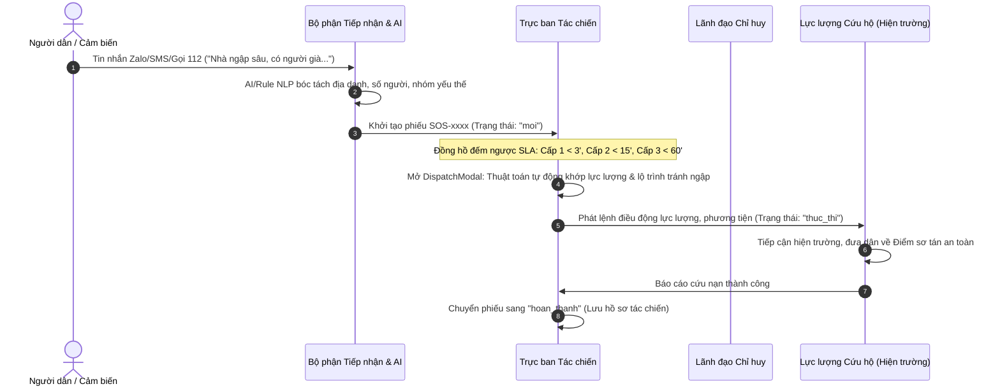
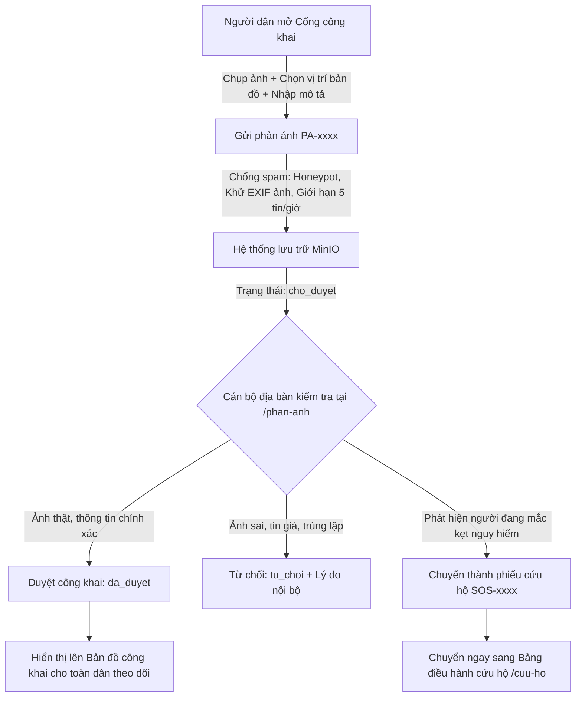
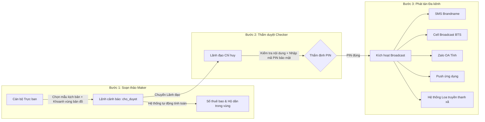

# QUY TRÌNH VẬN HÀNH CHUẨN (SOP) — HỆ THỐNG ĐIỀU HÀNH PCTT & TKCN TỈNH CAO BẰNG

Tài liệu này quy định chi tiết 5 quy trình nghiệp vụ cốt lõi của Hệ thống Điều hành Phòng chống thiên tai & Tìm kiếm cứu nạn tỉnh Cao Bằng, cơ chế phối hợp giữa **Người dân — Cán bộ tác chiến — Lãnh đạo chỉ huy**.

---

## MỤC LỤC

1. [Quy trình 1: Tiếp nhận, Phân loại & Điều phối Cứu hộ khẩn cấp (SOS Workflow)](#quy-trinh-1)
2. [Quy trình 2: Tiếp nhận, Xác minh & Công khai Phản ánh Hiện trường (Report Workflow)](#quy-trinh-2)
3. [Quy trình 3: Soạn thảo, Thẩm duyệt & Phát Cảnh báo Đa kênh (Alert Workflow)](#quy-trinh-3)
4. [Quy trình 4: Giám sát Khí tượng Thủy văn, IoT & Bản đồ Tác chiến (Monitoring Workflow)](#quy-trinh-4)
5. [Quy trình 5: Phân quyền & Giám sát An toàn Lãnh thổ (RBAC Workflow)](#quy-trinh-5)
6. [Bảng kiểm tra thực nghiệm (Test Execution Matrix)](#bang-kiem-tra)

---

<a name="quy-trinh-1"></a>
## 1. Quy trình 1: Tiếp nhận, Phân loại & Điều phối Cứu hộ khẩn cấp (SOS Workflow)

### Mục tiêu
Bảo đảm mọi tín hiệu cầu cứu của nhân dân trong vùng thiên tai được tiếp nhận, định vị, giao lực lượng xử lý trong thời gian nhanh nhất, tuân thủ nghiêm ngặt chỉ số cam kết thời gian phản hồi (SLA).



### Các bước thực hiện:
1. **Bước 1 (Tiếp nhận & Bóc tách NLP)**:
   - Nguồn: Cổng công khai, Hotline 112, Zalo OA, hoặc tin báo trực tiếp.
   - Công cụ: Bộ luật NLP (tuỳ chọn thêm mô hình ngôn ngữ) bóc tách địa danh xã/phường, thôn, số người mắc kẹt, nhóm yếu thế (trẻ em, người cao tuổi, phụ nữ mang thai).
2. **Bước 2 (Phân cấp ưu tiên & SLA)**:
   - **Cấp 1 (Đỏ - Khẩn cấp cực độ)**: Nguy hiểm tính mạng tức thì (sạt lở vùi lấp, lũ cuốn, mắc kẹt trên nóc nhà). SLA phản hồi: **< 3 phút**.
   - **Cấp 2 (Cam - Nguy cơ cao)**: Nước đang dâng, cô lập, có người già/trẻ nhỏ. SLA: **< 15 phút**.
   - **Cấp 3 (Vàng - Cần hỗ trợ)**: Ngập cục bộ, thiếu lương thực, nước sạch. SLA: **< 60 phút**.
3. **Bước 3 (Khớp nối lực lượng & Dò lộ trình an toàn)**:
   - Thuật toán GIS tự động lọc các đơn vị ứng trực gần nhất (Dân quân tự vệ, Quân đội, Công an PCCC & CNCH).
   - Kiểm tra tuyến đường di chuyển qua `RouteTool`: cảnh báo nếu lộ trình buộc phải đi qua vùng nguy hiểm đang hiệu lực (ngập, sạt lở, đường bị chia cắt).
4. **Bước 4 (Thực thi & Hoàn tất)**:
   - Giám sát vị trí lực lượng theo thời gian thực trên bản đồ (`/ban-do`).
   - Sau khi đưa người gặp nạn về điểm sơ tán an toàn, đánh dấu **"Đã cứu an toàn"** để kết thúc quy trình và lưu vết nhật ký pháp lý.

---

<a name="quy-trinh-2"></a>
## 2. Quy trình 2: Tiếp nhận, Xác minh & Công khai Phản ánh Hiện trường (Report Workflow)

### Mục tiêu
Huy động sức mạnh giám sát của nhân dân (Crowdsourcing) để phát hiện sớm các điểm ngập úng, sạt trượt đất đá, tắc đường đèo; đồng thời kiểm duyệt chặt chẽ để chống tin giả và bảo vệ tuyệt đối danh tính người gửi.



### Các nguyên tắc an toàn thông tin:
* **Khử EXIF và nén ảnh**: Ảnh hiện trường tự động được chuyển đổi sang chuẩn JPEG, xóa bỏ tọa độ gốc EXIF của thiết bị cá nhân để tránh lộ thông tin đời tư.
* **Bảo mật danh tính**: Họ tên, số điện thoại của người phản ánh chỉ cán bộ có quyền `report.view` tại địa bàn đó mới xem được; không công khai ra Internet. Địa chỉ IP chỉ lưu dạng băm để chống lạm dụng, không ai xem được IP gốc.
* **Ghi chú công khai**: Khi duyệt, cán bộ ghi chú kết quả xử lý (ví dụ: *"Đã cử dân quân cắm biển cảnh báo"*) để người dân trong khu vực yên tâm.

### 2.2. Tính năng Tra cứu Tiến độ Xử lý Cứu hộ & Phản ánh (Ticket Tracking):
Người dân sau khi gửi tin cứu hộ (SOS) hoặc phản ánh hiện trường (PA) có thể theo dõi tiến độ xử lý trực tiếp tại Cổng công khai (`/cong-khai`) mà không cần đăng nhập:
* **Tra cứu bằng Mã phiếu + SĐT đã dùng khi gửi**: Nhập đúng mã (`SOS-xxxx`, `PA-xxxx`) và số điện thoại. Mã phiếu tăng dần nên đoán được — vì vậy:
  - Không tìm gần đúng, không tìm chỉ bằng SĐT (tránh liệt kê phiếu của người khác).
  - Phiếu có lưu SĐT: nhập sai hoặc không nhập SĐT → trả kết quả giống "không tồn tại".
  - Phản ánh gửi ẩn danh (không SĐT): chỉ cần mã, nhưng chỉ xem được các mốc tiến độ, không xem nội dung / địa chỉ.
  - Phiếu SOS do cán bộ tạo không có SĐT người báo → người dân không tra được.
* **Bảo vệ quyền riêng tư**: API `POST /api/v1/public/track` (POST để SĐT không nằm trên URL / log truy cập), giới hạn 20 lần/phút/IP. Không bao giờ trả ghi chú nội bộ của phiếu SOS, lý do từ chối nội bộ, toạ độ hay vị trí lực lượng; SĐT hiển thị dạng che `099***666`. Kiểm thử: `node scripts/track-test.mjs`.
* **Thanh tiến độ (Stepper) 4 mốc chuẩn**:
  - 🟡 **Đã tiếp nhận**: Thời điểm hệ thống ghi nhận vào sổ trực điều hành tác chiến.
  - 🟠 **Đã điều động lực lượng**: Ghi nhận đơn vị cứu hộ xuất phát (ví dụ: *Đội Dân quân xã Bảo Lâm xuất phát lúc 16:35*).
  - 🟢 **Đội cứu hộ đang trên đường đến**: Hiển thị thời gian dự kiến tiếp cận (ETA), trang tự làm mới mỗi 15 giây.
  - 🔵 **Đã cứu hộ an toàn / Khắc phục hoàn tất**: Ghi nhận hoàn tất nhiệm vụ và giải toả hiện trường.
* **Tác động thực tiễn**: Giúp người dân an tâm, bình tĩnh, biết chính quyền đã điều động lực lượng và không cần gọi dồn dập vào đường dây nóng 112/114 làm nghẽn tổng đài.

---

<a name="quy-trinh-3"></a>
## 3. Quy trình 3: Soạn thảo, Thẩm duyệt & Phát Cảnh báo Đa kênh (Alert Workflow)

### Mục tiêu
Phát tán thông tin khẩn cấp (xả lũ hồ chứa, lũ quét, lệnh sơ tán) tới hàng chục nghìn người dân trong vùng nguy hiểm trong vài chục giây; bắt buộc áp dụng **Cơ chế kiểm soát 4 mắt (Maker – Checker)** để ngăn ngừa phát tán nhầm lẫn gây hoang mang dư luận.



### Quy tắc kiểm duyệt:
1. **Maker không được tự duyệt**: Tài khoản soạn thảo lệnh cảnh báo không thể tự phê duyệt lệnh của chính mình.
2. **Ký duyệt bằng mã PIN**: Lãnh đạo chỉ huy bắt buộc phải nhập mã PIN cá nhân (lưu dạng băm PBKDF2-SHA256) để phê chuẩn phát lệnh.
3. **Phân vùng chính xác**: Hỗ trợ phát theo ranh giới hành chính (xã/phường) hoặc khoanh vùng tự do đa giác (Polygon) trên bản đồ để chỉ gửi tin tới các thuê bao thực sự nằm trong vùng rủi ro.

---

<a name="quy-trinh-4"></a>
## 4. Quy trình 4: Giám sát Khí tượng Thủy văn, IoT & Bản đồ Tác chiến (Monitoring Workflow)

### Mục tiêu
Cung cấp bức tranh toàn cảnh (Common Operational Picture - COP) về tình hình mưa lũ, sạt lở trên toàn tỉnh cho Ban Chỉ huy thông qua mạng lưới cảm biến tự động và các mô hình dự báo quốc tế.

### Luồng tích hợp dữ liệu:
* **Dữ liệu quan trắc trạm (Nguồn đẩy)**:
  * Trạm đo mưa tự động, mực nước sông qua giao thức HTTP / MQTT / LoRaWAN ChirpStack.
  * Tự động lọc số đo dị thường (ngoài ngưỡng vật lý hợp lý).
  * Khi mực nước vượt ngưỡng Báo động I, II, III: trạm đổi màu Vàng/Cam/Đỏ trên bản đồ và vào danh sách "Cảm biến vượt ngưỡng". Cảm biến sạt lở vượt BĐ II tự khoanh vùng nguy cơ, tạo phiếu SOS nguồn cảm biến và bản nháp cảnh báo chờ duyệt. Âm báo tại trung tâm phát khi có phiếu SOS mới cấp 1–2.
* **Dữ liệu dự báo khí tượng (Nguồn kéo)**:
  * Tự động kéo mô hình tổ hợp ECMWF IFS + NOAA GEFS (Open-Meteo) mỗi 3 giờ.
  * Dự báo lượng mưa phân bố theo từng xã/phường trong 24h và 72h tới (xác suất P10 – P50 – P90).
* **Công cụ tác chiến GIS**:
  * Chế độ tua thời gian (Scrubber): Đối chiếu dữ liệu thực đo 12 giờ qua và dự báo mực nước 24 giờ tới.
  * Đo đạc khoảng cách cứu hộ, xác định vị trí hồ đập xung yếu, tính toán sức chứa còn lại tại các điểm sơ tán tập trung.

---

<a name="quy-trinh-5"></a>
## 5. Quy trình 5: Phân quyền & Giám sát An toàn Lãnh thổ (RBAC Workflow)

### Mục tiêu
Đảm bảo thông tin chỉ huy tác chiến chỉ được truy cập và điều hành bởi đúng người, đúng thẩm quyền và đúng địa bàn quản lý.

### Mô hình phân quyền Casbin với Domain phân cấp:
```
* (Toàn tỉnh)
├── BAOLAC/* (Cụm Bảo Lạc — 8 xã thuộc địa bàn huyện Bảo Lạc cũ)
│   ├── BAOLAC/CB-COBA (Xã Cô Ba)
│   └── BAOLAC/CB-KHANHXUAN (Xã Khánh Xuân)
└── BAOLAM/* (Cụm Bảo Lâm)
    └── BAOLAM/CB-YENTHO (Xã Yên Thổ)
```

| Cấp quản lý | Quyền hạn tiêu biểu | Phạm vi dữ liệu |
| :--- | :--- | :--- |
| **Super admin** | Toàn quyền, quản trị định nghĩa vai trò | Toàn tỉnh `*` |
| **Admin tỉnh** | Quản lý tài khoản, duyệt phản ánh toàn tỉnh; không điều động, không phát cảnh báo | Toàn tỉnh `*` |
| **Lãnh đạo BCH tỉnh** | Xem toàn tỉnh, điều động mọi lực lượng, phê duyệt phát lệnh cảnh báo toàn tỉnh | Toàn tỉnh `*` |
| **Trực ban Tác chiến tỉnh** | Tiếp nhận SOS, điều phối lực lượng, soạn lệnh cảnh báo | Toàn tỉnh `*` |
| **Chỉ huy cụm** | Điều phối lực lượng trong cụm, soạn và duyệt cảnh báo, duyệt phản ánh trong cụm | Cụm `BAOLAC/*` … |
| **Admin xã** | Quản lý tài khoản, duyệt phản ánh, tiếp nhận – cập nhật SOS trong xã | Xã `BAOLAC/CB-COBA` … |
| **Cán bộ PCTT xã** | Xem phản ánh, tiếp nhận – cập nhật SOS trong xã (không duyệt phản ánh) | Xã phụ trách |

Chi tiết quyền từng vai trò: [docs/rbac.md](rbac.md).

---

<a name="bang-kiem-tra"></a>
## 6. Bảng kiểm tra thực nghiệm (Test Execution Matrix)

Các quy trình được kiểm tra tự động bằng các kịch bản kiểm thử API (chạy trong CI mỗi lần push — xem `.github/workflows/ci.yml`):

| Quy trình nghiệp vụ | Kịch bản kiểm thử |
| :--- | :--- |
| **1. Cứu hộ khẩn cấp SOS** | `node scripts/smoke.mjs` |
| **2. Phản ánh người dân** | `node scripts/public-test.mjs` |
| **2.2. Tra cứu tiến độ** | `node scripts/track-test.mjs` |
| **3. Phát cảnh báo đa kênh** | `node scripts/smoke.mjs` |
| **4. Quan trắc IoT & Bản đồ** | `node scripts/iot-test.mjs` |
| **5. Phân quyền RBAC** | `node scripts/rbac-test.mjs` |

Kết quả từng lần chạy xem ở tab **Actions** trên GitHub.

---
*Tài liệu ban hành phục vụ công tác huấn luyện, diễn tập và vận hành Hệ thống Điều hành PCTT & TKCN tỉnh Cao Bằng.*
